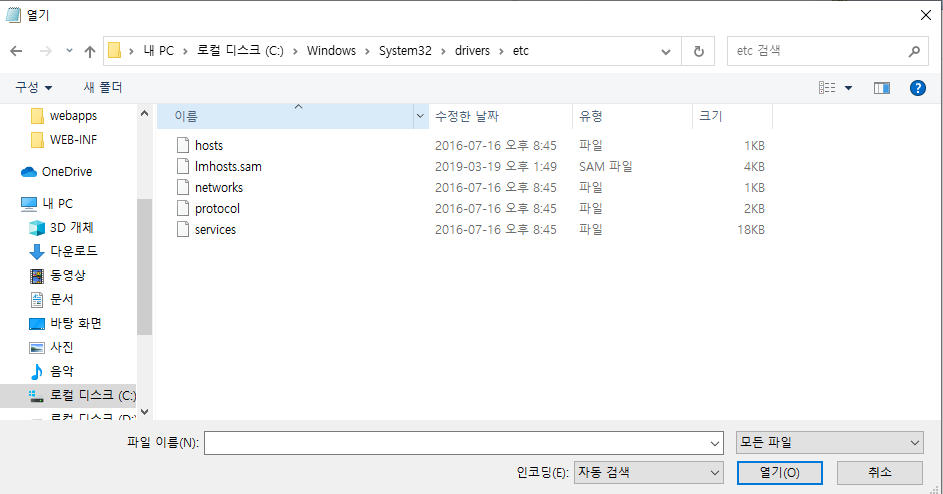
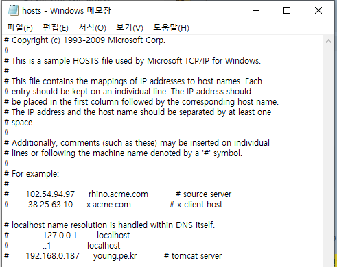
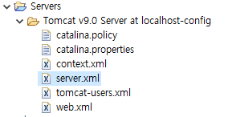

# Eclipse - Tomcat : 도메인 설정하기

* hosts파일 위치 확인

* 메모장 우클릭 &gt; 관리자모드 실행 &gt; 파일 &gt; 열기 &gt; 모든파일 &gt; hosts선택

* 하단에 ip로 도메인 임시 설정

* eclipse Servers &gt; server.xml선택

* &lt;Host&gt;태그 수정
* 컴퓨터 재부팅

