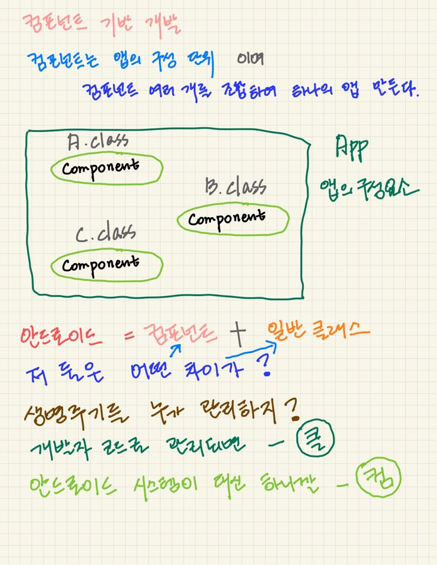
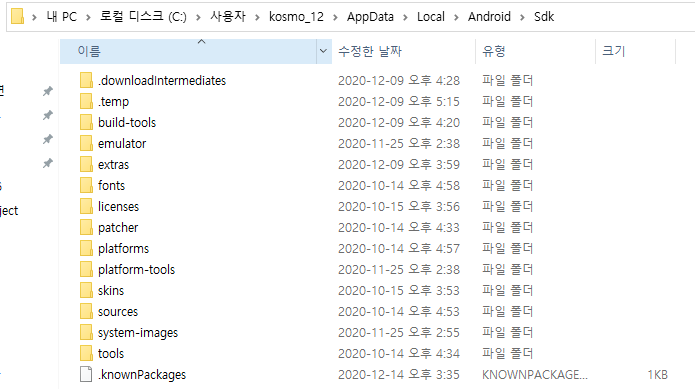

# 83 Days -


## 필기

### JSP와 인스턴스화

* &lt;jsp:useBean id="tv" class="com.TV scope=" "/&gt; 스코프가 없어 클래스를 유지할 수 없다.
* JSP에서는 인스턴스화하지 않는다.

## Spring

### @RequestMapping

* 3.0 이전 Spring - 모두 xml을 이용해 처리했다. - SimpleUrlHandlerMapping, PropertiesMethodNameResolver 이 두 클래스가 있어야 url패턴에 대응하는 메서드 이름을 찾을 수 있었다.
* 5.0 이전 Spring - 주로 자바를 이용해 처리하는 방식으로 변화했다.\(초보자들을 위한 배려\) - 메서드 선언 앞에 어노테이션 @RequestMapping을 사용할 수 있게 되었다. - @GetMapping, @PostMapping

### ViewResolver

```markup
	<!-- viewResolver추가 -->
	<bean id="viewResolver" class="org.springframework.web.servlet.view.InternalResourceViewResolver">
		<property name="prefix" value="/WEB-INF/board/"></property>
		<property name="suffix" value=".jsp"></property>
	</bean>
```

* 응답 페이지에 대한 url을 추가하는 클래스
* xml에 작성한다.

## Spring4\(Spring boot\)

### New Project



### boot 방식

* xml이 아닌 properties에서 작성한다.

### pom.xml

```markup
	<dependencies>
	<!--=========================== spring-boot 시작 ================================-->
		<dependency>
			<groupId>org.springframework.boot</groupId>
			<artifactId>spring-boot-starter-web</artifactId>
		</dependency>
		<dependency>
			<groupId>org.springframework.boot</groupId>
			<artifactId>spring-boot-starter-web-services</artifactId>
		</dependency>
		<dependency>
			<groupId>org.springframework.session</groupId>
			<artifactId>spring-session-core</artifactId>
		</dependency>
		<dependency>
			<groupId>org.springframework.boot</groupId>
			<artifactId>spring-boot-starter-test</artifactId>
			<scope>test</scope>
			<exclusions>
				<exclusion>
					<groupId>org.junit.vintage</groupId>
					<artifactId>junit-vintage-engine</artifactId>
				</exclusion>
			</exclusions>
		</dependency>
	<!--=========================== spring-boot 끝 ================================-->
	
	<!--=========================== 톰캣 의존성주입 시작[jsp문서 인식하게하기] ================================-->
		<dependency>
			<groupId>org.apache.tomcat.embed</groupId>
			<artifactId>tomcat-embed-jasper</artifactId>
		</dependency>
	<!--=========================== 톰캣 의존성주입 끝  ================================-->
	</dependencies>
```

* 하단의 톰캣의 의존성 주입 디펜던시가 작성되어 있어야만 jsp문서를 인식할 수 있다.

## Android

### 컴포넌트 기반 개발



* 컴포넌트는 생명주기를 안드로이드에서 관리해준다. 일반클래스와 컴포넌트는 서로 직접 인스턴스화할 수 없어 인텐트 API의 클래스의 메서드를 활용해 서로 다른 클래스의 소통을 이룬다.

### 컴포넌트

* 앱 내의 독립적인 실행 단위
* Activity : UI 컴포넌트
* Service : 백그라운드 컴포넌트
* Broadcast Receiver : 이벤트 모델의 역할을 수행하는 컴포넌트
* Content Provider : 어플리케이션간 데이터를 공유하기 위한 컴포넌트

### APK

* 앱을 하나의 배포파일로 만들어주는 단위
* 안드로이드 앱은 APK로 배포한다.

### 네이티브 & 웹 앱

* 네이티브 앱 - local의 성격을 갖고 다른 디바이스에서는 실행되지 않는 앱
* 하이브리드 앱 - 네이티브 + 웹

### intent

* 결합하지 않고 독립적으로 실행된다.
* A클래스에서 B클래스를 인텐트하면\(의뢰\) 시스템이 B를 실행한다.
* 일반클래스와 컴포넌트 간과 같이 서로 다른 클래스에서 소통을 해야할 때 사용한다.

### 컴포넌트의 결합

* Activity + Activity
* Activity + Service + Activity
* Activity + Activity + Service + ContentProvider

### Standard Developer Kit 경로



### 프로젝트 저장 경로


## AndroidX

### AndroidX

* 최신 하이브리드 앱을 구현하기위해 AndroidX 사용하기

### 표준 &gt; AndroidX로 Migrate하기



