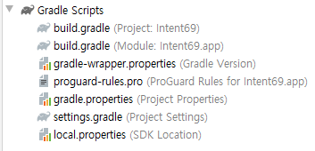
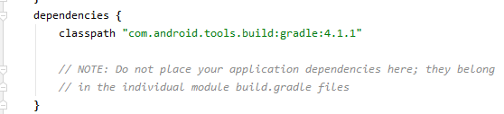
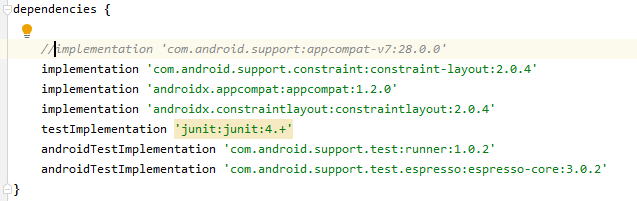

# 83 Days - Spring4 : boot, Android : 텀포넌트, APK, 네이티브+웹앱, intent, gradle, Android 살펴보기, 경로, AndroidX

### 사용 프로그램

* 사용언어 : JAVA\(JDK\)1.8.0\_261, JS, JQuery, JSP, Servlet, HTML, JSON
* 사용Tool  - Eclipse : Eclipse.org - Toad DBA Suite for Oracle 11.5 - Spring - Android Studio
* 사용 서버 - WAS : Tomcat

## 필기

### JSP와 인스턴스화

* &lt;jsp:useBean id="tv" class="com.TV scope=" "/&gt; 스코프가 없어 클래스를 유지할 수 없다.
* JSP에서는 인스턴스화하지 않는다.

## Spring

### @RequestMapping

* 3.0 이전 Spring - 모두 xml을 이용해 처리했다. - SimpleUrlHandlerMapping, PropertiesMethodNameResolver 이 두 클래스가 있어야 url패턴에 대응하는 메서드 이름을 찾을 수 있었다.
* 5.0 이전 Spring - 주로 자바를 이용해 처리하는 방식으로 변화했다.\(초보자들을 위한 배려\) - 메서드 선언 앞에 어노테이션 @RequestMapping을 사용할 수 있게 되었다. - @GetMapping, @PostMapping

### ViewResolver

```markup
	<!-- viewResolver추가 -->
	<bean id="viewResolver" class="org.springframework.web.servlet.view.InternalResourceViewResolver">
		<property name="prefix" value="/WEB-INF/board/"></property>
		<property name="suffix" value=".jsp"></property>
	</bean>
```

* 응답 페이지에 대한 url을 추가하는 클래스
* xml에 작성한다.

## Spring4\(Spring boot\)

### New Project



### boot 방식

* xml이 아닌 properties에서 작성한다.

### pom.xml

```markup
	<dependencies>
	<!--=========================== spring-boot 시작 ================================-->
		<dependency>
			<groupId>org.springframework.boot</groupId>
			<artifactId>spring-boot-starter-web</artifactId>
		</dependency>
		<dependency>
			<groupId>org.springframework.boot</groupId>
			<artifactId>spring-boot-starter-web-services</artifactId>
		</dependency>
		<dependency>
			<groupId>org.springframework.session</groupId>
			<artifactId>spring-session-core</artifactId>
		</dependency>
		<dependency>
			<groupId>org.springframework.boot</groupId>
			<artifactId>spring-boot-starter-test</artifactId>
			<scope>test</scope>
			<exclusions>
				<exclusion>
					<groupId>org.junit.vintage</groupId>
					<artifactId>junit-vintage-engine</artifactId>
				</exclusion>
			</exclusions>
		</dependency>
	<!--=========================== spring-boot 끝 ================================-->
	
	<!--=========================== 톰캣 의존성주입 시작[jsp문서 인식하게하기] ================================-->
		<dependency>
			<groupId>org.apache.tomcat.embed</groupId>
			<artifactId>tomcat-embed-jasper</artifactId>
		</dependency>
	<!--=========================== 톰캣 의존성주입 끝  ================================-->
	</dependencies>
```

* 하단의 톰캣의 의존성 주입 디펜던시가 작성되어 있어야만 jsp문서를 인식할 수 있다.

## Android

### 컴포넌트 기반 개발


* 컴포넌트는 생명주기를 안드로이드에서 관리해준다. 일반클래스와 컴포넌트는 서로 직접 인스턴스화할 수 없어 인텐트 API의 클래스의 메서드를 활용해 서로 다른 클래스의 소통을 이룬다.

### 컴포넌트

* 앱 내의 독립적인 실행 단위
* Activity : UI 컴포넌트
* Service : 백그라운드 컴포넌트
* Broadcast Receiver : 이벤트 모델의 역할을 수행하는 컴포넌트
* Content Provider : 어플리케이션간 데이터를 공유하기 위한 컴포넌트

### APK

* 앱을 하나의 배포파일로 만들어주는 단위
* 안드로이드 앱은 APK로 배포한다.

### 네이티브 & 웹 & 하이브리드


* 네이티브 앱 - 흔히 보는 앱스토어를 통해 다운로드하는 어플리케이션 - 개발 난이도가 높다. - 사용자 환경이 좋고, 모바일 기기에 최적화된 언어로 개발된다.   Android : java, IOS : Object-C - 스마트폰의 모든 기능을 활용할 수 있고, 실행속도가 빠르고 안정적이다. - 단, 특정 플랫폼에서만 동작해 업데이트에 불편함이 따른다.
* 웹 앱 - 설치된 어플리케이션이 아닌 네이티브 앱을 통해 보는 웹 사이트를 말한다. - 개발 난이도가 비교적 낮고 저렴하지만 네이티브 앱보다 성능이 떨어진다. - 스마트폰 화면의 크기에 맞춰 웹 브라우저를 줄인 것으로 기기 화면에 최적화된 UI/UX개발을 한다. - 일반적인 웹 기술 언어로 개발한다.   HTML, CSS, JS, JSP, PHP 등,.... - 스마트폰의 고유 정보나 하드웨어를 제어할 수 없다.
* 하이브리드 앱 - 네이티브 + 웹 - 네이티브 앱처럼 기기의 기능을 활용하고 웹앱처럼 HTML을 사용해 개발한다. - 여러 플랫폼에서 HTML을 재사용해 구현하므로 개발 비용이 감소한다. - 외형은 네이티브앱, 내부는 모바일 웹 앱으로 실행된다. - 별도의 하이브리드 웹 F/W가 필요하다.   PhoneGap, Sencha등...

### intent

* 결합하지 않고 독립적으로 실행된다.
* A클래스에서 B클래스를 인텐트하면\(의뢰\) 시스템이 B를 실행한다.
* 일반클래스와 컴포넌트 간과 같이 서로 다른 클래스에서 소통을 해야할 때 사용한다.

### 컴포넌트의 결합

* Activity + Activity
* Activity + Service + Activity
* Activity + Activity + Service + ContentProvider

### gradle 파일



* Project  - 프로젝트 수준 - 여러 모듈을 묶어서 관리하며 모든 모듈을 위한 최상위 설정이다.
* Module  - 모듈 수준 - 앱이 모듈 단위이며 패키지 이름으로 앱을 식별한다.
* settings.gradle

  - gradle에 모듈을 포함해 gradle module을 관리하고 빌드하게 설정하는 파일

### dependencies





* gradle 파일 안에 작성되는 앱을 위한 라이브러리를 등록할때 사용한다.
* 여기에 등록된 라이브러리는 안드로이드 스튜디오가 주입해주는 의존성 주입이다.

### 앱의 디렉터리와 파일


* AndroidManifest.xml - 앱의 메인 환경 파일
* java/MainActivity.java - 화면 구성을 위한 Activity 컴포넌트로 실제 이 파일이 실행되어 화면에 UI가 출력된다.
* res - 앱의 모든 리소스 파일은 res폴더의 하위에 위치한다.
* res/draqalbe - 리소스 중 이미지 파일을 저장하는 폴더
* res/layout - 리소스 중 UI구성을 위한 레이아웃 xml 파일을 저장하는 폴더
* res/mipmap - 리소스 중 앱의 아이콘 이미지를 저장하는 폴더
* res/values - 리소스 중 문자열 값 등.. 값을 위한 폴더

### Android 의 화면

* 보통은 xml으로 화면을 그리는 것을 권장하고, java에서는 setContentView\( \)메서드로 view xml을 지정한다.
* java로는 할 수 없을까? 할 수는 있다. 하지만 권장하지는 않는다. 



### Standard Developer Kit 경로


### 프로젝트 저장 경로


## AndroidX

### AndroidX

* 최신 하이브리드 앱을 구현하기위해 AndroidX 사용하기

### 표준 &gt; AndroidX로 Migrate하기



후기 : 이번주는 내내 영하 10도란다.. 넘모 추어...그래서 전기 온열 방석을 꺼냇더니 궁디가 뜨끈하니 좋다.

