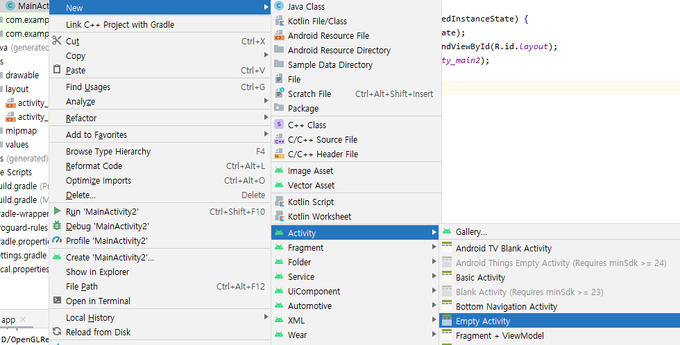

# Android 화면 : xml or java?

## XML

### 코드 : MainActivity2.java

```java
package com.example.intent69;

import android.os.Bundle;
import androidx.appcompat.app.AppCompatActivity;

public class MainActivity2 extends AppCompatActivity {

    @Override
    protected void onCreate(Bundle savedInstanceState) {
        super.onCreate(savedInstanceState);
        
        setContentView(R.layout.activity_main);
    }
}
```

* setContentView\( \)메서드로 xml문서를 그린다.
* 위 경우는 activity\_main.xml에 화면이 구현되어 있다.

### 코드 : Activity\_Main2.xml

```markup
<?xml version="1.0" encoding="utf-8"?>
<LinearLayout xmlns:android="http://schemas.android.com/apk/res/android"
    xmlns:tools="http://schemas.android.com/tools"
    android:layout_width="match_parent"
    android:layout_height="match_parent"
    android:orientation="vertical"
    android:id="@+id/layout"
    tools:context=".MainActivity2">

    <Button
        android:id="@+id/btn_add"
        android:layout_width="match_parent"
        android:layout_height="wrap_content"
        android:text="입력" />

    <Button
        android:id="@+id/btn_update"
        android:layout_width="match_parent"
        android:layout_height="wrap_content"
        android:text="수정" />
</LinearLayout>
```

## JAVA

### 코드 : MainActivity.java

```java
package com.example.intent69;

import android.os.Bundle;
import android.widget.Button;
import android.widget.LinearLayout;

import androidx.appcompat.app.AppCompatActivity;

public class MainActivity extends AppCompatActivity {

    @Override
    protected void onCreate(Bundle savedInstanceState) {
        super.onCreate(savedInstanceState);
        LinearLayout linearLayout = new LinearLayout(this);
        Button btn1 = new Button(this);
        btn1.setText("입력");
        linearLayout.addView(btn1);
        Button btn2 = new Button(this);
        btn2.setText("수정");
        linearLayout.addView(btn2);
        setContentView(linearLayout);
        //setContentView(R.layout.activity_main);
    }
}
```

* JAVA에 직접 구현

## JAVA + XML

### 코드 : MainActivity2/java

```java
package com.example.intent69;

import androidx.appcompat.app.AppCompatActivity;

import android.os.Bundle;
import android.widget.LinearLayout;

public class MainActivity2 extends AppCompatActivity {

    @Override
    protected void onCreate(Bundle savedInstanceState) {
        super.onCreate(savedInstanceState);
        LinearLayout linearLayout = findViewById(R.id.layout);
    }
}
```

* 위와 같이 xml의 id값으로 xml 객체에 접근 할 수 도 있다.

## Java로 작성한 View -&gt; xml변환

### Java로 작성한 View를 xml로 변환하기



* view가 작성된 자바파일 우클릭 &gt; New &gt; Activity &gt; Activity선택 &gt; 이름지정 &gt; Finish

### mainfest 설정

```markup
<?xml version="1.0" encoding="utf-8"?>
<manifest xmlns:android="http://schemas.android.com/apk/res/android"
    package="com.example.intent69">

    <application
        android:allowBackup="true"
        android:icon="@mipmap/ic_launcher"
        android:label="@string/app_name"
        android:roundIcon="@mipmap/ic_launcher_round"
        android:supportsRtl="true"
        android:theme="@style/Theme.Intent69">
       <!-- <activity android:name=".MainActivity2"></activity> -->
        <activity android:name=".MainActivity2">
            <intent-filter>
                <action android:name="android.intent.action.MAIN" />

                <category android:name="android.intent.category.LAUNCHER" />
            </intent-filter>
        </activity>
    </application>
</manifest>
```

* 기존 activity로 잡혀있던 파일을 새로 만들어진 xml을 갖는 java문서로 변경해야한다.

