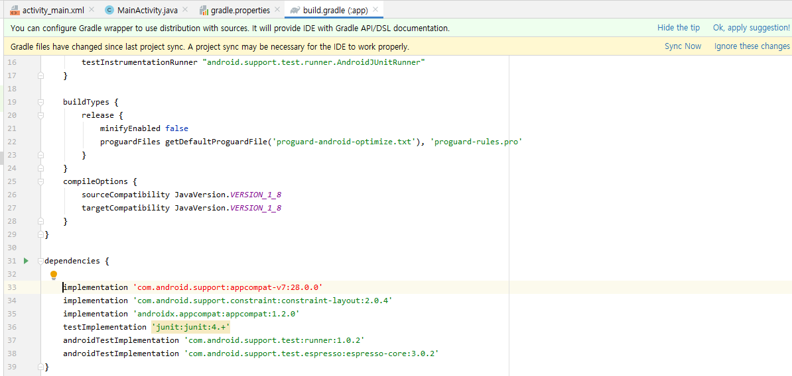
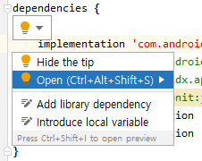
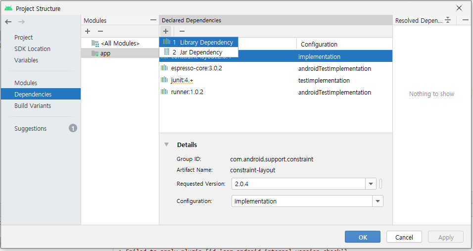
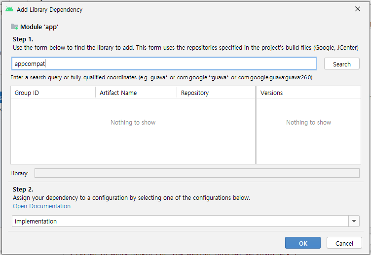
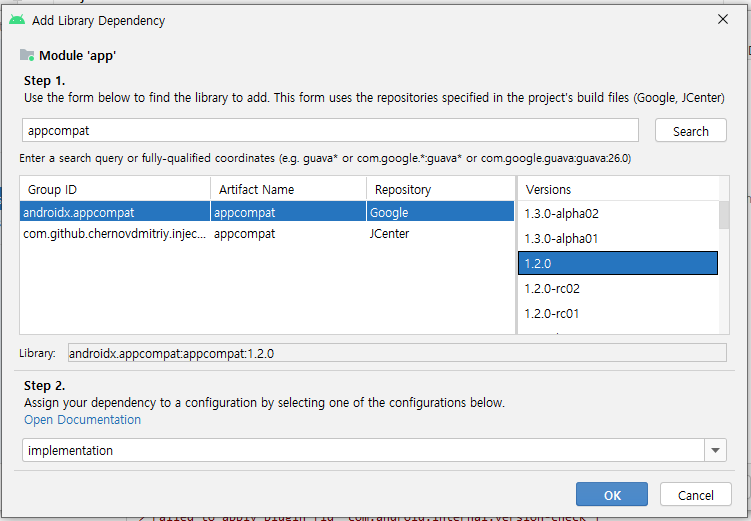
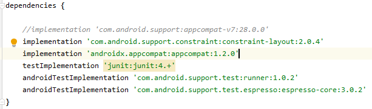
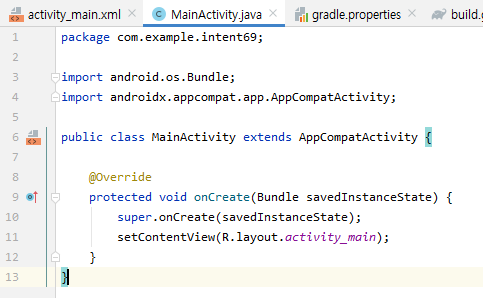
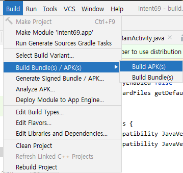

# AndroidX Migrate하기 : Intent69

### File &gt; Setting 


* Editor &gt; General &gt; Auto Import &gt; Auto import in compietion 체크 해제 &gt; Apply

### gradle.properties

```markup
android.useAndroidX=true
android.enableJetifier=ture
```

### build.gradle



* 상단 노란 팝업 Sync Now 클릭



* 붉은 표시 된 implementation 전구 &gt; Open



* Dependencies &gt; app &gt; + &gt; Library Dependency



* appcompat &gt; Search



* Google 1.2.0 선택 &gt; OK



* 새로 생긴 implmentation확인 &gt; 기존 implementation 주석처리

### MainActivity.java



* 기존 import 삭제 후 새로 import하면 androidX로 import되는 것을 볼 수 있다.



* APK로 build

