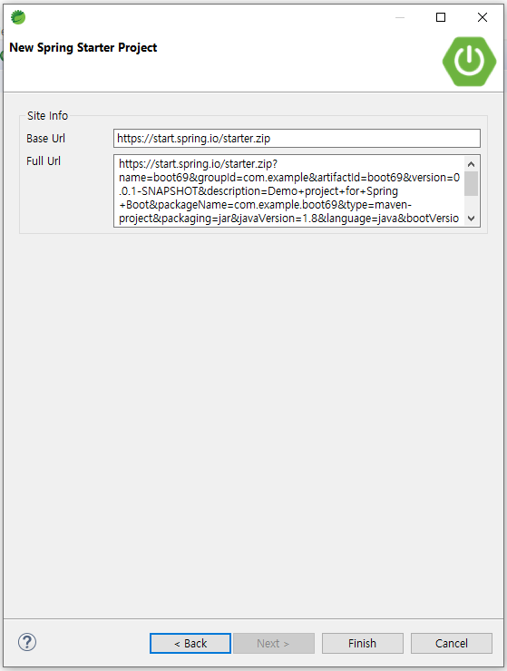

# Spring : New Project - spring boot

* File &gt; New &gt; Spring Starter Project

* Name : 프로젝트 별칭
* Java Version맞추기
* Next

* Web &gt; Speing Web, Spring Session, Spring Web Services 체크

* SQL &gt; Oracle Driver체크 &gt; Next

* Finish

* 파일 확인 &gt; 필요한 폴더 생성

