# 99 Days - VSCode 환경설정, Node.js, React

### 사용 프로그램

* 사용언어 : JAVA\(JDK\)1.8.0\_261, JS, JQuery, JSP, Servlet, HTML, JSON
* 사용Tool  - Eclipse : Eclipse.org, Toad DBA Suite for Oracle 11.5 , Spring, Android Studio, Visual Studio Code
* 사용 서버 - WAS : Tomcat

## Node.js

### node.js 다운로드

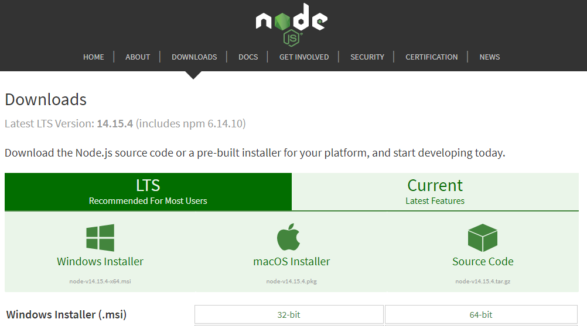

* nodejs.org

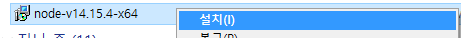

* 다운로드된 파일 우클릭 &gt; 설
* Next &gt; accept, Next &gt; Next &gt; Next &gt; Next &gt; Finish

* 생성 확인

## Visual Studio Code : spring-boot, React환경설정

### VSCode

* Eclipse 보다 script언어 활용에 특화되어있다.

### 확장프로그램 : JAVA

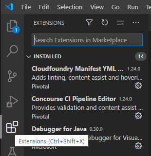

* 왼쪽에 Extensions 클

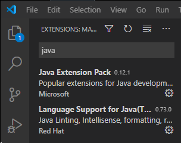

* JAVA &gt; JAVA Extension Pack - JAVA 언어지원, Maven프로젝트 관리
*  Language Support for Java 설치

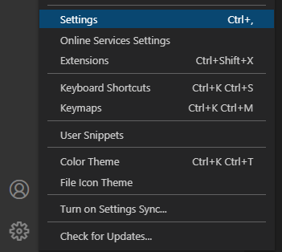

* 왼쪽 하단의 설정 아이콘 &gt; Settings &gt;

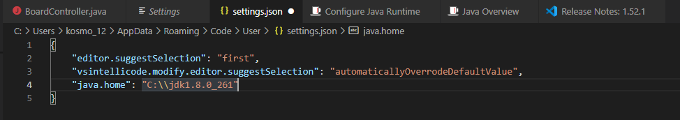

* setting.json에서 설치된 JVM으로 java.home version맞추기

### spring-boot : 프로젝트 생성

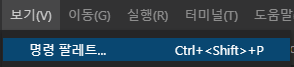

* 보기 &gt; 명령 팔레트

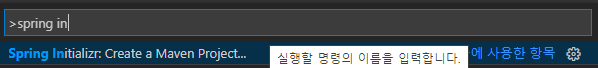

* Spring initializr Maven방식 선택

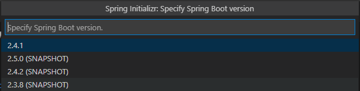

* spring-boot version 선

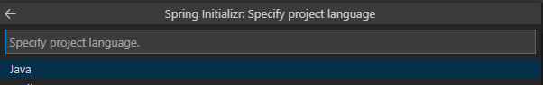

* 프로젝트 언어 선택

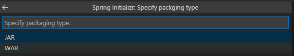

* 프로젝트 패키징 타입 선택 &gt; war

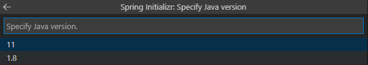

* JVM version 선택 &gt; Enter

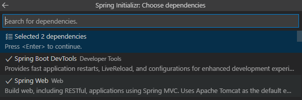

* dependency Spring Boot Dev Tools, Spring Web 선택 &gt; Enter

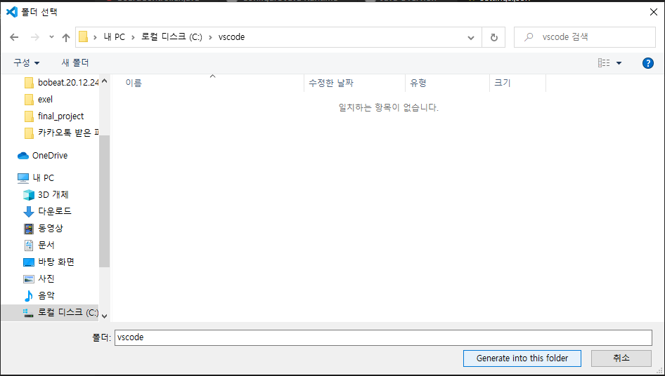

* 프로젝트 저장 경로 지정

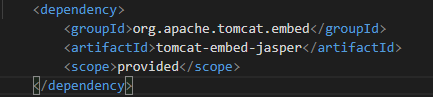

* pom.xml에 tomcat dependency 추가
* src &gt; main &gt; webapp 폴더 추가 &gt; WEB-INF 폴더 추가

후기 : 환경설정 어려운 것...

