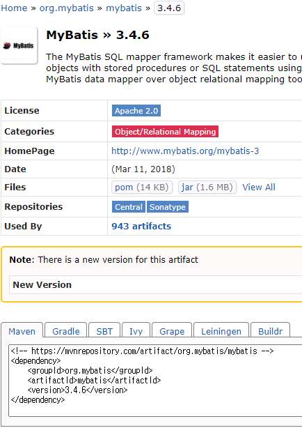
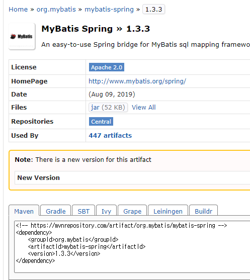
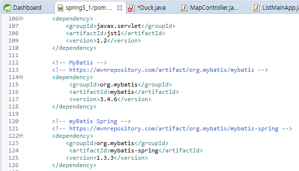

# maven

### 

* MyBatis의 Maven에서 제공하는 dependency를 활용한다.

* MyBatis Spring의 Maven에서 제공하는 dependency를 활용한다.
* MyBatis Spring의 경우에는 MyBatis.jar가 설치되어 있어야 사용할 수 있다. jar파일 사이에서도 의존관계가 존재하니 jar파일을 사용할때 주의해야한다.

* 이렇게 Spring에서 사용할 프로젝트의 pom.xml내부에 dependency를 작성하면

* 파일의 직접 추가 없이도 알아서 업데이트 된다.

### 

