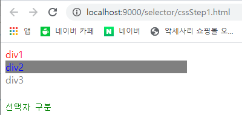
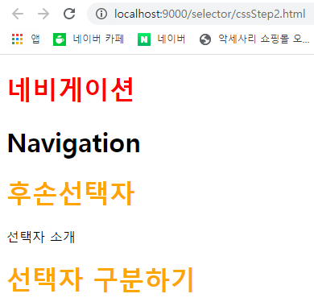

# cssStep.hrml - CSS선택자

### cssStep1



```markup
<!DOCTYPE html>
<html>
<head>
<meta charset="UTF-8">
<title>선택자 소개-[전체, 아이디, 클래스, 요소(태그)선택자]</title>
<style type="text/css">
	* {color:green;}
	div {color:red;}
	#d_2 {color:blue; width:300px; background:gray;}
	.d_3 {color:gray;}
</style>
</head>
<body>
선택자 구분<!-- TextNode:태그취급 -->
<div>div1</div><!-- 태그선택자 -->
<div id="d_2">div2</div>
<div class="d_3">div3</div>
</body>
</html>
```

### cssStep2



```markup
<!DOCTYPE html>
<!-- 코딩이 끝나더라도 예측해보고 실행하자. -->
<html>
<head>
<meta charset="UTF-8">
<title>자손선택자와 후손선택자 구분</title>
<style type="text/css">
	#header > h1 {color:red;}/*자손선택자*/
	#section  h1 {color:orange;}/*후손선택자*/
</style>
</head>
<body>
	<div id="header">
		<h1 class="title">네비게이션</h1>
		<div id="nav">
			<h1>Navigation</h1>
		</div>
	</div>
	<div id="section">
		<h1>후손선택자</h1>
		<p>선택자 소개<h1>선택자 구분하기</h1></p>
	</div>
</body>
</html>
```

