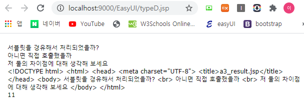

# typeD.jsp : 비동기통신 ajax, servlet호출, text, html

## typeD.jsp




```markup
<%@ page language="java" contentType="text/html; charset=UTF-8"
    pageEncoding="UTF-8"%>
<!DOCTYPE html>
<html>
<head>
<meta charset="UTF-8">
<!-- 비동기 통신 ajax를 사용 -->
<title>typeD.jsp[비동기통신 체험하기]</title>
	<link rel="stylesheet" type="text/css" href="https://www.jeasyui.com/easyui/themes/default/easyui.css">
    <link rel="stylesheet" type="text/css" href="https://www.jeasyui.com/easyui/themes/icon.css">
    <link rel="stylesheet" type="text/css" href="https://www.jeasyui.com/easyui/themes/color.css">
    <link rel="stylesheet" type="text/css" href="https://www.jeasyui.com/easyui/demo/demo.css">
    <script type="text/javascript" src="https://www.jeasyui.com/easyui/jquery.min.js"></script>
    <script type="text/javascript" src="https://www.jeasyui.com/easyui/jquery.easyui.min.js"></script>

</head>
<body>
<div id="d_msg"></div>
<div id="d_msg2"></div>
<script type="text/javascript">
$.ajax({ 
	 url:'a3.do'
  //,url:'a3.do?mem_id=땡떙&...'쿼리스트링을 붙여 호출할 수 있다.
	,method:'get'
	,success:function(data){//data는 text취급일까 html취급일까? get이던 post던 text취급
		alert(data);
		$("#d_msg").html(data);
		$("#d_msg2").text(data);
	}
});
</script>
11
</body>
</html>
```

## A3.java : Servlet

```java
package com.basic;

import java.io.IOException;

import javax.servlet.GenericServlet;
import javax.servlet.RequestDispatcher;
import javax.servlet.ServletException;
import javax.servlet.ServletRequest;
import javax.servlet.ServletResponse;
import javax.servlet.http.HttpServlet;
import javax.servlet.http.HttpServletRequest;
import javax.servlet.http.HttpServletResponse;

import org.apache.log4j.Logger;

public class A3 extends HttpServlet {
	
	Logger logger = Logger.getLogger(A3.class);
	
	public void init() { }
	
	public void doService(HttpServletRequest req, HttpServletResponse res)
			throws ServletException, IOException{
		//테스트 해보기
		logger.info("doService 호출성공");
		//res.sendRedirect("a3_result.jsp");
		RequestDispatcher view = req.getRequestDispatcher("a3_result.jsp");
		view.forward(req,res);
		//이 아래 코드는 진행이 될까?아니요 불가능 a3_result.jsp에서 응답을 하고 끝난다.
		
		//xxx.do?command=empInsert 이 쿼리스트링으로 
		String command = req.getParameter("command");//empInsert받아와 구분
		logger.info("command : "+command);
		//사원등록할거니?
		if("empInsert".equals(command)) {
			
		}		
	}
	@Override
	public void doGet(HttpServletRequest req, HttpServletResponse res) 
		throws ServletException, IOException{
			logger.info("doGet 호출성공");
			doService(req, res);
		}
	
	@Override
	public void doPost(HttpServletRequest req, HttpServletResponse res) 
		throws ServletException, IOException{
			logger.info("doPost 호출성공");
			doService(req, res);
	}
	
	public void destroy() { }	
}
```

## a3\_result.jsp

```markup
<%@ page language="java" contentType="text/html; charset=UTF-8"
    pageEncoding="UTF-8"%>
<!DOCTYPE html>
<html>
<head>
<meta charset="UTF-8">
<title>a3_result.jsp</title>
</head>
<body>
서블릿을 경유해서 처리되었을까?
<br>
아니면 직접 호출했을까
<br>
저 둘의 차이점에 대해 생각해 보세요
</body>
</html>
```

