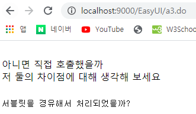
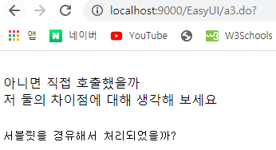

# a3\_result.jsp : 직접호출, servlet경유 호출

## a3\_result.jsp : 직접호출


```markup
<%@ page language="java" contentType="text/html; charset=UTF-8"
    pageEncoding="UTF-8"%>
<!DOCTYPE html>
<html>
<head>
<meta charset="UTF-8">
<title>a3_result.jsp</title>
</head>
<body>
서블릿을 경유해서 처리되었을까?
<br>
아니면 직접 호출했을까
<br>
저 둘의 차이점에 대해 생각해 보세요
</body>
</html>
```

## typeA.jsp : Servlet호출, &lt;form&gt;, post방식




```markup
<%@ page language="java" contentType="text/html; charset=UTF-8"
    pageEncoding="UTF-8"%>
<!DOCTYPE html>
<html>
<head>
<meta charset="UTF-8">
<title>typeA.jsp</title>
</head>
<body>
<form name="f_test" action="./a3.do" method="post">
<input type="submit">
</form>
</body>
</html>
```

## typeB.jsp : Servlet호출, &lt;form&gt;, get방식




```markup
<%@ page language="java" contentType="text/html; charset=UTF-8"
    pageEncoding="UTF-8"%>
<!DOCTYPE html>
<html>
<head>
<meta charset="UTF-8">
<title>typeB.jsp</title>
<script type="text/javascript">
	function send(){
		document.f_test.method="get";
		document.f_test.action="./a3.do";
		document.f_test.submit();
	}//get으로 보내질까 post로 보내질까?? get. 뒤에 정의된 방식을 따른다.
</script>
</head>
<body>
<form name="f_test" action="./a3.do" method="post">
<input type="button" onclick="send()">
</form>
</body>
</html>
```

## web.xml

```markup
<?xml version="1.0" encoding="UTF-8"?>
<web-app xmlns:xsi="http://www.w3.org/2001/XMLSchema-instance" xmlns="http://xmlns.jcp.org/xml/ns/javaee" xsi:schemaLocation="http://xmlns.jcp.org/xml/ns/javaee http://xmlns.jcp.org/xml/ns/javaee/web-app_4_0.xsd" id="WebApp_ID" version="4.0">

<!-- DD파일(Deployment Discriptor) = 배치서술자 -->	
	<servlet>
		<servlet-name>A3Servlet</servlet-name>
		<servlet-class>com.basic.A3</servlet-class>
	</servlet>
	<servlet-mapping>
		<servlet-name>A3Servlet</servlet-name>
		<url-pattern>/EasyUI/a3.do</url-pattern><!-- 주소앞에는 업무명이온다. 업무마다 구분하기위해 -->
	</servlet-mapping>

</web-app>
```

* 11번 - 서블릿 : /EasyUI/a3.do - JSP : dev\_html - webcontent - EasyUI - ...

## A3.java : Servlet

```java
package com.basic;

import java.io.IOException;
import javax.servlet.GenericServlet;
import javax.servlet.RequestDispatcher;
import javax.servlet.ServletException;
import javax.servlet.ServletRequest;
import javax.servlet.ServletResponse;
import javax.servlet.http.HttpServlet;
import javax.servlet.http.HttpServletRequest;
import javax.servlet.http.HttpServletResponse;
import org.apache.log4j.Logger;

public class A3 extends HttpServlet {	
	Logger logger = Logger.getLogger(A3.class);
	
	public void init() { }
	
	public void doService(HttpServletRequest req, HttpServletResponse res)
			throws ServletException, IOException{
		//테스트 해보기
		logger.info("doService 호출성공");
		
		//xxx.do?command=empInsert|empUpdate|empDelete|empSelect 이 쿼리스트링으로 
		String command = req.getParameter("command");//empInsert|empUpdate|empDelete|empSelect 이런걸 받아와 구분하자.
		logger.info("command : "+command);
		//사원등록할거니?
		if("empInsert".equals(command)) {
			
		}		
		//사원수정해야되는데..
		else if("empUpdate".equals(command)) {
			
		}				
		//퇴사한 사원이 있는데 어떻게 하죠?
		else if("empDelete".equals(command)) {
			
		}				
		//사원 목록을 보고 싶어 하세요.
		else if("empSelect".equals(command)) {
			
		}		
		
		//위 목록을 if, else if문으로 처리하면 코드가 더러워진다. -> controller mapper를 사용하자
		//목록이 많아질수록 if문이 엄청 길어질 수 도 있으므로
	}
	@Override
	public void doGet(HttpServletRequest req, HttpServletResponse res) 
		throws ServletException, IOException{
			logger.info("doGet 호출성공");
			doService(req, res);
		}
	
	@Override
	public void doPost(HttpServletRequest req, HttpServletResponse res) 
		throws ServletException, IOException{
			logger.info("doPost 호출성공");
			doService(req, res);
	}
	
	public void destroy() {	}	
}
```

