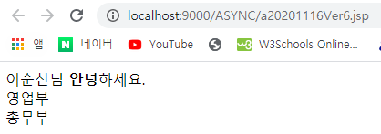

# document.wirte : 덮어쓰기

### 화면 1 : 기본 화면


### 화면 2 : 버튼 클릭시



### 코드 : a20201116Ver6

```markup
<%@ page language="java" contentType="text/html; charset=UTF-8"
    pageEncoding="UTF-8"%>
<%
   String v_name="이순신";
   String v_gender="남자";
%>    
<!DOCTYPE html>
<html>
<head>
<meta charset="UTF-8">
<title>Insert title here</title>
<script type="text/javascript" src="https://www.jeasyui.com/easyui/jquery.min.js"></script>
<script type="text/javascript">
	var g_dname="영업부"
	function refresh(){
		document.write("<%=v_name%>"+"님 <b>안녕</b>하세요.");
		document.write("<br>");
		document.write(g_dname);
		document.write("<br>");
		document.write(v_dname);
	}
</script>
</head>
<body>
<input type="button" value="전송" onclick="refresh()">
<script type="text/javascript">
	  v_dname="총무부"
	  document.write("<table width='350px' border='1' borderColor='green'>");
      document.write("<tr>");
      document.write("<td>");
      document.write("<%=v_name%>");
      document.write("</td>");
      document.write("<td>");
      document.write("<%=v_gender%>");
      document.write("</td>");
      document.write("</tr>");
      document.write("</table>");
</script>
</body>
</html>
```

### 설명

* document.wirte를 쓰면 화면1, 화면2와 같이 기존 데이터는 사라지기때문에 사용에 유의하자.


