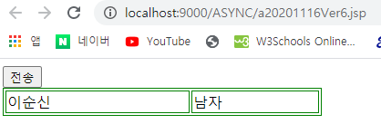

# JAVA변수와 JS변수 사용 : TimeLine + for, if문

## JAVA변수를 사용하면

### 화면

.png>)

### 소스보기


### 설명

* 소스에 변수로 작성했던 14, 17번 라인이 결정되어 있는 것을 볼 수 있다.
* 브라우저가 다운로드할때, 값과 태그를 같이 다운로드 하는 것을 알 수 있다.
* 변수들이 먼저 결정된다.

### 코드 : 20201116Ver5

```markup
<%@ page language="java" contentType="text/html; charset=UTF-8"
    pageEncoding="UTF-8"%>
<%
   String v_name="이순신";
   String v_gender="남자";
%>    
<!DOCTYPE html>
<html>
<head>
<meta charset="UTF-8">
<title>Insert title here</title>
<script type="text/javascript" src="https://www.jeasyui.com/easyui/jquery.min.js"></script>
</head>
<body>
<script type="text/javascript">
   $(document).ready(function(){
      document.write("<table width='350px' border='1' borderColor='green'>");
      document.write("<tr>");
      document.write("<td>");
      document.write("<%=v_name%>");
      document.write("</td>");
      document.write("<td>");
      document.write("<%=v_gender%>");
      document.write("</td>");
      document.write("</tr>");
      document.write("</table>");      
   });
</script>
</body>
</html>
```

## JS변수를 사용하면

### 화면

.png>)

### 소스보기


### 설명

* 18번, 21번에서 작성한 변수가 결정되어있지 않음을 알 수 있다.

### 코드 : 20201116Ver4

```markup
<%@ page language="java" contentType="text/html; charset=UTF-8"
    pageEncoding="UTF-8"%>
<!DOCTYPE html>
<html>
<head>
<meta charset="UTF-8">
<title>Insert title here</title>
<script type="text/javascript" src="https://www.jeasyui.com/easyui/jquery.min.js"></script>
<script type="text/javascript">
   var v_name="이순신";
   var v_gender="남자";
</script>
</head>
<body>
<script type="text/javascript">
   $(document).ready(function(){
      document.write("<table width='350px' border='1' borderColor='green'>");
      document.write("<tr>");
      document.write("<td>");
      document.write(v_name);//JS변수, java변수아님
      document.write("</td>");
      document.write("<td>");
      document.write(v_gender);
      document.write("</td>");
      document.write("</tr>");
      document.write("</table>");      
   });
</script>
</body>
</html>
```

## 응용

### 화면 : 기본



### 화면 : onclick

.png>)

### 코드 : 20201116Ver6

```markup
<%@ page language="java" contentType="text/html; charset=UTF-8"
    pageEncoding="UTF-8"%>
<%
   String v_name="이순신";
   String v_gender="남자";
%>    
<!DOCTYPE html>
<html>
<head>
<meta charset="UTF-8">
<title>Insert title here</title>
<script type="text/javascript" src="https://www.jeasyui.com/easyui/jquery.min.js"></script>
<script type="text/javascript">
	var g_dname="영업부"
	function refresh(){
		document.write("<%=v_name%>"+"님 <b>안녕</b>하세요.");
		document.write("<br>");
		document.write(g_dname);
		document.write("<br>");
		document.write(v_dname);
	}
</script>
</head>
<body>
<input type="button" value="전송" onclick="refresh()">
<script type="text/javascript">
	  v_dname="총무부"
	  document.write("<table width='350px' border='1' borderColor='green'>");
      document.write("<tr>");
      document.write("<td>");
      document.write("<%=v_name%>");
      document.write("</td>");
      document.write("<td>");
      document.write("<%=v_gender%>");
      document.write("</td>");
      document.write("</tr>");
      document.write("</table>");
</script>

</body>
</html>
```

### 설명

* 4,5 번은 지역변수, 14번은 멤버변수, 27번은 지역변수의 성격을 갖는다.
* 가장먼저 결정되는 변수 값은 몇번인가요?\
  \- 4,5번
* 29-37번의 document.write는 유지되지 않고 사라진다.\
  \- append의 성격이 아니라 setText의 성격\
  \- 기존 정보가 사라진다.\
  \- 버튼을 누르면 기존 내용이 사라져버리고 16-20번 코드가 화면에 덮어씌워진다.
* 27번은 프론트 부분인데 버튼을 눌렀을 때 왜 유지가 될까?\
  \- 메모리에 로드된 정보가 그냥 보여지는 것이다. \
  \- 서버를 경유해 통신을 거친것이 아님

## 응용2 : for문, if문

### 화면

.png>)

### 코드 : 20201116Ver6\_1

```markup
<%@ page language="java" contentType="text/html; charset=UTF-8"
    pageEncoding="UTF-8"%>
<%@ page import="java.util.List, java.util.Map, java.util.HashMap, java.util.ArrayList" %>
<%
	List<Map<String,Object>> empList = new ArrayList();
	Map<String, Object> remp = new HashMap<>();
	remp.put("ename","DORTHY");
	remp.put("gender",1);
	empList.add(remp);
	
	remp = new HashMap<>();
	remp.put("ename","JAMESE");
	remp.put("gender",0);
	empList.add(remp);
%>    
<!DOCTYPE html>
<html>
<head>
<meta charset="UTF-8">
<title>Insert title here</title>
<script type="text/javascript" src="https://www.jeasyui.com/easyui/jquery.min.js"></script>
</head>
<body>
<table border="1">
<!-- header 영역 시작 -->
   <tr>
      <th>이름</th>
      <th>성별</th>
   </tr>
<!-- header 영역 끝 -->
<%
   for(int i=0;i<empList.size();i++){
	   Map rmap = empList.get(i);
%>   
   <tr>
      <td><%=rmap.get("ename") %></td>
      <td>
      <% if("0".equals(rmap.get("gender").toString())){
      %>
      	남자
      <%
      	 }
         else if("1".equals(rmap.get("gender").toString())){
      %>
       	여자
      <%
         }
      %>
      </td>
   </tr>
<%
   }///////////////////////end of for
%>
</table>
</body>
</html>
```
