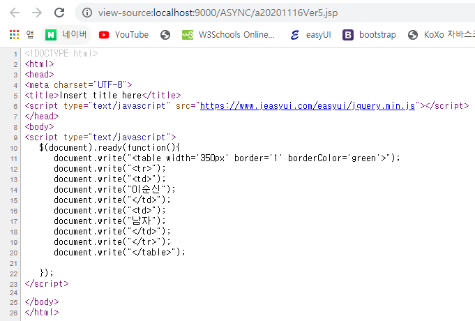
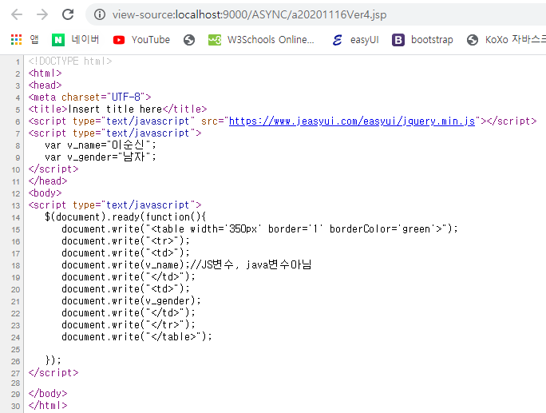

# JAVA변수와 JS변수 사용

## JAVA변수를 사용하면

### 화면


### 소스보기



* 소스에 변수로 작성했던 14, 17번 라인이 결정되어 있는 것을 볼 수 있다.
* 브라우저가 다운로드할때, 값과 태그를 같이 다운로드 하는 것을 알 수 있다.
* 변수들이 먼저 결정된다.

### 코드 : 20201116Ver5

```markup
<%@ page language="java" contentType="text/html; charset=UTF-8"
    pageEncoding="UTF-8"%>
<%
   String v_name="이순신";
   String v_gender="남자";
%>    
<!DOCTYPE html>
<html>
<head>
<meta charset="UTF-8">
<title>Insert title here</title>
<script type="text/javascript" src="https://www.jeasyui.com/easyui/jquery.min.js"></script>
</head>
<body>
<script type="text/javascript">
   $(document).ready(function(){
      document.write("<table width='350px' border='1' borderColor='green'>");
      document.write("<tr>");
      document.write("<td>");
      document.write("<%=v_name%>");
      document.write("</td>");
      document.write("<td>");
      document.write("<%=v_gender%>");
      document.write("</td>");
      document.write("</tr>");
      document.write("</table>");      
   });
</script>
</body>
</html>
```

## JS변수를 사용하면

### 화면


### 소스보기



* 18번, 21번에서 작성한 변수가 결정되어있지 않음을 알 수 있다.

### 코드 : 20201116Ver4

```markup
<%@ page language="java" contentType="text/html; charset=UTF-8"
    pageEncoding="UTF-8"%>
<!DOCTYPE html>
<html>
<head>
<meta charset="UTF-8">
<title>Insert title here</title>
<script type="text/javascript" src="https://www.jeasyui.com/easyui/jquery.min.js"></script>
<script type="text/javascript">
   var v_name="이순신";
   var v_gender="남자";
</script>
</head>
<body>
<script type="text/javascript">
   $(document).ready(function(){
      document.write("<table width='350px' border='1' borderColor='green'>");
      document.write("<tr>");
      document.write("<td>");
      document.write(v_name);//JS변수, java변수아님
      document.write("</td>");
      document.write("<td>");
      document.write(v_gender);
      document.write("</td>");
      document.write("</tr>");
      document.write("</table>");      
   });
</script>
</body>
</html>
```

