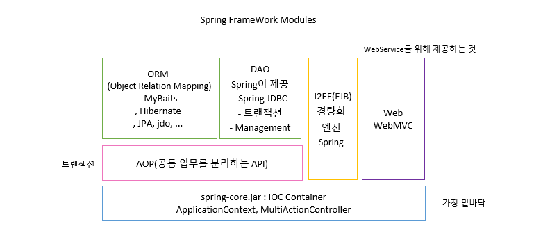

# 73 Days -

### ffffb사용 프로그램

* 사용언어 : JAVA\(JDK\)1.8.0\_261, JS, JQuery, JSP, Servlet, HTML, JSON
* 사용Tool  - Eclipse : Eclipse.org - Toad DBA Suite for Oracle 11.5 - Spring
* 사용 서버 - WAS : Tomcat

## Spring

### Spring Frameworks Modules



## Spring Container\(=엔진, API\) 유형

### 객체를 주입받는 방법 두가지

* spring-core.jar에서 제공해주는 BeanFactory와 ApplicationContext
* spring-core.jar는 Bean을 관리해주는 공장이다. - 공장장 : BeanFactory, ApplicationContext
* Bean을 관리, 필요시 주입하는 역할 - 스프링에게 의존성 주입받는 메서드 : getBean\( \); - 주소번지를 얻는다.

### ApplicationContext

* BeanFactory보다 더 많은 기능을 지원한다.
* 어플리케이션 동작시 Bean이 생성되기를 기다릴 필요가 없어 더 효율적이다.
* Context를 시작시킬때 모든 싱글톤 Bean을 미리 로딩한다.

### 공통점

* Bean을 관리한다.

```markup
<bean id="member-Controller" class="com.xxx.MemberController"/>
```

* Bean의 LifeCycle, 생성과 소멸을 담당한다.

```markup
<bean>
    <property name="listBean"></property>
</bean>
```

* Bean 생성시 필요한 속성을 정의 할 수 있다. - name속성을 정의하는 코드

```java
<Bean id="member-Controller" class="com.xxx.MemberController" 
        init-method="initMethod" destroy-method="destroyMethod"/>
```

* bean의 LifeCycle에 대한 메서드를 호출 할 수 있다. - spring에서도 init\( \) - service\( \) - destory\( \) 메서드를 지원한다.
* init-method : 해당 bean이 초기화된 후 호출되는 메서드
* destory-method : 해당 bean이 소멸되기 전에 호출되는 메서드

### 경로


* Spring Maven안에 저장된다.

### 코드 : ListMainApp.java

```java
package com.mycompany.online;

import java.util.List;
import org.springframework.beans.factory.BeanFactory;
import org.springframework.beans.factory.xml.XmlBeanFactory;
import org.springframework.context.ApplicationContext;
import org.springframework.context.support.ClassPathXmlApplicationContext;
import org.springframework.core.io.FileSystemResource;
import org.springframework.core.io.Resource;

public class ListMainApp {
	
	List<String> listList = null;
	   public void setListList(List<String> listList) {
	      this.listList = listList;
	   }
	   public static void main(String[] args) {
	      ListMainApp lma = new ListMainApp();
	      
	      //ApplicationContext사용시
	      ApplicationContext context = new ClassPathXmlApplicationContext("com\\\\mycompany\\\\online\\\\insaBean.xml");
	      ListController list2 = (ListController)context.getBean("insaBean");
	      for(String insa:list2.listBean) {
	    	  System.out.println(insa);
	      }
	      
	      //BeanFatory사용시
	      Resource resource = new FileSystemResource("C:\\workspace_sts3\\spring3\\src\\main\\java\\com\\mycompany\\online\\insaBean.xml");
	      BeanFactory factory = new XmlBeanFactory(resource);
	      ListController list = (ListController)factory.getBean("insaBean");
	      System.out.println(list.listBean);
	   }
}
```

### Console 출력


### 순제어

```java
 List<String> insaList = null; //선언
 insaList = new ArrayList<>(); //생성, 활동
 insaList.add("안녕");
 insaList.add("안녕하세요");
 insaList.add("기분좋은 하루 되세요");
 for(String insa:insaList) {
  System.out.println(insa);
 }
 insaList = null; 
```

* 순제어는 개발자가 객체의 생성부터 활동, 종료까지도 관리하는 것이다.
* 2번 : 선언
* 3번 : 생성, 활동
* 10번 : Candidate상태, 종료 - 이때 호출되는 것이 destroy메서드이다. 사라지기 전에 호출된다.

