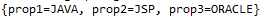
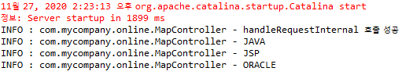

# Spring : Map

## JVM Test

### 코드 : nameBean.xml

```markup
<?xml version="1.0" encoding="UTF-8"?>
<beans 
    xmlns="http://www.springframework.org/schema/beans"
   xmlns:xsi="http://www.w3.org/2001/XMLSchema-instance"
   xsi:schemaLocation="http://www.springframework.org/schema/beans https://www.springframework.org/schema/beans/spring-beans.xsd">
    <bean id="nameBean" class="com.mycompany.online.MapTest"><!-- MapTest안에 정의되어 있다. 의존관계. -->
   		<property name="mapBean">
   			<map>
   				<entry>
   					<key><value>prop1</value></key>
   					<value>JAVA</value>
   				</entry>
   				<entry>
   					<key><value>prop2</value></key>
   					<value>JSP</value>
   				</entry>
   				<entry>
   					<key><value>prop3</value></key>
   					<value>ORACLE</value>
   				</entry>
   			</map>
   		</property>
   </bean>
</beans>
```

### 코드 : MapTest.java

```java
package com.mycompany.online;

import java.util.Map;

//java application에서 test하는 소스
public class MapTest {
		Map<String,String> mapBean = null;
	   public void setMapBean(Map<String, String> mapBean) {
	      this.mapBean = mapBean;
	   }
}
```

### 코드 : MapMainApp.java

```java
package com.mycompany.online;

import org.springframework.context.ApplicationContext;
import org.springframework.context.support.ClassPathXmlApplicationContext;;

public class MapMainApp {
	  
	   public static void main(String[] args) {
	      MapMainApp mma = new MapMainApp();

	      //ApplicationContext사용시 - ioc
	      ApplicationContext context = new ClassPathXmlApplicationContext("com\\mycompany\\online\\nameBean.xml");
	      MapTest mt = (MapTest)context.getBean("nameBean");//nameBean.xml문서에 있는 id값을 파라미터에 적는
	      System.out.println(mt.mapBean);
	   }
}
```

### 결과 : Console



## Web Test

### 코드 : servlet-context.xml

```markup
<?xml version="1.0" encoding="UTF-8"?>
<beans 
    xmlns="http://www.springframework.org/schema/beans"
   xmlns:xsi="http://www.w3.org/2001/XMLSchema-instance"
   xsi:schemaLocation="http://www.springframework.org/schema/beans https://www.springframework.org/schema/beans/spring-beans.xsd">
   <bean id="default-handler-mapping" class="org.springframework.web.servlet.handler.BeanNameUrlHandlerMapping"/>
     
   <bean name="/insaMap.nhn" class="com.mycompany.online.MapController">
   		<property name="mapBean">
   			<map>
   				<entry>
   					<key><value>prop1</value></key>
   					<value>JAVA</value>
   				</entry>
   				<entry>
   					<key><value>prop2</value></key>
   					<value>JSP</value>
   				</entry>
   				<entry>
   					<key><value>prop3</value></key>
   					<value>ORACLE</value>
   				</entry>
   			</map>
   		</property>
   </bean>
   
   <bean id="viewResolver" class="org.springframework.web.servlet.view.InternalResourceViewResolver">
      <property name="prefix">
         <value>/WEB-INF/views/</value>
      </property>
      <property name="suffix">
         <value>.jsp</value>
      </property>
   </bean>  
</beans>
```

### 코드 : MapController.java

```java
package com.mycompany.online;

import java.util.Iterator;
import java.util.Map;
import javax.servlet.http.HttpServletRequest;
import javax.servlet.http.HttpServletResponse;
import org.apache.log4j.Logger;
import org.springframework.web.servlet.ModelAndView;
import org.springframework.web.servlet.mvc.AbstractController;

public class MapController extends AbstractController {
	Logger logger = Logger.getLogger(MapController.class);
	
	Map<String,Object> mapBean = null;//Di하기위해 생성하지 않는다.

	public void setMapBean(Map<String,Object> mapBean) {
		this.mapBean = mapBean;//null이지만 주입이 성공하면 null이 아니다. -> xml가 주입될것
	}
	
	@Override
	protected ModelAndView handleRequestInternal(HttpServletRequest request, HttpServletResponse response)
			throws Exception {
		logger.info("handleRequestInternal 호출 성공");
		ModelAndView mav = new ModelAndView();
		Iterator<String> iter = mapBean.keySet().iterator();
		while(iter.hasNext()) {
			//System.out.println(mapBean.get(iter.next()));
			logger.info(mapBean.get(iter.next()));
		}
		mav.setViewName("di/mapPrint");//.jsp있으면 페이지 호출이 .jsp.jsp로 일어나 오류 발생한다.
		mav.addObject("mapBean", mapBean);
		return mav;
	}
}
```

### 코드 : mapPrint.jsp -View

```markup
<%@ page language="java" contentType="text/html; charset=UTF-8"
    pageEncoding="UTF-8"%>
<%@ page import="java.util.Iterator, java.util.Map" %>
<!DOCTYPE html>
<html>
<head>
<meta charset="UTF-8">
<title>di/mapPrint</title>
</head>
<body>
<!-- servlet-context.xml문서에 ViewResolver를 활용해 응답페이지에 대한
	 url을 완성하는데 설정이 추가된다.
	 접두어 : /WEB_INF/views
	 접미어 : .jsp : mav.setViewName("xxx.jsp");로 작성하면 .jsp가 두번 작성돼 에러가 발생한다.페이지 이름만 작성하자. -->
<%
	Map<String,Object> mapBean = (Map<String,Object>)request.getAttribute("mapBean");
	Iterator<String> iter = mapBean.keySet().iterator();
	while(iter.hasNext()){
		out.print(mapBean.get(iter.next()));
	}
%>
</body>
</html>
```

### 결과 : Web - url test


### 결과 : Console



