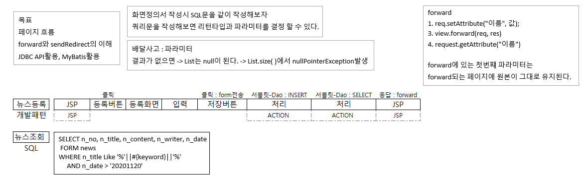

# 68 Days -

### 사용 프로그램

* 사용언어 : JAVA\(JDK\)1.8.0\_261, JS, JQuery, JSP, Servlet, HTML, JSON
* 사용Tool  - Eclipse : Eclipse.org - Toad DBA Suite for Oracle 11.5
* 사용 서버 - WAS : Tomcat

## 필기

### 학습목표

* include의 두 가지 방법에 대해 말하고 코딩 할 수 있다. - 액션태그 : &lt; jsp:include page=" " flush=false /&gt; - 다이렉티브: &lt;%@ include file=" " %&gt;
* forward에 대해서 설명하고 활용할 수 있다. - select - req.setAttribute\(" ", 값\); - req.getAttribute\(" "\);
* ajax에서 제공하는 비동기통신을 활용해 자동갱신 처리를 할 수 있다. --오늘 실습주제
* ajax로 처리하는 경우, include, forward로 처리해야하는 경우를 구분할 수 있다.

### 개발패턴의 종류

1. JSP - JSP
2. JSP - Action - JSP
3. Action - JSP
4. Action - JSP - Action - JSP

### UI협업 : include

* 화면의 템플릿을 패턴화 해서 분업이 가능하게 한다. - main, header, footer, menu, ..... - 화면의 모듈화

## 뉴스 : 준비

### 학습목표

* 페이지의 흐름을 이해한다.
* forward와 sendRedirect를 상황에 맞게 사용한다.
* JDBC와 MyBatis를 활용해 DB연동을 구현해본다.
* UI는 include를 활용해 모듈화한다.

### 기능

* 뉴스 등록
* 뉴스 목록 조회\(조건검색\)
* 뉴스 정보 수정
* 뉴스 삭제

### 개발패턴, sql 작성 : 등록, 조회



* 코드를 작성하기 전에 내가 처리할 업무에대한 설계와 sql문을 미리 작성해본다.
* 뉴스등록 업무의 개발패턴은 JSP - Action - Action - JSP로 이뤄진다. - jsp에서 url로 서블릿에게 요청하고,  서블릿에서 insert 결과가 1이 나오면 sendRedirect로 서블릿에게 조회를 요청하고,  서블릿에서 select 결과인 list를 req에 담아 forward로 응답 JSP가 응답화면을 그린다.
* 뉴스 조회같은 sql문에는 where절에 조건으로 무엇을 사용할 것인지에 대해서도 생각해봐야한다.

### 전체 흐름 순서도


* 수많은 요청중에서 .kos로 끝나는 모든 요청들은 서버가 인터셉트해 서블릿을 실행시킨다.
* 이 여러 요청들을 서블릿에서 if문을 사용해 구분한다. 업무가 다양할수록 if문이 길어진다. 공통코드를 빼서 인터페이스로 구현할 수 없을까?
* 또 주의깊게 봐야하는 부분은 응답이 JSP에서 이뤄지는 부분이다. 서블릿에서 java의 클래스들을 거쳐 처리된 정보를 forward로 request에 담아 JSP가 받게 되는데, 이렇게 forward의 request로 넘겨진 data는 원본이라는 것이다.
* 서블릿에서는 req.setAttirubute\("이름", 값\) JSP에서는 request.getAttribute\("이름", 값\) : Object 리턴타입이 오브젝트이므로 반드시 캐스팅연산자를 이용한 형전환이 이뤄져야 한다.

### 클래스, 메서드 정의서, 요청url


* Java에서 구현해야하는 클래스를 정의한다.
* 여기서 봐야하는 것은 Logic에서 forward를 사용하는 메서드는 select를 하는 메서드들이고, sendRedirect를 사용하는 메서드들은 테이블에 변화를 일으키는 역할이라는 것이다.
* select된 결과값은 보통 List&lt;Map&gt;, List&lt;VO&gt;이다.  화면에 보여줘야하므로  forward를 통해 data를 유지시켜줘야 한다.
* 하지만, 테이블에 변화를 일으키는 sql문들의 결과값은 data가 아닌 1또는 0이다. data를 넘길 필요가 없으니 서블릿안에서 처리된 결과를 가지고 if문을 사용해 1이면 다음 페이지를,  0이면 오류페이지를 보여준다던지 이렇게 처리할 수 있을 것이다.
* Dao는 DB연동과 sql문을 관리한다. Logic은 업무에 따라 필요한 Dao의 메서드를 호출한다.
* Controller 클래스에는 Logic클래스가, Logic클래스에는 Dao클래스가 인스턴스화 되어야 한다.

### 상세 순서도 : 등록


* 사용자로부터 입력받은 값은 쿼리스트링으로 서블릿에 요청을 보낸다.
* 서블릿에서 요청을 구분해 필요한 자바 Logic클래스를 호출한다.
* Dao에서 myBatis를 사용해 sql문을 DB에 요청하고, DB에서 insert문 결과로 0, 1을 내보낸다.
* 성공시 sendRedirect로 서블릿에게 조회를 요청한다.
* 다시 Dao에서 myBatis를 사용해 select결과로 List를 반환해주면, 
* Servlet은 forward함수를 사용해 요청 data를 유지하고, jsp는 그 값을 받아 응답화면을 출력한다.

## 뉴스 : 테이블생성 - Toad

### 테이블 생성 : Toad

```sql
create table news
(
n_no number(5) constraints news_no_pk primary key 
,n_title varchar2(100) not null
,n_content varchar2(4000)
,n_date varchar2(30)
,n_writer varchar2(30)
)
```

* 어떤 항목들을 다룰 것인지, 컬럼명, 타입, 크기, PK등을 고려해 테이블을 생성한다.

### 테이블 script확인

```sql
DROP TABLE SCOTT.NEWS CASCADE CONSTRAINTS;
```

* 생성된 테이블의 script에 들어가보면 이런 제약조건이 자동 생성되어 있음을 볼 수 있다.
* 테이블 드랍\(삭제\)에 관한 제약 조건인데, CASCADE옵션은 테이블 삭제시 포링키로 물려 있는 다른 테이블까지도 삭제해버리는 옵션이므로 주의하자.

```sql
CREATE UNIQUE INDEX SCOTT.NEWS_NO_PK ON SCOTT.NEWS
(N_NO)
```

* 또 밑에 보면 index도 자동 생성된 것을 볼 수 있다.
* PK는 자동적으로 index를 갖게된다.

### 시퀀스 생성하기 : PK, 뉴스번호


* 시퀀스는 메뉴 중에 스키마 브라우저 항목에서 생성할 수 있다.
* Next Value : 몇개씩 숫자를 올릴 것인지
* Min Value : 시작 값, 최소값
* Max Value : 최대 값

### row 추가하기

```sql
insert into news values(seq_news_no.nextval, '제목', '기사내용'
                                ,to_char(sysdate,'YYYY-MM-DD'), '기자이름')
```

* 테이블에 data를 추가할때에는 관계형DB인 오라클의 경우에는 특히 스키마를 맞춰야한다.
* not null인 컬럼data는 비어있으면 안되고, 컬럼의 타입과 data의 타입도 맞아야 한다.
* 추가 SQL : INSERT INTO 테이블이름 VALUES\('값', '값', ...\)
* 여기서 확인할 것은, 우리가 PK로 사용할 뉴스 번호는 시퀀스를 사용한다는 것이다. 생성한 시퀀스 이름.nextval 시퀀스 다음 번호를 data로 넣는다.

## 뉴스 : 코드

### 코드 작성시

* 요청을 서블릿에서 분리하다보면 if문으로 경우를 너무 많이 나눠야 하는 상황이 발생한다. 코드가 길어져 분석이 어려워지고, 직관적이지 않은 코드가 된다.
* 자체적으로 반복되는 코드나, 합칠 수 있는 부분을 직접 합친다. 자동화 프로그램을를 같이 사용한다\(IoC\). ex\) Spring F/W

### 전체조회, 상세조회

* Q. 서블릿과 logic의 메서드를 하나로 합칠것인가 나눠야 할까?
* A. 목적에 따라 다르다. - 관리 : 나눠야한다. - 코드 경량 : 합친다.
* Servlet에서 받은 요청은 분리하고, Logic클래스에서는 동일한 메서드를 호출하자.
* 파라미터로 조건을 구분하면 된다. - 전체조회는 0과같은 의미없는 값을 파라미터로 넘겨 전체 select하게 하고, - 상세조회는 화면에서 사용자로부터 입력받은 조건값을 파라미터로 넘겨 조건 select하게 한다.
* FrontController.java\(Servlet\) - getNewsList\( \), getNewsDetail\( \)
* NewsLogic - geNewsList\( \)

## 코드 : 자동갱신 - position속성, Interval함수

### CSS : position속성과 absolute

```markup
<head>
<style type="text/css">
	div #d_news{
		position: absolute;
	}
</style>
</head>
```

* 뉴스목록이 자동으로 갱신될때마다 자동으로 html의 지정된 &lt;div&gt;태그의 위치에 목록이 들어오려면 좌표가 필요하다.
* CSS에서 좌표값으로 접근할 수 있게 해주는 속성을 지원한다. - position: absolute

### setInterval\( , \)

```markup
<body>
<script type="text/javascript">
	$(document).ready(function(){
		function start(){
			watch = setInterval(autoReload, 3000)//함수이름, 시간정보ms(3초)
		}
		start();
	});
</script>
</body>
```

* **setInterval\(, \)** : 일정 시간 간격으로 함수를 실행하는 함수
* 첫번쨰 파라미터 : 시간정보가 될때마다 호출할 콜백메서드 이름
* 두번째 파라미터 : 메서드를 호출할 시간정보, 단위는 ms
* 3초마다 autoReload라는 함수를 실행한다.

### setTimeout\( , \), clearInterval

```markup
<body>
<script type="text/javascript">
	$(document).ready(function(){
		function stop(){
			setTimeout(function(){
				clearInterval(watch);
			}, 10000);
		}
		start();
		stop();//stop을 호출하지않으면 무한루프
	});
</script>
</body>
```

* 무한루프를 방지하기위해  stop함수도 있어야한다.
* **setTimeout\( , \)** : 일정 시간이 지난 후에 함수를 한번만 실행하는 함수
* 첫번쨰 파라미터 : 시간정보가 될때마다 호출할 콜백메서드 이름 - 여기서는 함수안에 함수를 정의했다. 함수이름을 넣거나, 함수를 구현하거나
* 두번째 파라미터 : 함수를 실행할 시간정보, 단위는 ms
* **clearInterval\( \)** : 진행중인 함수를 멈추는 함수
* 파라미터 : 멈출 함수이름
* stop함수를 호출하면, 진행되던 watch가 10후에 중지된다,

### sample코드 : 뉴스 목록 자동갱신

