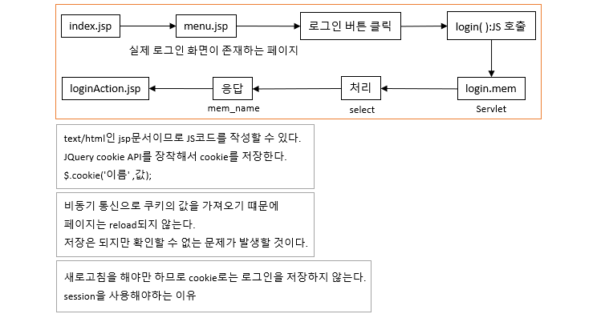
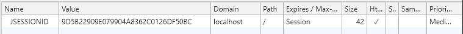
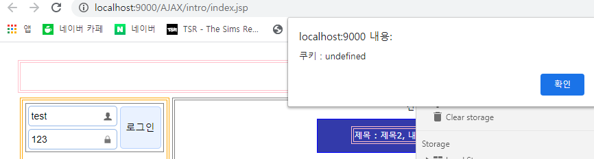
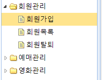
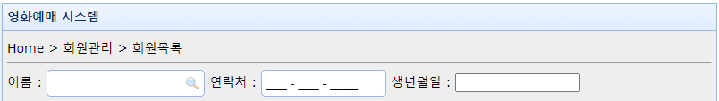

# 70 Days - 로그인, 로그아웃 : cookie(JS), session, hode, show, easyUI : tree, maskedbox

### 사용 프로그램

* 사용언어 : JAVA(JDK)1.8.0\_261, JS, JQuery, JSP, Servlet, HTML, JSON
* 사용Tool  - Eclipse : Eclipse.org - Toad DBA Suite for Oracle 11.5
* 사용 서버 - WAS : Tomcat

## 복습 : Login

### 로그인 구현 방법

* 1 : 표준서블릿을 이용한 모델1, xxx.jsp
* 2 : 사용자 정의 서블릿을 이용하는 모델2, xxx.mem
* 공통점 : HttpServlet, 서블릿을 사용한다.

### 필요 사항

* 로그인시 url이 변하지 않고, 사용자에게 맞는 화면이 부분 제공되어야 한다.
* 비동기 통신(ajax)와 변수를 사용해야한다.
* 프로시서저를 호출한 결과에 대한 값을 화면에 전달한다.\
  \- 변수 : 회원이름
* 화면까지 값을 유지, 전달해야한다.\
  \- forward
* 로그인 정보를 유지하기 위해 cookie를 사용할까 session을 사용할까?

## 로그인, 로그아웃 : session과 cookie

### 로그인 : session과 cookie



* 비동기 통신을 이용할 것이기때문에 페이지가 reload되기 전에는 브라우저에서 쿠키를 확인할 수 없다.
* 브라우저가 페이지를 다운로드해야 읽어올 수 있는데, 다운로드가 이뤄지지 않으면 쿠키는 local에는 저장되겠지만 브라우저는 이 쿠키를 반영할 수 없다.
* 로그인에 필요한 정보들은 보안에 민감한 비밀번호나 개인정보가 들어가기때문에 cookie보다는 상대적으로 보안이 지켜지는 session에 저장하는 것이 좋겠다.

### 서버의 사용자 식별



* 서버가 사용자마다 session id를 부여해 식별한다.
* 클라이언트는 cookie안에 session id를 내려받아 text로 갖는다.
* 개발자 도구로 application의 Cookies에 seesion id가 있는데 Domain이 localhost인 것을 볼 수 있다.\
  \- Domain : cookie가 생성된곳

### Session

* 서버가 관리한다.
* 캐시 메모리에 저장된다.\
  \- 캐시메모리 제조사 : AMD, Intel
* 캐시메모리는 공간이 작기때문에 저장할 수 있는 정보가 한정적이다.\
  \- FIFO, 휘발성 
* 서버에서 관리해 보안이 엄격해 접근하기 어렵다.

### Session 삭제 : 로그아웃

* 전체 삭제 : session.invalidate( );
* 부분 삭제 : session.removeAttribute('이름')

### Cookie

.png>)

* 클라이언트(local)에서 text로 관리한다.\
  \- 사용자의 local pc에 저장된다.
* cookie는 응답을 통해 생성된다.\
  \- response객체가 있어야한다.\
  \- 반드시 응답을 내보내야하는데, 응답처리는 클라이언트에서도, 서버측에서도 처리할 수 있다.
* JS로 관리할 수 있다.\
  \- JQuery cookie API
* 노출되어도 괜찮은, 대용량이 될 수 있는 정보를 담는데 사용한다.\
  \- 장바구니, 찜한상품, 좋아요, 오늘하루 보지 않기, ...
* 클라이언트에서 관리되는 것들은 서버측에서 접근, 호출, 처리하려면 반드시 응답처리가 되어있어야(결정되어있어야)한다.
* 하지만 JS는 클라이언트 local에 이미 다운로드 되어있으므로 JS로 cookie에 접근하는 것은 자유롭다.\
  단, 브라우저가 새로운 것을 반영하려면 페이지가 새로 다운로드되어야 하므로(정적이므로) 브라우저는 페이지가 리로드 되어야 변경, 생성된 쿠키를 인식할 수 있다.\
  \- JS : location.reload( );\
  \- 서버측에 다시 요청을 시도하는 행위

### cookie : 서버와 브라우저



* 위 이미지는 맞는 id와 pw를 입력하고 로그인을 입력 한 뒤의 alert이다.
* 로그인 부분이 갱신되지 않았기 때문에 local에는 '김유신'이라는 cookie가 저장되었지만, 브라우저에서는 cookie를 찾아 볼 수 없다.
* alert의 확인을 클릭하면 로그인 부분이 부분갱신되고, 그때 쿠키를 확인할 수 있게 된다.

.png>)

* 새로운 로그인으로 local에는 쿠키가 '이성계'라는 값으로 변경되었지만 역시 브라우저는 갱신되기 전에는 인식하지 못한다. 이전 쿠키의 값 '김유신'을 보여주고 있다.

### 로그인정보를 JS로 cookie에 유지하기


[js-cookie.md](js-cookie.md)


### 로그아웃 구현

* cookie를 삭제한다.
* show( ), hide( )함수를 사용한다.\
  \- 로그인 화면, 로그인 성공 화면을 구현한다.\
  \- 로그인 시 성공하면 로그인 화면을 hide, 성공 화면을 show\
  \- 로그아웃 시 로그인 화면을 show, 성공 화면을 hide한다.

## easyUI API

### tree : 화면



### tree : 코드

```markup
<!---------------- [[ 메뉴트리 영역 ]] -------------------->
			<ul id="tre_movie" class="easyui-tree">
				 <li data-options="state:'closed'">
                 	<span>회원관리</span>
                 		<ul>
                            <li>
                                <span>회원가입</span>
                            </li>
                            <li>
                                <span>회원목록</span>
                            </li>
                            <li>
                                <span>회원탈퇴</span>
                            </li>
                        </ul>
                 </li>
				 <li data-options="state:'closed'">
                 	<span>예매관리</span>
                 </li>
				 <li data-options="state:'closed'">
                 	<span>영화관리</span>
                 </li>
			</ul>
		<!---------------- [[ 메뉴트리 영역 ]] -------------------->
```

### maskedbox : 화면



### maskedbox : 코드

```markup
    <div data-options="region:'center',title:'영화예매 시스템'" style="padding:5px;background:#eee;">
    	<div style="margin:4px 0;"></div>
    	<!-- 시스템 메뉴 단계 시작 -->
		Home > 회원관리 > 회원목록
		<hr>
		<!------------------- [[ 콘텐츠 추가  ]] ------------------->
		<!------------------- [[ 조건검색 추가  ]] ------------------->
		<label>이름 : </label>
		<input id="sb_name" class="easyui-searchbox"/>
		<label>연락처 : </label>
		<input class="easyui-maskedbox" mask="999 - 999 - 9999" style="width:140px"/>
		<label>생년월일 : </label>
		<input id="db_birth" class="easyui-datedbox" style="width:140px"/>	
```

###

###
