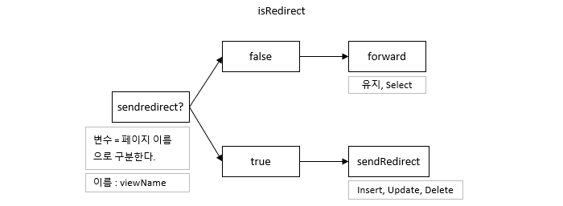

# 71 Days -

### 사용 프로그램

* 사용언어 : JAVA\(JDK\)1.8.0\_261, JS, JQuery, JSP, Servlet, HTML, JSON
* 사용Tool  - Eclipse : Eclipse.org - Toad DBA Suite for Oracle 11.5
* 사용 서버 - WAS : Tomcat

## 복습

### 페이지 이동

* forward - data가 유지되어야 하는 페이지 이동에 사용한다. - select - req.setAttribute, RequsetDispatcher와 함께 사용된다.
* sendRedirect - data가 유지되지 않아도 되는 페이지 이동에 사용한다. - insert, update, delete

## 온라인 시험 솔루션\(POJO F/W\) 설계 - Step1

### 전체 설계 분석

1. MVC패턴에 대한 설계\(POJO F/W\)
2. DB설계
3. 화면정의서
4. 디자인\(bootstrap - 반응형\)

### 기존 방식

* 자바 기반으로 어플리케이션을 개발할 때 자바 객체를 생성하고 서로간의 의존 관계를 연결시키는 작업에 대한 제어권은 보통 개발되는 어플리케이션에 있다.

## Part1 : Interface

### Action.java

* doGet메서드와 doPost메서드를 doService메서드안에서 한번에 처리한다. - Controller의 execute메서드를 정의해 구분한다.
* 리턴타입을 void가 아닌 Object를 사용한다. - Controller의 execute메서드의 타입은 ActionForward클래스다. - 그러므로 execute의 리턴타입도 ActionForward클래스여야 한다. - ActionForward클래스는 getter, setter를 담당하는 클래스다.

### Action.java : 코드

```java
package mvc1.online;

import java.io.IOException;
import javax.servlet.ServletException;
import javax.servlet.http.HttpServletRequest;
import javax.servlet.http.HttpServletResponse;

public interface Action {
	
	public ActionForward execute(HttpServletRequest request, HttpServletResponse response)
			throws ServletException, IOException;
	
}
```

### returnType

* doGet과 doPost는 메서드를 오버라이드 하는 것이므로 void를 사용할 수 밖에 없지만, 우리가 만든 Interface의 메서드 execute는 returnType이 ActionForward클래스\(object\)이다.

### Interface를 직접 만드는 이유

* 재사용성을 높이기 위함
* 파라미터나 returnType을 자유롭게 사용하기 위함
* 프레임 워크의 원리를 알아보기 위함

## Part2 : 요청 접수 Servlet

### FrontMVC1.java

* 모든 요청을 받는 Servlet
* web.xml - url : \*.test
* 페이지 이동에 대한 코드를 작성한다.

### FrontMVC1.java : 

```java
package mvc1.online;

import java.io.IOException;
import javax.servlet.RequestDispatcher;
import javax.servlet.ServletException;
import javax.servlet.http.HttpServlet;
import javax.servlet.http.HttpServletRequest;
import javax.servlet.http.HttpServletResponse;
import org.apache.log4j.Logger;

public class FrontMVC1 extends HttpServlet {
	Logger logger = Logger.getLogger(FrontMVC1.class);
	MemberController memCtrl = new MemberController();	

	public void doService(HttpServletRequest req, HttpServletResponse res) 
			throws ServletException, IOException{
		logger.info("doService 호출성공");
		ActionForward af = null;
		
		if("") {
			af = memCtrl.execute(req, res);
		}		
		//MemberController에서 객체주입을 받아온다. 그래야  null이 아닐것이므로
		//viewName은 누가 어디서 결정해야 할까? 
		//어떻게 가져오지? ActionForward의 getter로
		if(af!=null) {//af가 null이면 NullPointerException발생
			if(af.isRedirect()) {
				res.sendRedirect(af.getViewName());
			}else {
				RequestDispatcher view = req.getRequestDispatcher(af.getViewName());
				view.forward(req, res);
			}
		}
	}//////////////////////////end of doService
	
	@Override
	public void doGet(HttpServletRequest req, HttpServletResponse res) 
		throws ServletException, IOException{
			doService(req,res);
		}
	
	@Override
	public void doPost(HttpServletRequest req, HttpServletResponse res) 
		throws ServletException, IOException{
			doService(req,res);
	}
}
```

### 회원관리 Controller Servlet : MemberLogic.java

```java
package mvc1.online;

import java.io.IOException;
import javax.servlet.ServletException;
import javax.servlet.http.HttpServlet;
import javax.servlet.http.HttpServletRequest;
import javax.servlet.http.HttpServletResponse;
import org.apache.log4j.Logger;

public class MemberController extends HttpServlet implements Action {
	Logger logger = Logger.getLogger(MemberController.class);

	@Override
	public ActionForward execute(HttpServletRequest req, HttpServletResponse res)
			throws ServletException, IOException {		
		//returntype이 ActionForward 이여야하는데 ActionForward는 서블릿이므로 싱글톤이다.
		//인스턴스화는 null방지용
		ActionForward af = new ActionForward();
		return af;
	}
}
```

* FrontMVC1에서 Servlet을 주입받아 사용할 수 있으므로 굳이 HttpServlet을 상속받지 않아도된다.
* Action인터페이스의 execute메서드를 오버라이드 \(재정의\)해서 사용한다.

## Part3 : getter, setter

### ActionForward.java



* 페이지 이름을 받아와 forward할것인지, sendRedirect할 것인지 결정한다.
* getter, settet - viewName :  페이지 이름   기본값은 null - isRedirect : 페이지 이동 방식   접두어 is는 return Type이 boolean이라는 것이다.   true면 sendRedirect, false면 forward를 사용한다.  기본값은 false

### ActionForward.java : 코드

```java
package mvc1.online;

public class ActionForward {
	private String viewName = null;
	private boolean isRedirect = false;
	
	public String getViewName() {
		return viewName;
	}
	public void setViewName(String viewName) {
		this.viewName = viewName;
	}
	
	public boolean isRedirect() {
		return isRedirect;
	}
	public void setRedirect(boolean isRedirect) {
		this.isRedirect = isRedirect;
	}
}
```

## Part4 : Servlet, Controller 조립

### src

* Servlet : FrontMVC1.java
* Controller : MemberController.java

### 키워드

* **DI** - 의존성 주입\(Dependency Injection\)
* **Ioc** - 제어역전 - 외부에서 제어하는 것 - Spring F/W, Tomcat, JDK, Android   제어역전을 할 수 있는 프로그램들 - Action.java\(Interface:execute\(req,res\)\)를 외부에서 주입받는 것이다.   returnType:ActionForward   이 반환 값으로 redirect, forward한다.

### URL

* url : /업무명/업무내용명.test
* ActionForward의 viewName을 url에서 가져와 결정한다.
* url을 배열로 substring을 사용해 분리한다. - upmu\[0\]=업무명, upmu\[1\]=업무내용명

### URL분리 하기

* String uri = req.getRequestURI\( \):String - URL에서 URI만 가져온다. 도메인 다음 주소
* String context = req.getContextPath\( \):String - server.xml에 등록된 Context의 path를 가져온다. - 루트경로 = 프로젝트이름, /
* String command = uri.substring\(context.length\( \)+1\); - uri의 제일 앞에 붙는 '/'를 잘라내 나머지를 가져온다. - split에서 '/'를 기준으로 분리해야하는데 맨앞의 '/'를 없애야 두개로 분리되므로 - split에서 0부터 가져오면 된다.
* int end = command.lastIndexof\('.'\); - split의 끝나는 자리를 찾아야한다. - uri의 업무내용명 뒤에 붙는 .test의 위치를 담는다. 정확히는 .의 위치
* command = command.substring\(0,end\)
* upmu\[ \] = command.split\("/"\);




