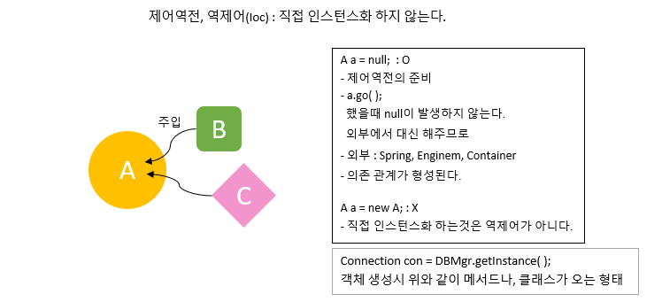
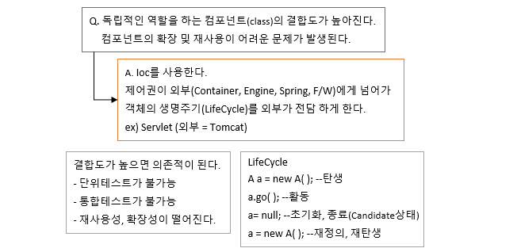
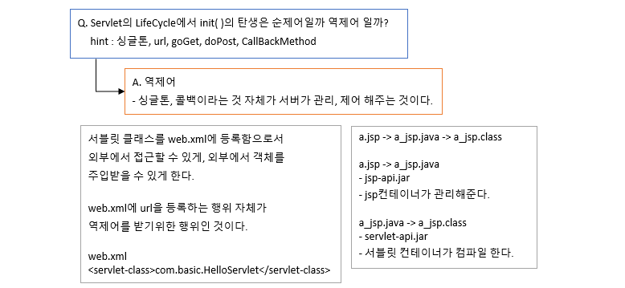

# 71 Days - DI, Ioc, 온라인시험솔루션1, Interface, servlet:req,res주입,  url자르기, getter-setter, 클래스 조립

### 사용 프로그램

* 사용언어 : JAVA(JDK)1.8.0\_261, JS, JQuery, JSP, Servlet, HTML, JSON
* 사용Tool  - Eclipse : Eclipse.org - Toad DBA Suite for Oracle 11.5
* 사용 서버 - WAS : Tomcat

## 복습

### 페이지 이동

* forward\
  \- data가 유지되어야 하는 페이지 이동에 사용한다.\
  \- select\
  \- req.setAttribute, RequsetDispatcher와 함께 사용된다.
* sendRedirect\
  \- data가 유지되지 않아도 되는 페이지 이동에 사용한다.\
  \- insert, update, delete

## IoC(역제어)

### 역제어(Ioc)



### 기존 순제어

.png>)

### Q1. 순제어 경우의 결합도



### Q2. Servlet은 역제어일까?



### 결론

.png>)

* 프레임워크를 활용해 웹 개발을 하는 경우, \
  게임 엔진을 활용해 개발을 진행하는 경우
* 공통점은 의존성 주입이 발생하는 제어역전을 통해 객체의 라이프 사이클이 관리되므로 자원관리의\
  책임이 개발자가 아닌 컨테이너에게 넘어가 개발자의 부담을 덜어준다는 것이다.
* 따라서 서버가 xml문서를 분석하는 것이 선행 조건이 되어야 한다.\
  이때 인터페이스나 추상클래스의 형태로 메서드 이름을 결정지어준다.
* 이 과정 덕분에 구현 메서드의 이름이 통일되고, 동일한 리턴타입, 파라미터를 갖게되므로 개발자의\
  경력에 따른 기술 편차를 줄여줄 수 있어 많이 활용된다.

## 온라인 시험 솔루션(POJO F/W) 설계 - Step1

### 전체 설계 분석

1. MVC패턴에 대한 설계(POJO F/W)
2. DB설계
3. 화면정의서
4. 디자인(bootstrap - 반응형)

### 기존 방식

* 자바 기반으로 어플리케이션을 개발할 때 자바 객체를 생성하고 서로간의 의존 관계를 연결시키는 작업에 대한 제어권은 보통 개발되는 어플리케이션에 있다.

## Part1 : Interface

### Action.java

* doGet메서드와 doPost메서드를 doService메서드안에서 한번에 처리한다.\
  \- Controller의 execute메서드를 정의해 구분한다.
* 리턴타입을 void가 아닌 Object를 사용한다.\
  \- Controller의 execute메서드의 타입은 ActionForward클래스다.\
  \- 그러므로 execute의 리턴타입도 ActionForward클래스여야 한다.\
  \- ActionForward클래스는 getter, setter를 담당하는 클래스다.

### Action.java : 코드

```java
package mvc1.online;

import java.io.IOException;
import javax.servlet.ServletException;
import javax.servlet.http.HttpServletRequest;
import javax.servlet.http.HttpServletResponse;

public interface Action {
	
	public ActionForward execute(HttpServletRequest request, HttpServletResponse response)
			throws ServletException, IOException;
	
}
```

### returnType

* doGet과 doPost는 메서드를 오버라이드 하는 것이므로 void를 사용할 수 밖에 없지만,\
  우리가 만든 Interface의 메서드 execute는 returnType이 ActionForward클래스(object)이다.

### Interface를 직접 만드는 이유

* 재사용성을 높이기 위함
* 파라미터나 returnType을 자유롭게 사용하기 위함
* 프레임 워크의 원리를 알아보기 위함

## Part2 : 요청 접수 Servlet

### FrontMVC1.java

* 모든 요청을 받는 Servlet
* web.xml - url : \*.test
* 페이지 이동에 대한 코드를 작성한다.

### doService(HttpServlet req, HttpServlet res)

* doService( )메서드는 표준 서블릿에서 제공되는 서블릿이 아니다.
* @Override라는 어노테이션은 사용할 수 없다.\
  \- 어노테이션도 컴파일 대상이기때문에 문법오류가 발생한다.
* 그렇다면 파라미터의 req, res는 누구로부터 주입받아 사용할 수 있는 것일까?\
  \- doGet, doPost로부터 받는다.

### 서블릿의 req,res주입 - methodA( )

```java
public class FrontMVC1 extends HttpServlet {
			public void methodA(HttpServletRequest req, HttpServletResponse res) 
						throws ServletException, IOException{

					res.sendRedirect("/index.jsp");//NullPointerException
				}
	}
```

* 메서드의 앞에는 소유주가 위치한다.\
  \- 소유주.메서드( );
* 파라미터 안에 선언된 변수는 메서드 내부에서 초기화 하지않거나 외부에서 주입되지 않으면 null이다.
* 위 메서드는 표준서블릿에서 Override하여 재정의한 메서드가 아니므로 서버에게서 객체를 주입받을 수 없다.
* res객체를 주입받지 못하는 메서드이므로 문법오류는 발생하지 않지만 NullPointerExceoption이 발생한다.
* 선언된 지역변수 req와 res가 null이므로

### 서블릿 테스트 : try-catch

* 서블릿은 throws를 사용해 예외처리를 모두 호출하는 곳으로 넘겨버리기때문에 테스트할때에 에러를 쉽게 확인할 수 없다.
* 테스트할 서블릿 구문을 try-catch안에 넣어 e.printStackTrace( );함수를 작성하면 에러코드를 볼 수 있다.

### FrontMVC1.java : 서블릿

```java
package mvc1.online;

import java.io.IOException;
import javax.servlet.RequestDispatcher;
import javax.servlet.ServletException;
import javax.servlet.http.HttpServlet;
import javax.servlet.http.HttpServletRequest;
import javax.servlet.http.HttpServletResponse;
import org.apache.log4j.Logger;

public class FrontMVC1 extends HttpServlet {
	Logger logger = Logger.getLogger(FrontMVC1.class);
	MemberController memCtrl = new MemberController();	

	public void doService(HttpServletRequest req, HttpServletResponse res) 
			throws ServletException, IOException{
		logger.info("doService 호출성공");
		ActionForward af = null;
		
		if("") {
			af = memCtrl.execute(req, res);
		}		
		//MemberController에서 객체주입을 받아온다. 그래야  null이 아닐것이므로
		//viewName은 누가 어디서 결정해야 할까? 
		//어떻게 가져오지? ActionForward의 getter로
		if(af!=null) {//af가 null이면 NullPointerException발생
			if(af.isRedirect()) {
				res.sendRedirect(af.getViewName());
			}else {
				RequestDispatcher view = req.getRequestDispatcher(af.getViewName());
				view.forward(req, res);
			}
		}
	}//////////////////////////end of doService
	
	@Override
	public void doGet(HttpServletRequest req, HttpServletResponse res) 
		throws ServletException, IOException{
			doService(req,res);
		}	
	@Override
	public void doPost(HttpServletRequest req, HttpServletResponse res) 
		throws ServletException, IOException{
			doService(req,res);
	}
}
```

### 회원관리 Controller : MemberController.java

```java
package mvc1.online;

import java.io.IOException;
import javax.servlet.ServletException;
import javax.servlet.http.HttpServlet;
import javax.servlet.http.HttpServletRequest;
import javax.servlet.http.HttpServletResponse;
import org.apache.log4j.Logger;

public class MemberController extends HttpServlet implements Action {
	Logger logger = Logger.getLogger(MemberController.class);

	@Override
	public ActionForward execute(HttpServletRequest req, HttpServletResponse res)
			throws ServletException, IOException {		
		//returntype이 ActionForward 이여야하는데 ActionForward는 서블릿이므로 싱글톤이다.
		ActionForward af = null;
		String viewName = null;
		boolean isRedirect = false;
		viewName = "/onLineTest/index.jsp";
		isRedirect = true;
		//VO역할을 해주는 ActionForward클래스에게 값을 set해준다.
		//이 과정이 없으면 서블릿에서 af를 사용할때 nullPointerException이 발생한다.
		af.setRedirect(isRedirect);
		af.setViewName(viewName);
		return af;
	}
}
```

* FrontMVC1에서 Servlet을 주입받아 사용할 수 있으므로 굳이 HttpServlet을 상속받지 않아도된다.
* Action인터페이스의 execute메서드를 오버라이드 (재정의)해서 사용한다.

### ActionForward에 값 담기

* 위 컨트롤러에서 25, 26번라인이 없다면 isRedirect의 기본값은 false이므로 서블릿에서 sendRedirect를 사용할 수없고, forward로 넘어간다.
* forward를 사용하기위해 ActionForward에서 viewName을 가져와 페이지이름으로 사용하는데, viewNmae이 nulll이므로 nullPointerException이 발생하므로 주의하자

### web.xml

```markup
<!-- online test -->
	<servlet>
		<servlet-name>MVC1</servlet-name>
		<servlet-class>mvc1.online.FrontMVC1</servlet-class>
	</servlet>
	<servlet-mapping>
		<servlet-name>MVC1</servlet-name>
		<url-pattern>*.test</url-pattern>
	</servlet-mapping>
```

## Part3 : getter, setter

### ActionForward.java


* 페이지 이름을 받아와 forward할것인지, sendRedirect할 것인지 결정한다.
* getter, settet\
  \- viewName :  페이지 이름\
    기본값은 null\
  \- isRedirect : 페이지 이동 방식\
    접두어 is는 return Type이 boolean이라는 것이다.\
    true면 sendRedirect, false면 forward를 사용한다.\
   기본값은 false

### ActionForward.java : 코드

```java
package mvc1.online;

public class ActionForward {
	private String viewName = null;
	private boolean isRedirect = false;
	
	public String getViewName() {
		return viewName;
	}
	public void setViewName(String viewName) {
		this.viewName = viewName;
	}
	
	public boolean isRedirect() {
		return isRedirect;
	}
	public void setRedirect(boolean isRedirect) {
		this.isRedirect = isRedirect;
	}
}
```

## Part4 : Servlet, Controller 조립

### src

* Servlet : FrontMVC1.java
* Controller : MemberController.java

### 키워드

* **DI**\
  ****- 의존성 주입(Dependency Injection)
* **Ioc**\
  ****- 제어역전\
  \- 외부에서 제어하는 것\
  \- Spring F/W, Tomcat, JDK, Android\
    제어역전을 할 수 있는 프로그램들\
  \- Action.java(Interface:execute(req,res))를 외부에서 주입받는 것이다.\
    returnType:ActionForward\
    이 반환 값으로 redirect, forward한다.

### URL

* url : /업무명/업무내용명.test
* ActionForward의 viewName을 url에서 가져와 결정한다.
* url을 배열로 substring을 사용해 분리한다.\
  \- upmu\[0]=업무명, upmu\[1]=업무내용명

### URL분리 하기

* String uri = req.getRequestURI( ):String\
  \- URL에서 URI만 가져온다. 도메인 다음 주소
* String context = req.getContextPath( ):String\
  \- server.xml에 등록된 Context의 path를 가져온다.\
  \- 루트경로 = 프로젝트이름, /
* String command = uri.substring(context.length( )+1);\
  \- uri의 제일 앞에 붙는 '/'를 잘라내 나머지를 가져온다.\
  \- split에서 '/'를 기준으로 분리해야하는데 맨앞의 '/'를 없애야 두개로 분리되므로\
  \- split에서 0부터 가져오면 된다.
* int end = command.lastIndexof('.');\
  \- split의 끝나는 자리를 찾아야한다.\
  \- uri의 업무내용명 뒤에 붙는 .test의 위치를 담는다. 정확히는 .의 위치
* command = command.substring(0,end)
* upmu\[ ] = command.split("/");


[untitled-25](untitled-25/)


### 코드 : url분리 - FrontMVC1.java

```java
public void doService(HttpServletRequest req, HttpServletResponse res) 
			throws ServletException, IOException{
		ActionForward af = null;
		
		String uri = req.getRequestURI();//member/memberList.test
		String context = req.getContextPath();//dev_html, /
		String command = uri.substring(context.length()+1);
		//logger.info(command);
		int end = command.lastIndexOf(".");
		//logger.info(end);
		command = command.substring(0, end);
		//logger.info(command);
		String upmu[] = null;
		upmu = command.split("/");
		for(String str:upmu) {
			logger.info(str);
		}
```

* 테스트 url\
  \- local:9000/member/memberList.test

### 코드 : MemberController연결 - FrontMVC1.java

```java
public void doService(HttpServletRequest req, HttpServletResponse res) 
			throws ServletException, IOException{
		ActionForward af = null;

		if("member".equals(upmu[0].toString())) {
			req.setAttribute("command", upmu[1].toString());//값 유지
			af = memCtrl.execute(req, res);
		}/////////////////////////////end of 회원관리	
```

* 가져온 url에서 업무이름 member에 해당하는 Controller를 호출한다.
* 호출할때 request객체에 member업무의 memberList라는 업무 내용임을 담아 넘겨야한다.
* Controller에서는 memberLogic클래스에서 memberList라는 업무 메서드를 호출할 것이다.

후기 :  날씨가 추웟다가 괜찮앗다가 추웠다가 나는 아침에 롱패딩을 들었다가 놧다가....음..
