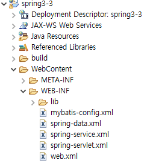
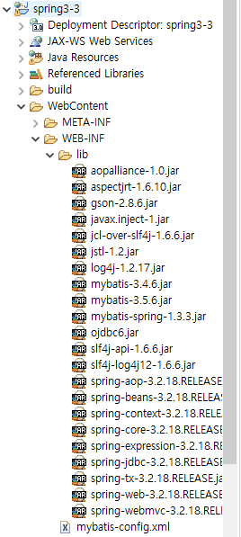

# 75 Days -

### 사용 프로그램

* 사용언어 : JAVA\(JDK\)1.8.0\_261, JS, JQuery, JSP, Servlet, HTML, JSON
* 사용Tool  - Eclipse : Eclipse.org - Toad DBA Suite for Oracle 11.5 - Spring
* 사용 서버 - WAS : Tomcat

## Spring

### web.xml

```markup
<?xml version="1.0" encoding="UTF-8"?>
<web-app version="2.5" xmlns="http://java.sun.com/xml/ns/javaee"
	xmlns:xsi="http://www.w3.org/2001/XMLSchema-instance"
	xsi:schemaLocation="http://java.sun.com/xml/ns/javaee https://java.sun.com/xml/ns/javaee/web-app_2_5.xsd">

	<!-- The definition of the Root Spring Container shared by all Servlets and Filters -->
	<context-param>
		<param-name>contextConfigLocation</param-name>
		<param-value>/WEB-INF/spring/root-context.xml</param-value>
	</context-param>
```

* &lt;context-param&gt;
* 서버 기동시 한 번 읽고 유지한다.

```markup
	<!-- Creates the Spring Container shared by all Servlets and Filters -->
	<listener>
		<listener-class>org.springframework.web.context.ContextLoaderListener</listener-class>
	</listener>
```

* &lt;listener&gt;태그가 있어야 Context를 읽을 수 있다.

```markup
	<!-- Processes application requests -->
	<servlet>
		<servlet-name>appServlet</servlet-name>
		<servlet-class>org.springframework.web.servlet.DispatcherServlet</servlet-class>
		<init-param>
			<param-name>contextConfigLocation</param-name>
			<param-value>/WEB-INF/spring/appServlet/servlet-context.xml</param-value>
		</init-param>
		<load-on-startup>1</load-on-startup>
	</servlet>
```

* &lt;init-param&gt;
* 서블릿의 요청이 있을 때마다 새로 읽는다.

```markup
	<servlet-mapping>
		<servlet-name>appServlet</servlet-name>
		<url-pattern>*.nhn</url-pattern>
	</servlet-mapping>
</web-app>
```

* DispatcherServlet이 인터셉트 받게되는 url mapping

### DispatcherServlet

* xxx.jsp가 아닌xxx.test로 요청이 들어오면, DispatcherServlet이 인터셉트한다. SimpleUrlHandlerMapping에서 DispacherServlet이 받은  url의 클래스를 찾는다. Controller를 연결해준다.
* req, res를 제공해주는 클래스가 DispatcherServlet이다. - HttpServlet을 상속받는다. - req, res를 제공받지 못하면 메서드를 찾을 수 없게된다. - 의존적이다. 결합도가 높다.
* Spring에서는 결합도를 낮추기 위해 인터페이스와 추상클래스를 제공한다. - spring-core.jar라는 엔진이 제공해주는 Controller\( I \)와 AbstractController추상 클래스
* 이때 객체를 주입받을 수 있게 해주는 것이 ApplicationContext와 BeanFactory이다.

### SimpleUrlHandlerMapping

* 기존의 자바에서는 web.xml안에 모든 서블릿 클래스를 매핑했었다. 코드가 길어지고 가독성이 떨어져 이를 보완하기 위해 spring framwork가 제공하는 코드이다.
* 자바코드가 아닌 xml에 등록되어 존재한다.  - &lt;bean&gt;태그 안에 위치한다.
* SimpleUrlHandlerMapping은 web.xml 에 매번 클래스를 등록하는 과정을 줄여준다. - DispatcherServlet과 Controller사이에서 url에 맞는 Controller를 찾아주는 역할이다.
* &lt;bean id="인스턴스 변수명" class="클래스 풀 네임" /&gt; 호출되는 클래스는 반드시  req, res를 제공받아야 하고, Servlet.xml에 등록되어 있어야한다. 이때 클래스를 등록할때 사용하는 것이 SimpleUrlHandlerMapping클래스이다. 

### Spring을 사용한 Java+MyBatis


### SqlSessionFactoryBean

* Spring과  MyBatis사이에서 bean을 관리하면서 Connection을 맺는 역할을 한다.
* 빈을 관리한다는 것은 java class라는 것이고, spring에서는 mybatis.jar안에서 제공한다.

### 객체주입법

* Setter객체 주입법 - Java코드에 작성된다. - 동종간 연결에서 사용한다. - Java + Java
* 생성자 객제 주입법 - xml코드에 작성된다. - Java + xml,  xml + xml - 이종간 연결에서 사용한다.

### Spring이 제공해주는 틀


## maven방식과 수동 방식

### jar배포

* 필요한 API를 활용하기 위해 jar파일을 프로젝트에 배포할때, maven을 활용하는 방식과 수동으로 파일을 등록하는 방법이 있다.

### maven방식

* 필요한 jar파일이 제공하는 dependency를 활용하면 훨씬 쉽게 배포할 수 있다.



### 수동

* 필요한 jar파일을 에디터의 프로젝트 내부 WEB-INF하위의 lib폴더에 배포한다.

  해당 프로젝트의 Build Path에서 Add Jar버튼을 통해 라이브러리에 추가한다.

### 운영 서버 작업시

* 자바에서 Dynamic Web Project로 생성되지 않은 프로젝트들은 서버 플러그인이 없어 서버에 추가될 수 없어 url로 접근할 수 없다. 서버의 add and remove창에서도 확인할 수 없다.

  그러므로 외부에서 직접 tomcat서버를 실행해 테스트를 진행해야하는데, 이렇게 되면 콘솔도, 이클립스 에디터도 없이 xml문서를 일일히 수정하며 테스트해야하는 번거로움이 있다.

* 회사에서 직접 운영하는 운영서버에는 외부 플러그인을 설치하지 않기때문에 수동으로 테스트해야한다.

## Eclipse에서 Spring사용하기

### 1. Spring tool install


* Help &gt; Eclipse Marketplace wizard


* Spring Tools Installed

### 2. 새 자바 Project생성하기


* File &gt; Dynamic Web Project


* 프로젝트 생성시 표준과 같은 파일들을 정의해준다.
* 최대한 표준에 부합하는 형식으로 생성한다.


* Default output folder는 WEB-INF하위의 classes폴더로 지정한다.
* 컴파일된 파일이 담기는 곳

### 3. xml, jar배포



* WEB-INF밑에 Spring에서 정의한 xml문서를 붙인다.



* WEB-INF폴더 하위 lib폴더에 Spring에서 사용한 jar파일을 모두 배포한다.

### Spring을 활용한 로그인 구현하기

* Eclipse에서 Spring과 myBatis를 활용해 로그인 로직을 구현해보자

