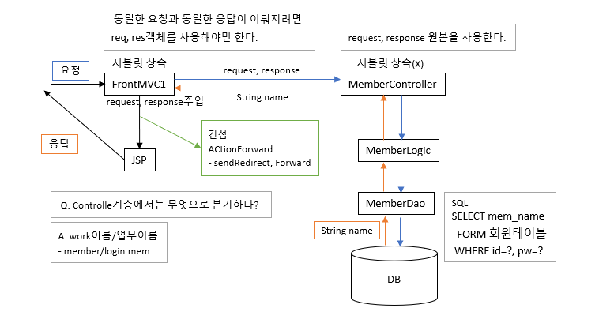

# 74 Days -

### 사용 프로그램

* 사용언어 : JAVA\(JDK\)1.8.0\_261, JS, JQuery, JSP, Servlet, HTML, JSON
* 사용Tool  - Eclipse : Eclipse.org - Toad DBA Suite for Oracle 11.5 - Spring
* 사용 서버 - WAS : Tomcat

## 필기

### MVC패턴

*  Controll계층 - 추상클래스나 인터페이스 혹은 구현체 클래스를 제공받아 처리한다. - AbstracController\(A\), MultiActionController\(구현체\), Controller\(I\)
* Model 계층 - 개발자가 집중해야하는 부분
* View 계층 - UI/UX솔루션 역할
* 요청을 jsp가 받으면 모델1 : 태그와 공존해야 하므로 내장객체를 제공한다. 요청을 Servlet이 받으면 모델2 : 직접 선언해야한다.
* 이 MVC패턴은 request와 response에 의존적이다. 재사용성, 이식성이 떨어져 단위테스트, 통합테스트에 어려움이 있다. 독립적이지 않기때문에 결합도를 낮추는 코드를 작성해야한다. - 상속이아닌, 인터페이스와 추상클래스를 활용한다.

### Model계층

* DAO패턴은 MODEL계층의 한 부분이다.
* DAO가 있으므로 트랜잭션 처리가 가능하다.
* 재사용성을 높인다. - 업무와 업무가 연결되는 부분을 재사용해 처리 할 수 있게 해준다.

### 개발 방법론

* 개발자는 로직부분에만 집중하고 코딩을 전개한다.
* 이렇게 하기 위해 MVC패턴이나 Spring을 활용한다.
* 넥사크로, 부트스트랩, EasyUI같은 UI솔루션이나 API가 제공되고 있다.
* DB연동시 반복되는 코드를 줄이기 위해 MyBatis를 사용한다.
* git과 같은 형상관리 툴을 사용하면 재택근무가 가능하다.

## 팀프로젝트 준비

### 페이퍼 작업

* 역할 분담
* 계획\(시간을 효율적으로 활용\)
* 표준 - 약속
* 팀프로젝트가 100%라면 - 50% : 계획, 설계, 분석\(회사문서, 보고서, 자료수집, 자료분석, 업무 정의, 프로세스이해\) - 20% : 코딩 - 10% : 테스트

### 역할

* ProjectManager : 사람관리
* ProjectLeader : 설계, 조립, 테스트시나리오, 배포, 이행 - 기술지원, 표준제시, 가이드
* Crew : 처리

## Session

### Session과 Cookie

* session - 서버의 cash메모리에 클라이언트 상태를 저장한다.
* cookie - 클라이언트 local에 text로 저장된다. - cookie에 가장 먼저 저장되는 정보 : Session ID

### Session과 request

```java
HttpSession session = request.getSession();
```

* 내장객체 request로 session을 생성한다.

### Session과 web.xml

```markup
	<!-- session에 값을 유지하는 방법, 30분동안 유지한다. -->
	<session-config>
		<session-timeout>30</session-timeout>
	</session-config>
```

## 로그인 구현

### 작업지시서

1. 로그인 처리 - 프로시저 활용 - 세션 적용 - MyBatis활용
2. 테이블 설계 - 시험과목에 대한 테이블 추가 - 시험응시에 대한 테이블 추가
3. 화면정의서 작성 - 시험응시에 대한 화면 그리기 - 화면과 DB테이블을 비교해 보면서 테이블 설계에 대한 타당성\(유효성\) 체크하기   누락된 컬럼이 있는지, 관계가 올바른지, 

### 테이블 관계

* 회원 - 시험응시 테이블 관계
* 시험과목 - 회원 테이블 관계
* 시험과목 - 시험응시 테이블 관계
* 관계 형태  - 1:n, n:m, 1:1 - PK와 FK선택과 확인
* 관계형태에 따라 조인 대상 테이블이 결정된다.

### 순서도



