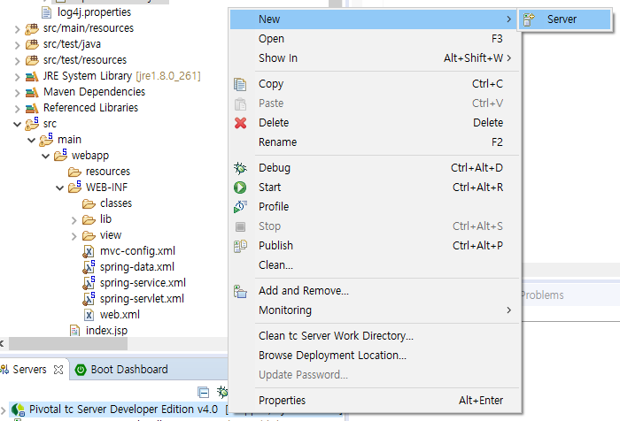
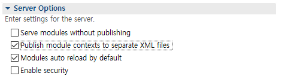
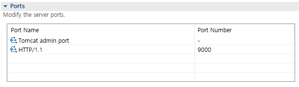

# 74 Days - MVC패턴, session과 cookie, Spring서버설정, Spring Controller, 객체주입법 : 생성자 객체주입법, Sonata

### 사용 프로그램

* 사용언어 : JAVA(JDK)1.8.0\_261, JS, JQuery, JSP, Servlet, HTML, JSON
* 사용Tool  - Eclipse : Eclipse.org - Toad DBA Suite for Oracle 11.5 - Spring
* 사용 서버 - WAS : Tomcat

## 필기

### MVC패턴

*  Controll계층\
  \- 추상클래스나 인터페이스 혹은 구현체 클래스를 제공받아 처리한다.\
  \- AbstracController(A), MultiActionController(구현체), Controller(I)
* Model 계층\
  \- 개발자가 집중해야하는 부분
* View 계층\
  \- UI/UX솔루션 역할
* 요청을 jsp가 받으면 모델1 : 태그와 공존해야 하므로 내장객체를 제공한다.\
  요청을 Servlet이 받으면 모델2 : 직접 선언해야한다.
* 이 MVC패턴은 request와 response에 의존적이다.\
  재사용성, 이식성이 떨어져 단위테스트, 통합테스트에 어려움이 있다.\
  독립적이지 않기때문에 결합도를 낮추는 코드를 작성해야한다.\
  \- 상속이아닌, 인터페이스와 추상클래스를 활용한다.

### Model계층

* DAO패턴은 MODEL계층의 한 부분이다.
* DAO가 있으므로 트랜잭션 처리가 가능하다.
* 재사용성을 높인다.\
  \- 업무와 업무가 연결되는 부분을 재사용해 처리 할 수 있게 해준다.

### 개발 방법론

* 개발자는 로직부분에만 집중하고 코딩을 전개한다.
* 이렇게 하기 위해 MVC패턴이나 Spring을 활용한다.
* 넥사크로, 부트스트랩, EasyUI같은 UI솔루션이나 API가 제공되고 있다.
* DB연동시 반복되는 코드를 줄이기 위해 MyBatis를 사용한다.
* git과 같은 형상관리 툴을 사용하면 재택근무가 가능하다.

## 팀프로젝트 준비

### 페이퍼 작업

* 역할 분담
* 계획(시간을 효율적으로 활용)
* 표준 - 약속
* 팀프로젝트가 100%라면\
  \- 50% : 계획, 설계, 분석(회사문서, 보고서, 자료수집, 자료분석, 업무 정의, 프로세스이해)\
  \- 20% : 코딩\
  \- 10% : 테스트

### 역할

* ProjectManager : 사람관리
* ProjectLeader : 설계, 조립, 테스트시나리오, 배포, 이행 - 기술지원, 표준제시, 가이드
* Crew : 처리

## Session

### Session과 Cookie

* session\
  \- 서버의 cash메모리에 클라이언트 상태를 저장한다.
* cookie\
  \- 클라이언트 local에 text로 저장된다.\
  \- cookie에 가장 먼저 저장되는 정보 : Session ID

### Session과 request

```java
HttpSession session = request.getSession();
```

* 내장객체 request로 session을 생성한다.

### Session과 web.xml

```markup
	<!-- session에 값을 유지하는 방법, 30분동안 유지한다. -->
	<session-config>
		<session-timeout>30</session-timeout>
	</session-config>
```

## 로그인 구현

### 작업지시서

1. 로그인 처리\
   \- 프로시저 활용\
   \- 세션 적용\
   \- MyBatis활용
2. 테이블 설계\
   \- 시험과목에 대한 테이블 추가\
   \- 시험응시에 대한 테이블 추가
3. 화면정의서 작성\
   \- 시험응시에 대한 화면 그리기\
   \- 화면과 DB테이블을 비교해 보면서 테이블 설계에 대한 타당성(유효성) 체크하기\
     누락된 컬럼이 있는지, 관계가 올바른지, 

### 테이블 관계

* 회원 - 시험응시 테이블 관계
* 시험과목 - 회원 테이블 관계
* 시험과목 - 시험응시 테이블 관계
* 관계 형태 \
  \- 1:n, n:m, 1:1\
  \- PK와 FK선택과 확인
* 관계형태에 따라 조인 대상 테이블이 결정된다.

### 순서도


## Spring :  설정

### 디펜던시 spring버전 변경

.png>)

* 이전에는 jar파일을 항상 다운로드 받아 lib에 넣어주고 build path로 연결해주었지만, 디펜던시를 제공하기 때문에 간단히 xml에서 버전을 변경해주면 자동으로 버전이 변경된다.

.png>)

### Tomcat서버 사용하기



* 기본 서버 우클릭 > New > Server

.png>)

* 사용할 서버를 선택한다.

.png>)

* 서버 제품을 지정해준다.

.png>)

* 해당 서버를 사용할 프로젝트를 지정한다.

### Tomcat server설정



* 두번쨰 체크박스를 체크해야 xml문서를 따로 관리할 수 있다.
* xml이 서버폴더의 하위에 생성된다.



* Tomcat admin port번호를 지정하지 않으면 서버가 기동되지 않으니 주의하자

## Spring : Controller

### Spring MVC

* 다른 MVC기반의 F/W와 같이 Spring에서도 Controller를 사용해 클라이언트의 요청을 처리한다.\
  요청을 FrontController가 받아 업무에 맞는 Controller에게 전달한다.\
  이 FrontController가 기능하도록 Spring에서 제공하는것이 DispatcherServlet이다.
* DispatcherServlet\
  \- 클라이언트의 요청을 받는다. Controller에게 요청을 전달하고 리턴된 값을 View에 전달한다.
* HandlerMapping\
  \- 요청된 url을 어떤 Controller가 처리할지 Mapping한다.
* Controller\
  \- 요청을 처리하고 결과를 DispatcherServlet에 반환한다.
* ViewResolver\
  \- 처리 결과를 보여줄 View를 정한다.\
  \- property 두가지를 갖는다.\
    prefix(Controller가 리턴한 뷰 이름 앞에 붙는 접두어)\
    suffix(Controller가 리턴한 뷰 이름 뒤에 붙는 접미어)
* View\
  \- 응답을 출력한다.

### DispatcherServlet

* 클라이언트의 요청을 받는 객체.
* web.xml에 등록된 url로 들어오는 모든 요청을 받아 알맞은 업무 Controller에게 전달하고, 결과를 받아 응답페이지를 호출하는 역할을 수행한다.
* 모든 요청을 한 곳에서 받아 처리하고, 요청에 맞는 handler로 요청을 Dispatch하고, 해당 Handler의 실행결과를 HttpResponse의 형태로 만들어준다.
* Controller에서 업무 처리내용과 이동할 페이지, 이동방식을 결정하고, FrontController에서 페이지를 호출한다.

### Controller

* Spring에서 클라이언트의 요청을 처리하는 Controller를 구현하는 두가지 방법이 있다.\
  \- Controller 인터페이스를 implements한다.\
  \- AbstractController 추상클래스를 상속받는다.
* FrontController를 web.xml에 url을 등록하고, 해당 요청을 업무 별로 Controller에 전달한다.
* main메서드를 활용한 local서비스가 아닌 url을 이용하는 웹서비스를 제공한다.
* request, response를 누릴 수 있다.\
  \- 파라미터로 전달받은 req, res객체를 사용한다.\
  \- 직접 HttpServlet을 상속받지 않아도 사용할 수 있다.
* 외부 서버와 통신에 대해서나 처리결과에 대한 자원(json, xml)을 공유 할 수 있다.

### Controller : Controller인터페이스

* Controller 인터페이스를 implements하고 handleRequest추상메서드를 알맞게 구현한다.
* 파라미터로 전달받은 req, res객체를 사용한다.
* ModelAndView객체를 리턴한다.\
  \- 뷰 페이지 이름, data를 ModelAndView객체에 담을 수 있다.\
  \- setViewName( ), addObject( ), ...

### 코드 : Controller

```java
package com.di;

import javax.servlet.http.HttpServletRequest;
import javax.servlet.http.HttpServletResponse;
import org.springframework.web.servlet.ModelAndView;
import org.springframework.web.servlet.mvc.Controller;

public class SonataController implements Controller {

	//Controller 인터페이스에서의 오버라이드 메서드
	@Override
	public ModelAndView handleRequest(HttpServletRequest request, HttpServletResponse response) throws Exception {
		// TODO Auto-generated method stub
		return null;
	}
}
```

### Controller : AbstractController

* AbstractController클래스는 Controller인터페이스를 implements하고, 추가적인 기능을 제공한다.
* 프로퍼티를 제공한다.
* Controller와 달리 handlerRequestInternal( )메서드를 구현한다.\
  \- AbstractController클래스의 handleReqeust메서드는 내부적으로 필요한 작업을 수한한뒤에 handlerRequestInternal( )메서드를 호출한다.

### AbstractController Property

* supportedMethods\
  \- Controller가 처리할 수 있는 메서드 지정, 지원되지않는 메서드를 사용한 요청이 발생하면 ServletException을 발생시킨다.
* requiresSession\
  \- Controller가 HttpSession을 필요로 하는지 여부를 결정한다.\
    true일때 클라이언트와 관련된 session이 존재하지 않을떄 ServletExceotion을 발생시킨다.
* synchronizeSession\
  \- HttpSession을 사용해 Controller에 대한 처리를 동기화 할지 여부를 정한다.
* cacheSecoends\
  \- Http응답에 캐시에 관련된 디렉티브를 생성할지 여부를 정한다.\
  \- 기본 값은 -1 : 캐시 디렉티브가 응답결과에 포함되지 않는다.
* useExporesHeader\
  \- Expires 헤더의 사용여부를 정한다.\
  \- 기본값 true
* useCacheHeader\
  \- Cache-Control 헤더의 사용여부를 정한다.\
  \- 기본값 true

### 코드 : AbstractController

```java
package com.di;

import javax.servlet.http.HttpServletRequest;
import javax.servlet.http.HttpServletResponse;
import org.springframework.web.servlet.ModelAndView;
import org.springframework.web.servlet.mvc.AbstractController;

public class SonataController extends AbstractController {

	//AbstractController 추상클래스에서의 오버라이드 메서드 
	@Override
	protected ModelAndView handleRequestInternal(HttpServletRequest request, HttpServletResponse response)
			throws Exception {
		// TODO Auto-generated method stub
		return null;
	}
}
```

## Spring : 생성자 객체 주입법

### POJO

* POJO로 구현하는 클래스는 local 서비스만을 제공한다. \
  \- main메서드로 실행
* 서버와 통신하는 web 서비스를 제공할 수 없기때문에 req, res객체도 사용할 수 없다.\
  \- 안드로이드와의 연계도 불가능하다.
* 통신하기위해서 web.xml을 지원하지 않기때문에 io로 읽고, 쓰기를 하는데, 속도가 느리고 서버에 부담이 되는 방식이다.
* 이렇게 구현한 클래스에서 xml에 접근하기 위해서는 해당 xml의 id에 직접 접근해야한다.\
  \- xml문서를 스캔하지 않으므로 bean을 관리하는 클래스를 활용한다.

### 생성자 객체 주입법

* spring-core.jar가 제공하는 ApplicationContext, BeanFactory가 bean을 관리한다.\
  \- \<bean id=" " class | type=" "/>\
  \- type인 경우 추상클래스, 인터페이스 모두 올 수 있다.
* 기존 **setter를 활용한 객체주입코드**는 java에서 처리했지만 생성자 객체주입코드는 xml에서 처리한다.
* 기존의 VO class\
  private 접근제한자를 갖는 멤버변수를 작성하고, setter, getter메서드로만 변수에 접근하도록 한다. \
  변수를 별도로 초기화 하려면 값을 결정하는 클래스에서 직접 인스턴스화 하여 set메서드를 활용했다.\
  \- dVO.setViewName("xxx.jsp")\
  \- setter객체주입법은 동종간 처리시 사용한다. (권장사항)
* **생성자 객체 주입법**\
  set메서드를 활용하는 것이 아닌 생성자의 파라미터에 값을 담아 초기화한다.\
  \- new DeptVO("10", true, "xxx.jsp")\
  \- 이때 주의 할 것은 파라미터의 타입과 갯수가 일치하는 생성자가 있어야 한다는 것이다.\
  \- 생성자 객체주입법은 이종간 처리시 사용한다.\
    자바와 myBatis, 자바와 Oracle이런 경우
* xml과 xml사이에서도 객체 주입을 처리할 수 있다.

### 객체주입의 종류

* ArrayList al = new ArrayList( );\
  \- 직접, 생성자 객체주입법
* ArrayList al = null;\
  \- 외부에서 주입받는다.
* ArrayList al = 타입.methoadA( );\
  \- set, get메서드를 활용한 객체 주입법

후기 : 추워....
