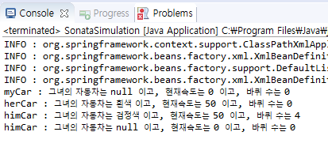

# Sonata : 생성자 객체주입법

### 코드 : Sonata.java

```java
package com.di;

public class Sonata {
	String carColor = null;
	int speed = 0;
	int wheelNum = 0;
	
	//생성자 객체주입법 -- 생성자로 초기화
	public Sonata() {}
	
	public Sonata(int speed) {
		this.speed = speed;
	}
	
	public Sonata(String carColor, int speed) {
		this.carColor = carColor;
		this.speed = speed;
	}
	
	public Sonata(String carColor, int speed, int wheelNum) {
		this.carColor = carColor;
		this.speed = speed;
		this.wheelNum = wheelNum;
	}
	
	//Object가 제공하는 메서드
	@Override
	public String toString() {
		return "그녀의 자동차는 "+this.carColor+" 이고, 현재속도는 "+this.speed+" 이고, 바퀴 수는 "+this.wheelNum;
	}
}
```

* 파라미터가 서로다른 세 생성자를 갖고있다.
* 부모 Object가 가진 toString메서드를 오버라이드 했다.

### 코드 : sonataBean.xml

```markup
<?xml version="1.0" encoding="UTF-8"?>
<beans 
    xmlns="http://www.springframework.org/schema/beans"
   xmlns:xsi="http://www.w3.org/2001/XMLSchema-instance"
   xsi:schemaLocation="http://www.springframework.org/schema/beans https://www.springframework.org/schema/beans/spring-beans.xsd">
   <bean id="myCar" class="com.di.Sonata"/><!-- xml을 통해 소나타객체를 주입받을 수 있는 준비 끝 -->
   
   <bean id="herCar" class="com.di.Sonata">
   	<constructor-arg index="0" type="java.lang.String" value="흰색"></constructor-arg>
   	<constructor-arg index="1" type="int" value="50"></constructor-arg>
   </bean>
   
   <bean id="himCar" class="com.di.Sonata">
   	<constructor-arg index="0" type="java.lang.String" value="검정색"></constructor-arg>
   	<constructor-arg index="1" type="int" value="50"></constructor-arg>
   	<constructor-arg index="2" type="int" value="4"></constructor-arg>
   </bean>
</beans>
```

* 연결된 Sonata.java의 생성자와 파라미터가 같은 갯수, 타입을 갖는 bean들이 작성되어 있다.
* 지정된 class로만 제공받을 수 있다..

### 코드 : SonataSimulation.java

```java
package com.di;

import org.springframework.beans.factory.BeanFactory;//spring-bean.jar
import org.springframework.beans.factory.xml.XmlBeanFactory;
import org.springframework.context.ApplicationContext;//spring-context.jar
import org.springframework.context.support.ClassPathXmlApplicationContext;
import org.springframework.core.io.FileSystemResource;
import org.springframework.core.io.Resource;

public class SonataSimulation {
	
	public static void main(String[] args) {
		ApplicationContext context = new ClassPathXmlApplicationContext("com\\di\\sonataBean.xml");
		Sonata myCar = (Sonata)context.getBean("myCar");
		
		Resource resource = new FileSystemResource("C:\\workspace_sts3\\spring3\\src\\main\\java\\com\\di\\sonataBean.xml");
	    BeanFactory factory = new XmlBeanFactory(resource);//가운데 줄은 depricated대상이다.
	    Sonata herCar = (Sonata)factory.getBean("herCar");
	    Sonata himCar = (Sonata)factory.getBean("himCar");
	    
	    Sonata gnomCar = new Sonata();
	    
	    System.out.println("myCar : "+myCar);
	    System.out.println("herCar : "+herCar);
	    System.out.println("himCar : "+himCar);
	    System.out.println("himCar : "+gnomCar);
	}
}
```

* xml을 주입받는 세가지 방법을 사용해 보았다.\
  \- ApplicationContext의 getBean ()메서드를 사용해 xml의 bean id에 접근하는 것\
  \- BeanFactory의 getBean( )메서드를 사용해 xml의 bean id에 접근하는 것\
  \- 직접 생성자를 호출하는 것
* 가져온 값들의 반환값을 Sonata클래스로 캐스팅연산자를 사용해 맞춰준다.

### 결과 : console


