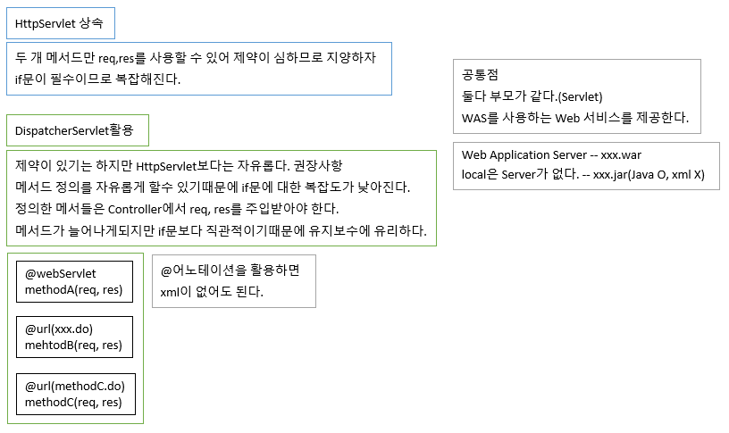

# 76 Days -

### 사용 프로그램

* 사용언어 : JAVA\(JDK\)1.8.0\_261, JS, JQuery, JSP, Servlet, HTML, JSON
* 사용Tool  - Eclipse : Eclipse.org - Toad DBA Suite for Oracle 11.5 - Spring
* 사용 서버 - WAS : Tomcat

## 필기

### 다형성

* 객체지향 프로그램의 핵심으로 재사용성을 높여주고 유지보수에 유리하다.
* @Override, 메서드를 재정의해서 사용할 수 있다.
* 다형성 필요조건 - 선언부 변수이름 = 생성부 - 인터페이스 = 구현클래스
* 예시 - List list = new ArrayList\( \); - Map map = new HashMap\( \);

### 인터페이스와 추상클래스 사용 의의

* 기능의 명세서와 같은 역할을 한다.
* 인터페이스와 추상클래스 내부의 추상 메서드를 @Override해서 사용하므로 규칙을 지키기 쉬워진다.
* 유지보수에도 유리하다.
* 코드 작성이 쉬워진다.

### 결합도 낮추기

1. 다형성 \(POJO\) - 선언부와 생성부가 다르다. - 개발자가 직접 작성한다.
2. 디자인 패턴 \(Spring framwork\) - Spring 엔진이 도와준다.

## Spring

### Main메서드에서의 DI

* ApplicationContext - spring-context.jar
* BeanFactory - spring-beans.jar
* 공통점 - 객체\(Bean\) 생성을 관리해준다. \(A a = null;\)

### HttpServelt과 DispatcherServelt



### 연결

* java : java - 동종간 연결 - Controller : Logic, Logic : Dao
* java : xml - 이종간 연결 - Dao : MyBatis, Controller : Spring
* xml : xml - 이종간 연결 - spring : MyBatis

### anntation

* @어노테이션을 작성하면 xml이 없어도 된다.

### &lt;context-param&gt;

* 서버 기동시 한번 읽고 유지된다.
* 공통적으로 필요한 부분을 처리할 때 사용한다. - 보안 인증, log4j, ...

### &lt;init-param&gt;

* 해당 url요청이 들어올때마다 새로 읽혀야 하는 정보, 그래서 서블릿 태그 안에 작성된다.

### 객체 조립 : &lt;bean&gt;, &lt;property&gt;

```markup
	<bean id="member-controller" class="com.spring.mvc1.MemberController">
		<property name="methodNameResolver" ref="propertiesPathNameResolver"/>
		<property name="memberLogic" ref="member-logic"/>
	</bean>
	
	<bean id="simpleUrlHandlerMapping" class="org.springframework.web.servlet.handler.SimpleUrlHandlerMapping">
		<property name="mappings">
			<props>
				<prop key="/member/login.test">member-controller</prop>
			</props>
		</property>
	</bean>  
	    
	<bean id="propertiesPathNameResolver" class="org.springframework.web.servlet.mvc.multiaction.PropertiesMethodNameResolver">
		<property name="mappings">
			<props>
				<prop key="/member/login.test">login</prop>
			</props>
		</property>
	</bean> 
```

* &lt;property&gt;태그의  - name = setter메서드 이름 - ref = 인스턴스 변
* 스프링컨테이너가 Controller에게 Logic객체를 주입하는 xml이다. - spring-core.jar가 필요한 객체를 대신 주입해준다.
* xml에 클래스를 등록하고, 클래스를 작성한다.
* WAS가 DispatcherServlet과 필요한 시점에 객체를 주입해 메서드를 호출한다.

