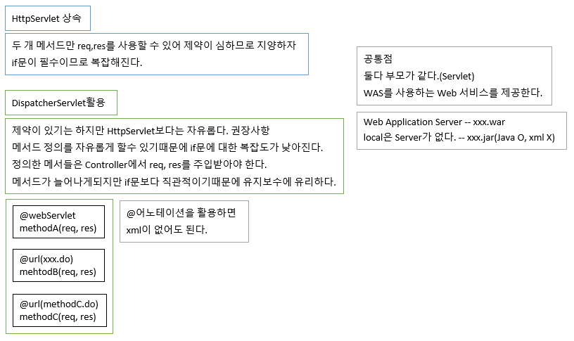

# 76 Days -

### 사용 프로그램

* 사용언어 : JAVA\(JDK\)1.8.0\_261, JS, JQuery, JSP, Servlet, HTML, JSON
* 사용Tool  - Eclipse : Eclipse.org - Toad DBA Suite for Oracle 11.5 - Spring
* 사용 서버 - WAS : Tomcat

## 필기

### 다형성

* 객체지향 프로그램의 핵심으로 재사용성을 높여주고 유지보수에 유리하다.
* @Override, 메서드를 재정의해서 사용할 수 있다.
* 다형성 필요조건 - 선언부 변수이름 = 생성부 - 인터페이스 = 구현클래스
* 예시 - List list = new ArrayList\( \); - Map map = new HashMap\( \);

### 인터페이스와 추상클래스 사용 의의

* 기능의 명세서와 같은 역할을 한다.
* 인터페이스와 추상클래스 내부의 추상 메서드를 @Override해서 사용하므로 규칙을 지키기 쉬워진다.
* 유지보수에도 유리하다.
* 코드 작성이 쉬워진다.

### 결합도 낮추기

1. 다형성 \(POJO\) - 선언부와 생성부가 다르다. - 개발자가 직접 작성한다.
2. 디자인 패턴 \(Spring framwork\) - Spring 엔진이 도와준다.

### 명세서 파일\(xsd, dtd\)

* xml문서에 대한 명세서 역할을 하는 파일은 xsd파일이다. - xml문법을 따른다. - 변수를 여러개 정의할 수 있다.
* html문서에 대한 명세서 역할을 하는 파일은 dtd파일이다. - 변수는 하나만 선언할 수 있다.
* MyBatis에 대한 명세서 역할을 하는 파일은 dtd파일이다. - 변수는 하나만 선언할 수 있다.

### 닫는 태그

```markup
<!-- 자식태그를 작성하지않을때는 열린-닫힌태그를 한번에 작성한다. 나누지 않는다 에러발생할 수 잇음 -->
	<context:component-scan base-package="com.di"/>
```

* 자식 태그가 없는 경우에는 열린태그와 닫힌태그를 한번에 작성한다.
* 자식태그가 없을때 태그를 분리하면 에러가 발생할 수 있다.

## Spring

### Main메서드에서의 DI


* ApplicationContext - spring-context.jar
* BeanFactory - spring-beans.jar
* 공통점 - 객체\(Bean\) 생성을 관리해준다. \(A a = null;\)

### HttpServelt과 DispatcherServelt



### 연결

* java : java - 동종간 연결 - Controller : Logic, Logic : Dao
* java : xml - 이종간 연결 - xml = web.xml, spring-servlet,xml, spring-service.xml, spring-data.xml - Dao : MyBatis, Controller : Spring
* xml : xml - 이종간 연결 - spring : MyBatis

### anntation

* @어노테이션을 작성하면 xml이 없어도 된다.

### &lt;context-param&gt;

* 서버 기동시 한번 읽고 유지된다.
* 공통적으로 필요한 부분을 처리할 때 사용한다. - 보안 인증, log4j, ...

### &lt;init-param&gt;

* 해당 url요청이 들어올때마다 새로 읽혀야 하는 정보, 그래서 서블릿 태그 안에 작성된다.

### 객체 조립 : &lt;bean&gt;, &lt;property&gt;

```markup
	<bean id="member-controller" class="com.spring.mvc1.MemberController">
		<property name="methodNameResolver" ref="propertiesPathNameResolver"/>
		<property name="memberLogic" ref="member-logic"/>
	</bean>
	
	<bean id="simpleUrlHandlerMapping" class="org.springframework.web.servlet.handler.SimpleUrlHandlerMapping">
		<property name="mappings">
			<props>
				<prop key="/member/login.test">member-controller</prop>
			</props>
		</property>
	</bean>  
	    
	<bean id="propertiesPathNameResolver" class="org.springframework.web.servlet.mvc.multiaction.PropertiesMethodNameResolver">
		<property name="mappings">
			<props>
				<prop key="/member/login.test">login</prop>
			</props>
		</property>
	</bean> 
```

* &lt;property&gt;태그의  - name = setter메서드 이름 - ref = 인스턴스 변수
* 스프링컨테이너가 Controller에게 Logic객체를 주입하는 xml이다. - spring-core.jar가 필요한 객체를 대신 주입해준다.
* xml에 클래스를 등록하고, 클래스를 작성한다.
* WAS가 DispatcherServlet과 필요한 시점에 객체를 주입해 메서드를 호출한다.

### Spring제공 골격 받기

* java를 통해 지원받기
* xml을 통해 지원받기
* properties파일을 통해 지원받기
* 여러가지 상황이 연출 될 수 있다. - java&java, java&xml\(web.xml\), xml,xml, 안드로이드&java - 여러 장치에서 해당 서비스를 동일하게 제공받고 싶어 한다.

## Spring : HelloBean, 결합도를 낮추는 코드

### 결합도를 낮추는 코드


* 인터페이스를 활용할때에는 구현체 클래스가 있어야한다.
* 외부의 다른 클래스에서 인터페이스를 사용하려면 인스턴스화시 구현체클래스를 사용해야한다. 인터페이스클래스 인스턴스변수 = context.getBean\("메서드이름", 구현체클래스.class\); 반드시 구현체 클래스를 두번째 파라미터에 명시해 클래스를 구분하도록 한다.
* 이렇게 인스턴스화를 하게되면 타입이 맞지않으므로 캐스팅 연산자가 필요하다.



### xml 생성하기


* 패키지 선택 &gt; New &gt; Spring Bean Configuration File


* 파일이름.xml &gt; Next


* beans 체크 &gt; 버전에 맞는 xsd체크 &gt; Next


* 체크하지 않고 Finish


* 생성 확인

## Java : Java - @\(O\), xml\(X\)

### @어노테이션


* Spring에서는어노테이션을 활용하면 xml없이도 자바로만으로도 외부객체주입을 받을 수 있다.
* 여태까지 Controller클래스가 MultiActionController클래스를 상속받았다면 이를 어노테이션으로 처리할 수 도 있다. - 상속을 받는 경우보다 제약이 없고 자유롭다.
* 메서드나 클래스에 RequestMapping어노테이션을 사용해 url을 등록할 수 있다.

### web.xml에 어노테이션 추가하기	

```markup
   <servlet>
      <servlet-name>appServlet</servlet-name>
      <servlet-class>org.springframework.web.servlet.DispatcherServlet</servlet-class>
      <init-param>
         <param-name>spring.profiles.active</param-name>
         <param-value>dev</param-value>
      </init-param>
      <init-param>
         <param-name>contextClass</param-name>
         <param-value>org.springframework.web.context.support.AnnotationConfigWebApplicationContext</param-value>
      </init-param>
      <init-param>
         <param-name>contextConfigLocation</param-name>
         <param-value>
            config.MvcConfig
            config.ControllerConfig
            config.WebMvcConfig
            config.HttpInterceptor
            config.WebSocketConfig
         </param-value>
      </init-param>
      <load-on-startup>1</load-on-startup>
   </servlet>
      
   <servlet-mapping>
      <servlet-name>appServlet</servlet-name>
      <url-pattern>/</url-pattern>
   </servlet-mapping>
```

* spring이 제공하는 AnnotationConfigWebApplicationContext 를 활용한다. - 서버가 어노테이션을 읽을 수 있도록 해준다.
* Java에서 web.xml 하나에 모두 등록 하던 작업을 spring에서는 spring-servlet.xml과 spring-service.xml 그리고 spring-data.xml을 나누었듯이 AppContext도 여러개로 나누어서 처리할 수 있다.
* 15-19번이 Configuration 어노테이션으로 등록된 클래스들 이다.

### 코드 : AppContext.java - Configuration

```java
package com.di;

import org.springframework.context.annotation.Bean;
import org.springframework.context.annotation.Configuration;

import com.spring.mvc1.DeptController;
import com.spring.mvc1.DeptDao;
import com.spring.mvc1.DeptLogic;

//import할 수 있다. java:java에서만 사용할 수 있다. 
@Configuration
public class AppContext {
	
	//<bean id="deptController" class="com.do.DeptController/> 
	@Bean
	public DeptController deptController() {
		
		//new를 spring이 해주므로 일반적으로 개발자가 직접하는 것과는은 차이가 있다. 
		//생성자가 호출되면 deptController가 메모리에 로딩된다. 
		//언제? 메서드가 호출될때네 spring이 주입해준다.=di
		return new DeptController();
	}
}
```

* 이 클래스가 Bean을 관리하는 Cnfoguration역할을 하는 클래스이다. - spring에게서 객체를 주입받을 수 있도록 해준다.
* 객체를 주입받을 메서드는 @Bean어노테이션을 붙인다. - xml에서 Bean태그를 활용해 클래스를 등록하는 것과 같다. - spring이 bean으로서 관리할 수 있게된다.
* 주의할점은 메서드 이름이 호출시 불려지는 이름과 같아야 한다는 것이다. 메서드 이름이 다르면 ApplicationContext, BeanFactory가 메서드를 찾을 수 없다.
* return에 **'new'**가 온다. 인스턴스화와 비슷한 역할을 수행하지만, 해당 객체는 개발자가 아닌 spring이 필요한때에 생성, 주입해주는 것이다. DeptController클래스의 생성자가 호출될때 클래스가 메모리에 로딩된다.

## xml : xml

### 코드 : spring-data.xml

```markup
<?xml version="1.0" encoding="UTF-8"?>
<beans xmlns="http://www.springframework.org/schema/beans"
	xmlns:xsi="http://www.w3.org/2001/XMLSchema-instance"
	xsi:schemaLocation="http://www.springframework.org/schema/beans http://www.springframework.org/schema/beans/spring-beans.xsd">
	<bean id="data-source-target" class="org.springframework.jdbc.datasource.DriverManagerDataSource">
		<property name="driverClassName">
			<value>oracle.jdbc.driver.OracleDriver</value>
		</property>
		<property name="url">
			<value>jdbc:oracle:thin:@192.168.0.187:1521:orcl11</value>
		</property>
		<property name="username">
			<value>scott</value>
		</property>
		<property name="password">
			<value>tiger</value>
		</property>
	</bean>
	
	<!-- myBatis를 사용할 수 있도록 spring에서 sqlSessionFactory를 제공한다. -->
	<bean id="sqlSessionFactory" class="org.mybatis.spring.SqlSessionFactoryBean"><!-- driver class이름 -->
		<property name="configLocation" value="WEB-INF/mybatis-config.xml"/>
		<property name="dataSource" ref="data-source-target"/>
	</bean>
	
	<!-- myBatis를 사용할 수 있도록 spring에서 sqlSessionTemplate=sqlSesion를 제공한다. 위 bean과 의존관계에 있다. -->
	<bean id="sqlSessionTemplate" class="org.mybatis.spring.SqlSessionTemplate">
		<constructor-arg index="0" ref="sqlSessionFactory"/>
	</bean>			
</beans>
```

* 이 코드가 바로 xml : xml 이다. spring과 MyBatis가 만나는 곳을 xml:xml로 처리했다.

### 

