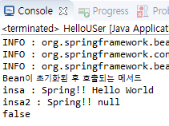

# HelloBean : 결합도를 낮추는 코드

### 코드 : applicationContext.xml

```markup
<?xml version="1.0" encoding="UTF-8"?>
<beans xmlns="http://www.springframework.org/schema/beans"
	xmlns:xsi="http://www.w3.org/2001/XMLSchema-instance"
	xsi:schemaLocation="http://www.springframework.org/schema/beans http://www.springframework.org/schema/beans/spring-beans-3.2.xsd">
  <!-- bean태그에 클래스 등록 -->
	<!-- 이 객체를 어떻게 주입해서 test할까? spring Container구동해서 객체주입을 받아보자 -->
	<!-- class에는 구현체 클래스. scope는 싱글톤으로 관리할떄 사용한다, 근데 기본값일 듯 -->
	<bean id="helloBean" class="com.ch3.HelloBeanImpl" scope="singleton" init-method="initMethod" destroy-method="destroyMethod">
		<property name="msg">
			<value>Hello World</value>
		</property>
	</bean>
</beans>
```

### 코드 : HelloBean.jaca -Interface

```java
package com.ch3;

public interface HelloBean {
	public String getGreeting();
}
```

### 코드 : HelloBeanImpl.java -구현체클래스

```java
package com.ch3;

public class HelloBeanImpl implements HelloBean {
	
	private String msg = null;

	public void setMsg(String msg) {
		this.msg = msg;
	}

	@Override
	public String getGreeting() {
		// TODO Auto-generated method stub
		return "Spring!! "+this.msg;
	}
	
	//LifCycle을 이용한 메서드, 간섭-관여할때 사용할 수 있다.
	public void initMethod() {//bean초기화 후에 호출되는 메서드
		System.out.println("Bean이 초기화된 후 호출되는 메서드");
	}
	
	//LifCycle을 이용한 메서드, 간섭-관여할때 사용할 수 있다.
	public void destroyMethod() {//bean초기화 후에 호출되는 메서드
		System.out.println("Bean이 소멸되기 직전에 호출되는 메서드");
	}
}
```

### 코드 : HelloUser.java

```java
package com.ch3;

import org.springframework.context.support.AbstractApplicationContext;
import org.springframework.context.support.GenericXmlApplicationContext;

public class HelloUSer {

	public static void main(String[] args) {
		AbstractApplicationContext context = new GenericXmlApplicationContext("applicationContext.xml");
		
		HelloBean helloBean = (HelloBean)context.getBean("helloBean", HelloBeanImpl.class);
		HelloBean helloBean2 = new HelloBeanImpl();
		
		String insa = helloBean.getGreeting();
		System.out.println("insa : "+insa);
		
		String insa2 = helloBean2.getGreeting();
		System.out.println("insa2 : "+insa2);//null 객체주입이 없다.
		
		System.out.println(helloBean==helloBean2);//주소번지가 다르므로 false
	}

}
```

### 결과 : Console



