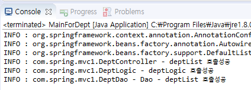
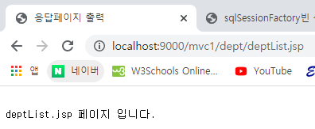
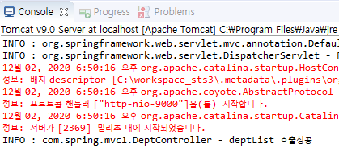

# Dept - Java : Java, @ \(O\), xml \(X\)

## com.di

### 코드 : AppContext.java

```java
package com.di;

import org.springframework.context.annotation.Bean;
import org.springframework.context.annotation.Configuration;

import com.spring.mvc1.DeptController;
import com.spring.mvc1.DeptDao;
import com.spring.mvc1.DeptLogic;

@Configuration//import할 수 있다. java:java에서만 사용할 수 있다.ㅅ 스프링에서 객체를 주입받을 수 있게 해준다.
public class AppContext {
	
	//<bean id="deptController" class="com.do.DeptController/>이 xml을 자바에서 어노테이션을 활용하면 할 수 있다.
	@Bean//Spring이 관리할 수 있는 Bean으로 만들어준다.
	public DeptController deptController() {//메서드 이름이 다르면 ApplicationContext, BeanFactory가 찾을 수 없다.
		
		//new를 spring이 해주므로 일반적으로 개발자가 직접하는 거랑은 차이가 있다. 생성자가 호출되면 deptController가 메모리에 로딩된다. 언제? 메서드가 호출될때네 spring이 주입해준다.=di
		return new DeptController();
	}
	
	@Bean
	public DeptLogic deptLogic() {
		
		return new DeptLogic();//new를 spring이 해주므로 일반적으로 개발자가 직접하는 거랑은 차이가 있다.
	}
	
	@Bean
	public DeptDao deptDao() {
		
		return new DeptDao();//new를 spring이 해주므로 일반적으로 개발자가 직접하는 거랑은 차이가 있다.
	}
}
```

### 코드 : MainForDept.java

```java
package com.di;

import org.springframework.context.ApplicationContext;
import org.springframework.context.annotation.AnnotationConfigApplicationContext;

import com.spring.mvc1.DeptController;
import com.spring.mvc1.DeptDao;
import com.spring.mvc1.DeptLogic;

public class MainForDept {

	public static void main(String[] args) {
		
		//어노테이션으로 등록된 메서드를 사용할 수 있다.
		ApplicationContext context = new AnnotationConfigApplicationContext(AppContext.class);
		
		DeptController deptController = context.getBean("deptController", DeptController.class);
		DeptLogic deptLogic = context.getBean("deptLogic", DeptLogic.class);
		DeptDao deptDao = context.getBean("deptDao", DeptDao.class);
		deptController.setDeptLogic(deptLogic);
		deptLogic.setDeptDao(deptDao);
		deptController.deptList();
	}
}

```

## com.spring.mvc1

### 코드 : DeptController.java

```java
package com.spring.mvc1;

import java.util.List;
import java.util.Map;

import javax.servlet.http.HttpServletRequest;
import javax.servlet.http.HttpServletResponse;

import org.apache.log4j.Logger;
import org.springframework.stereotype.Controller;
import org.springframework.web.bind.annotation.RequestMapping;
import org.springframework.web.servlet.ModelAndView;
import org.springframework.web.servlet.mvc.multiaction.MultiActionController;

@Controller
@RequestMapping("/dept/*")
public class DeptController {

	Logger logger = Logger.getLogger(DeptController.class);
	
	//이때 변수명은 property의 name에 들어갈 값과 일치해야한다.
	private DeptLogic deptLogic = null;
	
	public void setDeptLogic(DeptLogic deptLogic) {
		this.deptLogic = deptLogic;
	}

	@RequestMapping("deptList.test")
	public String deptList() {
		logger.info("deptList 호출성공");
		List<Map<String,Object>> deptList = null;
		deptList = deptLogic.deptList();
		return "redirect:deptList.jsp";
	}
}
```

* xml을 활용하지 않을때에는 어노테이션@을 사용해 주입받을 수 있다.
* @Controller를 활용한 Controller클래스
* 32번코드는 MainForDept.java에서 JVM으로 실행할때에는 객체주입이 정상적으로 일어나 문제가 되지 않지만, Web에서 url로 test할때에는 객체주입이 되지 않기때문에 NullPointerException이 발생한다. url로 테스트 할때에는 32번코드를 주석처리 해야 한다.
* 33번은 res.sendRedirect\("deptList.jsp"\)와 같다.

### 코드 : DeptLogic.java

```java
package com.spring.mvc1;

import java.util.List;
import java.util.Map;
import org.apache.log4j.Logger;

public class DeptLogic {
	Logger logger = Logger.getLogger(DeptLogic.class);
	
	private DeptDao deptDao = null;

	public void setDeptDao(DeptDao deptDao) {
		this.deptDao = deptDao;
	}

	public List<Map<String, Object>> deptList() {
		logger.info("deptLogic 호출성공");
		List<Map<String,Object>> deptList = null;
		deptList = deptDao.deptList();
		return deptList;
	}
}
```

### 코드 : DeptDao.java

```java
package com.spring.mvc1;

import java.util.ArrayList;
import java.util.List;
import java.util.Map;
import org.apache.log4j.Logger;

public class DeptDao {
	Logger logger = Logger.getLogger(DeptDao.class);

	public List<Map<String,Object>> deptList() {
		logger.info("Dao - deptList 호출성공");
		List<Map<String,Object>> deptList = new ArrayList<>();
		return deptList;
	}
}
```

* DAO에서 DB와 연동되어 deptList에 값이 담겨야 하지만 DB를 구현하지 않았기때문에 null이 발생한다.
* nullPointerException을 방지하기 위해 13번에서 null이 아닌 new ArrayList\( \)로 생성한다.

## 결과

### JVM : MainForDept.java



* MainForDept클래스에서 정상적으로 객체주입이 이뤄져 Dao까지 연결되는 것을 볼 수 있다.

### WEB : url



* chrome에서는 응답페이지가 출력되는 것을 볼 수 있다.



* 객체 주입이 일어나지 않아 Logic과의 연결을 주석 처리 해놓았기때문에 Controller 클래스에서만 요청이 처리된다.

