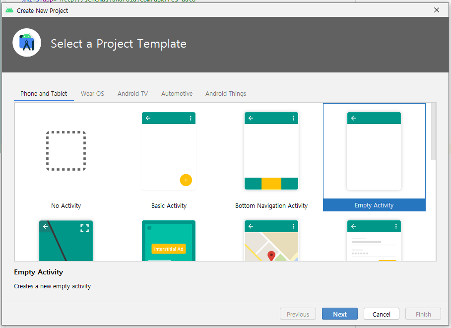

# Android studio 새 프로젝트 생성

### 프로젝트명 : Hello69Ver1.apk 

* File &gt; New &gt; New Project

* Activity 선택

* 이름, 저장경로, 최소사양 지정
* Use legacy android support libraries 체크 - 이전에 사용하던 libraries파일들을 계속 유지한다.

