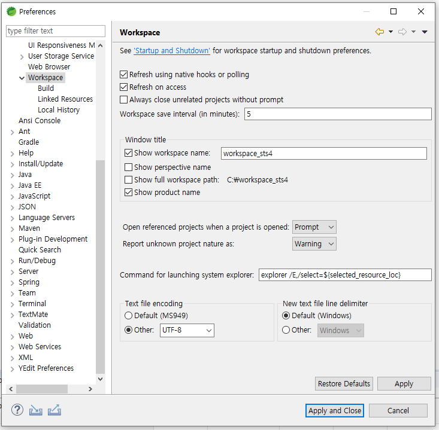
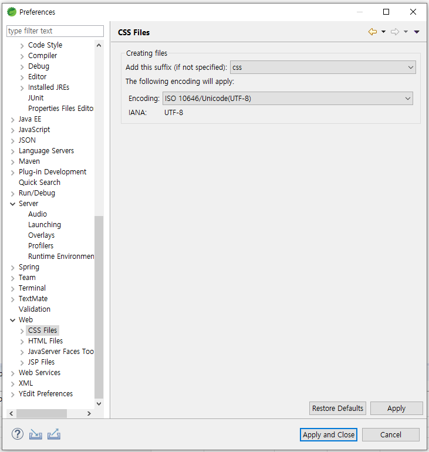

# Spring tool 4.1.1 환경설정

## window &gt; preferences

* General &gt; Contect Types
* Text 및 하위 모든 파일을 UTF-8로 설정

* General &gt; Workspace &gt; Build
* Save automatically before build 체크\(동기화\)

* General &gt; Workspace
* Refresh using native hooks or polling 체크\(동기화\)
* Text file encoding &gt; Other:UTF-8

* Server &gt; Runtime Environments
* Tomcat서버 제품 등록하기

* Web 항목 하위의 모든 항목 Encoding 설정하기

