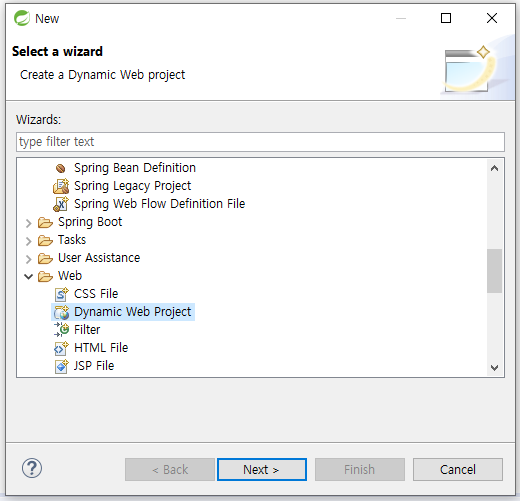
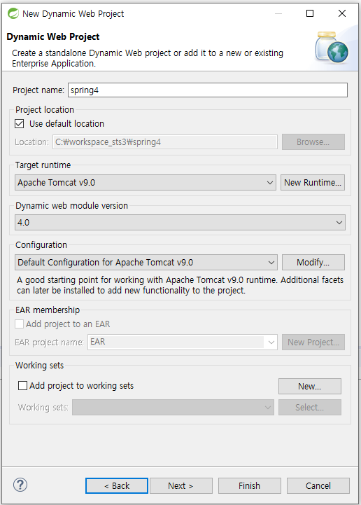
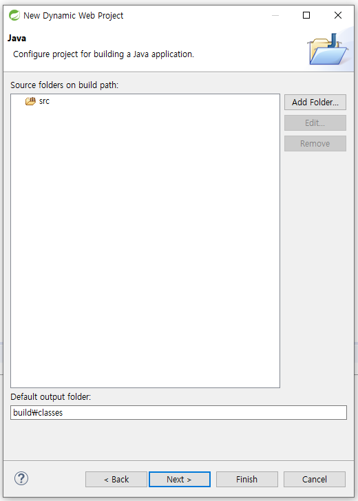
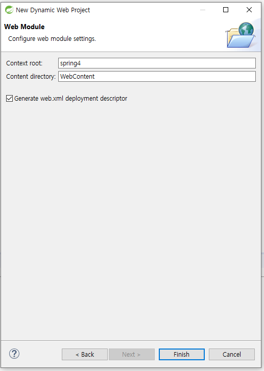

# spring4 : 1-2 프로젝트 생성하기

### file &gt; New &gt; other

* Web &gt; Dynamic Web Project &gt; Next

* 프로젝트이름 &gt; 서버지정 &gt; 버전설정 &gt; Next

* src폴더, Default output folder설정 &gt; Next

* Generate web.xml deployment descriptor 체크 &gt; Finish

