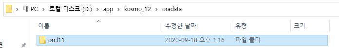

# 82 Days -

### 사용 프로그램

* 사용언어 : JAVA\(JDK\)1.8.0\_261, JS, JQuery, JSP, Servlet, HTML, JSON
* 사용Tool  - Eclipse : Eclipse.org - Toad DBA Suite for Oracle 11.5 - Spring
* 사용 서버 - WAS : Tomcat

## Final Project

### 서버

* 팀별 오라클 서버 컴퓨터 결정
* 계정 이름과 비밀번호, SID이름 공유

### Tablespace

* 테이블 스페이스 추가 CREAT TABLESPACE 이름결정 detafile '경로' SIZE 100M;
* 테이블 스페이스 수정 ALTER database detafile '경로' RESIZE 150M;
* 테이블 스페이스 확인하기 SELECT tablespace\_name, file\_name, maxbytes FROM dba\_data\_files WHERE tablespace\_name = '테이블스페이스 이름_'_
* 테이블 스페이스 삭제 DROP tablespace 테이블스페이스명

### 계정 생성

* 계정 생성 및 테이블스페이스 할당 CREAT USER 계정이름 IDENTIFIED BY 비밀번호 dafault tablelspace 테이블스페이스 이름;
* 권한 GRANT CREAT seqence to 계정이름\(시퀀스 생성권한\) GRANT CREAT trigger to 계정이름\(트리거 생성권한\) GRANT CREAT view to 계정이름\(뷰 생성권한\) GRANT CREAT table to 계정이름 whid addmin option;\(테이블 생성권한\) GRANT CREAT session to 계정이름 with admin option\(DB 접속권한\) alter user 계정이름 quota unlimited on 테이블스페이스명;
* Session &gt; New Connection에서 생성한 계정이름+비밀번호대로 계정 생성 - connect as : Nomal,  - SID : 는 오라클제품 설치시 지정한 초기 식별자 이므로 비워둬도 됨

### 관리자 계정 찾기 : CMD

```text
명령 프롬프트(즉, DOS 창)에서 다음을 실행합니다. 

C:\>sqlplus "/as sysdba"
SQL> show user
USER is "SYS" 

이제 암호를 원하는 대로 설정합니다. 

SQL> alter user sys identified by 암호;
SQL> alter user system identified by 암호;
```

* sys계정 비밀번호를 잃어버렸거나 연속으로 3번 입력을 잘못하면 자동 종료가 되어 버린다.
* 이때 sys계정을 찾을 수 있는 방법

### Oracle : 저장경로, SID



### Oracle 서버 : 종료, 재시작


