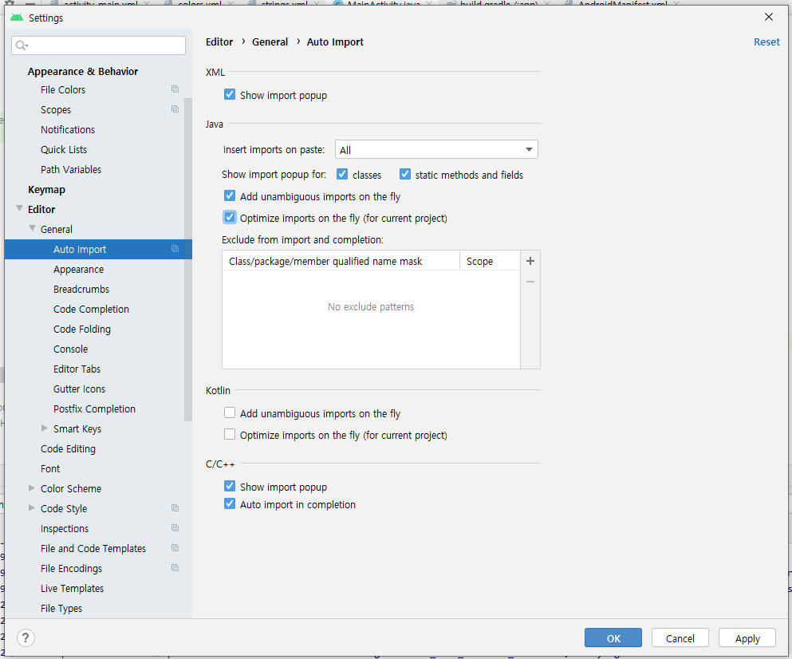

# 82 Days - Oracle, Toad, CMD, Trigger, View, AndroidStudio

### 사용 프로그램

* 사용언어 : JAVA\(JDK\)1.8.0\_261, JS, JQuery, JSP, Servlet, HTML, JSON
* 사용Tool  - Eclipse : Eclipse.org - Toad DBA Suite for Oracle 11.5 - Spring
* 사용 서버 - WAS : Tomcat

## Oracle

### 서버

* 팀별 오라클 서버 컴퓨터 결정
* 계정 이름과 비밀번호, SID이름 공유



### Tablespace

* sys 관리자 계정에서 진행
* 테이블 스페이스 추가 CREATE TABLESPACE 이름결정 detafile '경로' SIZE 100M;
* 테이블 스페이스 수정 ALTER database detafile '경로' RESIZE 150M;
* 테이블 스페이스 확인하기 SELECT tablespace\_name, file\_name, maxbytes FROM dba\_data\_files WHERE tablespace\_name = '테이블스페이스 이름_'_
* 테이블 스페이스 삭제 DROP tablespace 테이블스페이스명

### 계정 생성

* sys 관리자 계정에서 진행
* 계정 생성 및 테이블스페이스 할당 CREATE USER 계정이름 IDENTIFIED BY 비밀번호 default tablelspace 테이블스페이스 이름;
* 권한 GRANT CREATE seqence to 계정이름  with admin option; \(시퀀스 생성권한\) GRANT CREATE trigger to 계정이름  with admin option;    \(트리거 생성권한\) GRANT CREATE view to 계정이름  with admin option;        \(뷰 생성권한\) GRANT CREATE table to 계정이름 with admin option;        \(테이블 생성권한\) GRANT CREATE session to 계정이름 with admin option;   \(DB 접속권한\) alter user 계정이름 quota unlimited on 테이블스페이스명;
* Session &gt; New Connection에서 생성한 계정이름+비밀번호대로 계정 생성 - connect as : Nomal,  - SID : 는 오라클제품 설치시 지정한 초기 식별자 이므로 비워둬도 됨

### Oracle : 저장경로, SID


### Oracle 서버 : 종료, 재시작


### Trigger

```sql
grant create trigger to scott;
```

* 트리거 생성

```sql
create or replace trigger tri_test
    before update or delete or insert on imsi
begin 
    if(to_char(sysdate,'DY') in ('목'))
    then
        raise_application_error(-20500,'목요일에는 입력|수정|삭제 가 불가능합니다.');
    end if;
end;
```

* 트리거 구현


```sql
insert into imsi values(1);
```

* 트리거 테스트
* 목요일에 해당 SQL을 입력하면 에러창이 발생한다.

### View

```sql
grant create view to scott ;
```

* view 생성

```sql
create view view_dept_emp(e_empno, d_deptno, d_dname)
as SELECT a.empno e_empno
        ,b.deptno, b.dname
     FROM emp a, dept b
    WHERE a.deptno = b.deptno;
```

* view 구현


```sql
SELECT a.e_empno FROM view_dept_emp a, emp b
 WHERE a.e_empno = b.empno;
```

* 확인


```sql
select * from user_views
 where view_name LIKE 'VIEW_%' 
```

* 등록된 view확인하기

## CMD

### 관리자 계정 찾기

```sql
명령 프롬프트(즉, DOS 창)에서 다음을 실행합니다. 

C:\>sqlplus "/as sysdba"
SQL> show user
USER is "SYS" 

이제 암호를 원하는 대로 설정합니다. 

SQL> alter user sys identified by 암호;
SQL> alter user system identified by 암호;
```

* sys계정 비밀번호를 잃어버렸거나 연속으로 3번 입력을 잘못하면 자동 종료가 되어 버린다.
* 이때 sys계정을 찾을 수 있는 방법

### sqlplus : 테이블생성

```sql
C:\Users\kosmo_12>sqlplus

SQL*Plus: Release 11.1.0.7.0 - Production on 목 12월 10 11:18:30 2020

Copyright (c) 1982, 2008, Oracle.  All rights reserved.

사용자명 입력: scott
암호 입력:

다음에 접속됨:
Oracle Database 11g Enterprise Edition Release 11.1.0.7.0 - Production
With the Partitioning, OLAP, Data Mining and Real Application Testing options

SQL> create table imsi(no number(5));

테이블이 생성되었습니다.
```

## ER-win

### 관계형태

* 1 : 1
* 1 : n 이력관리 시스템에서는 반드시 필요한 관계
* n : m 카타시안의 곱 조인하면 필요하지 않은 데이터까지 모두 보여주므로 최대한 1:n으로 구현해야한다. n : m가운데에 행위 엔티티를 추가한다.

## Android Studio

### 매니페스트 파일

* 인터넷 권한
* 구글맵에 데힌 키, 인증
* 네트워크에 대한 권한
* xml로 작성된 앱의 전반적인 정보를 관리하는 문서이다.

### JAVA소스 폴더

* 실제 JAVA소스파일이 존재하는 폴더

### Gradle script

* 빌드시 필요한 스크립트 파일

### res

* 각종 리소스들이 저장되는 폴더 문자열 리소스, 이미지 리소스, ....

### Activity

* Object를 상속받으면 자바, HttpServlet을 상속받으면 서블릿인 것처럼  AppCompatActivity상속받아야 Activity이다.
* 라이프 사이클 : 임의로 수정할 수 없음 - onCreate\(Bundle savedInstanceState\){ }   entry point가 되는 메서드로, 자바의 main과 역할이 같다.   파라미터 번들 ; 이전 어플이 실행되었던 상태를 기억하는 저장소 클래스 - super.onCreate\(savedInstanceState\);   상위 클래스의 메서드를 호출해주는 코드, 안전성이 보장된다.

### Apply code Changes

* 두번째 실행부터는 즉시실행 버튼으로 실행한다.
* 한번 실행 이후 부터는 Run으로 실행하면 매번 빌드와 앱 설치를 다시 진행하므로 테스트 속도가 느려진다.
* 이 경우 수정 내용이 반영된 앱을 실제 기기에 설치하여 실행하는 것이 아니니 주의 하자.
* Ctrl + Alt + F10

## Android Studio 설정

### Java코드 자동 import



* File &gt; Settings &gt; Editor &gt; General &gt; Auto import

