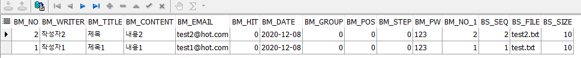

# 87 Days -

### 사용 프로그램

* 사용언어 : JAVA\(JDK\)1.8.0\_261, JS, JQuery, JSP, Servlet, HTML, JSON
* 사용Tool  - Eclipse : Eclipse.org, Toad DBA Suite for Oracle 11.5 , Spring, Android Studio
* 사용 서버 - WAS : Tomcat

## Toad : 게시판 + 첨부파일 테이블

### SELECT : Equal Join



```sql
SELECT *
  FROM board_master_t bm, board_sub_t bs
 WHERE bm.bm_no = bs.bm_no;
```

* master에는 존재하지만 sub테이블에는 첨부파일이 없을때 이퀄조인을 걸면 양쪽테이블에 모두 존재하는 것만 보여준다.

### SELECT : Outter Join


```sql
SELECT *
  FROM board_master_t bm, board_sub_t bs
 WHERE bm.bm_no = bs.bm_no(+);
```

* 하지만 실제로 게시판에서 update된 것은 두 건이므로 sub테이블의 첨부파일이 존재하지 않더라도 master테이블에는 게시글이 있기때문에 이를 보여주기 위해서는 null이 있는 테이블에 \(+\)를 추가한다.

### WHERE : LIKE, AND, OR, NULL


```sql
SELECT *
  FROM board_master_t bm right outer join board_sub_t bs
    ON bm.bm_no = bs.bm_no
 WHERE bm_title LIKE '%'||'목'||'%'
    OR bm.bm_content IS NULL;
```

* OR이나 IN의 경우에는 \(+\)를 허용하지 않아 위의 문법을 사용해야 한다.
* AND를 사용할 수록 조건이 많아져 SELECT결과물은 줄어들고, OR는 사용할 수록 조건이 광범위해져 SELECT결과물이 늘어난다.

### UPDATE

```sql
UPDATE board_master_t -- 글 삽입에 대한 없데이트, 트랜잭션처리가 필요
   SET bm_step = bm_step + 1
 WHERE bm_group = 35
   AND bm_step > 1;
   
UPDATE board_master_t -- 목록화면인지 상세보기 화면인지, 목록 아닐까
   SET bm_step = bm_step + 1
 WHERE bm_group =:x
   AND bm_step >:Y
```

