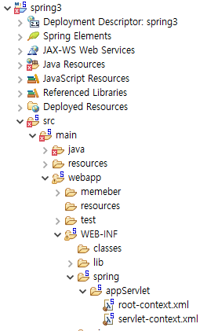
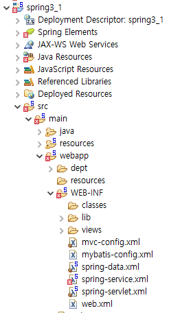

# 86 Days -

### 사용 프로그램

* 사용언어 : JAVA\(JDK\)1.8.0\_261, JS, JQuery, JSP, Servlet, HTML, JSON
* 사용Tool  - Eclipse : Eclipse.org, Toad DBA Suite for Oracle 11.5 , Spring, Android Studio
* 사용 서버 - WAS : Tomcat

## Toad

### 테이블 + pk 생성

```sql
create table board_master_t
(bm_no number(5) constraints bm_no_pk primary key);
```

* pk를 설정하면 index는 자동으로 생성된다.

### index 생성

```sql
create unique index scott.bmno_pk on scott.board_sub_t(bm_no, bs_seq);
```

* pk가 없다면 index를 따로 생성한다.

### FK 제약조건 생성

```sql
--제약조건 안전장치 설정, 제약조건 넣기
alter table scott.board_sub_t add(constraint fk_bmno
foreign key(bm_no)
references scott.board_master_t(bm_no)
enable validate);
```

* FK 제약조건 설정하기



## Spring 실습 : boot이전

### boot 이전

* xml기반 설정
* 단점 : xml에 오류 발생시 서버가 터져 다른 개발자들도 테스트가 불가능해지는 일이 발생한다.
* 장점 : boot보다 유지보수에 유리한 점이 있다.

### webapp&gt;board, WER-INF&gt;board

* sendRedirect, forward는 webapp, ModelAndView는 후

### spring3 프로젝트



* 스프링 메뉴에서 제공한 프로젝트로 xml기반으로 설정했지만 이클립스가 제공하는 프로젝트 트리구조를 준수하는 프로젝트 실습

### spring3-1 프로젝트



* 스프링 메뉴에서 제공한 프로젝트 이지만 이클립스가 제공하는 xml문서가 아닌 개발자가 직접 xml문서를 정의한 프로젝트 실습
* &lt;init-param&gt;spring servlet.xml&lt;init-param/&gt; 서블릿의 요청 발생시 마다 새로 읽어 처리한다.
* &lt;context\_param&gt;spring-service.xml, spring-data,xml&lt;context-param/&gt; 단독 선언되어 서버가 처음 기동될때 읽은 내용을 유지한다. 

## Spring 실습 : boot이후

### boot 이후

* application.properties기반 설정
* 어노테이션 사용
* 장점 : 개발자로서의 편리함을 제공해준다.

