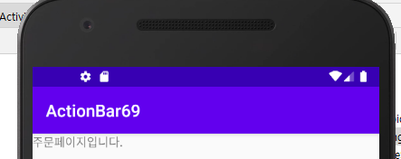
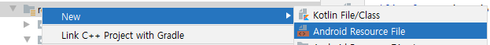
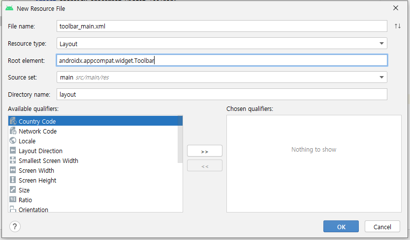

# 88 Days -

### 사용 프로그램

* 사용언어 : JAVA\(JDK\)1.8.0\_261, JS, JQuery, JSP, Servlet, HTML, JSON
* 사용Tool  - Eclipse : Eclipse.org, Toad DBA Suite for Oracle 11.5 , Spring, Android Studio
* 사용 서버 - WAS : Tomcat

## 필기

### 크롤링 & 스크래핑

* 크롤링 : 웹에 있는 모든 정보를 끌어오는 것
* 스크래핑 : 웹에 있는 정보들 중 필요한 것만 가져오는 것
* 이 작업에는 파이썬 같이 비교적 가볍고 짧은 언어가 적절하다.

### 클라우드 시스템

* 파이어베이스\(JSON:NoSQL제품, 경량 DB\) 
* 클라우드 데이터베이스 솔루션 활용능력

### 웹 소켓 통신

* http프로토콜 - 비상태 프로토콜 : stateless - 어떻게 유지할 것인가 : Oracle\(비싸다\)아닌 경량 DB\(NoSQL\)를 사용한다.   NoSQL제품 중의 하나가 파이어베이스\(클라우드\)이다.

### 웹과 앱

* 웹 - html\(DOM\) \_ 웹 크롤링, 웹 스크래핑
* 앱 - 하이브리드 앱\(웹앱 + 네이티브앱\) - Activity + Fragment\(include, JPanel, Div\)

### QnA

1. 페이지를 요청할 떄 Spring을 경유할 것인가요? - 등록화면과 같이 Controller에서 바로 응답페이지를 출력하는 경우에는 오라클을 경유하지 않는다.
2. 경유할 때와 경유하지 않는 때의 차이는 무엇인가요? - ModelAndView의 사용유무 - 사용하지 않는다면 jsp의 배포위치는 반드시 webapp아래일 것이고   사용한다면 jsp의 배포위치는 반드시 WEB-INF/views/ 아래일 것이다. - String의 경우는 예외
3. void일때, ModelAndView일때, String일 때 각각의 배포위치는 어떻게 되나요? - webapp아래 배포 : void - WEB-INF아래 배포 : ModelAndView, String

### 배포 위치

* 어디에 배포할 것인지 
* redirect와 forward의 경우로 나눈다.
* 페이지 출력 전에 오라클을 경유하는 경우\(특수한경우:화면에 목록이 이미 출력되는 설계\) &lt;select class="easyui-combobox" data-options="url:jsonXXXList.sp"/&gt;
* 조회 버튼을 클릭시 오라클을 경유하는 경우 \(일반적\) onClick -&gt; xxx.jsp
* webapp아래 배포하는 경우\(sendRedirect\) - 등록한 후에 결과 처리 메세지를 출력하는 페이지 와 같은 경우 - 유지하지 않아도되는 경우
* WEB-INF아래 배포하는 경우\(forward\)의 리턴타입 - return "board/boardList" - ModelAndView mav = new ModelAndVies\( \);   mav.setViewName\("board/boardLsit"\);

### easyUI : View 처리 방법 

* JSON으로 처리한다 : data-options HTML코드로 처리한다 : 익스프레션 : &lt;%= %&gt;
* JS에서 처리한다. 태그안에서 처리한다. 직접 출력한다.

## 계층형 게시판

### 학습목표

1. 트랜잭션 처리를 설명하고 구현 할 수 있다.
2. 스프링 부트 이전과 이후에 대한 비교를 통해  객체주입법이나 스프링에서 지원하는 어노테이션을 활용할 수 있다. - 환경설정   부트 이전 : xml 사용   부트 이후 : xml 없이 설정구현
3. MVC패턴을 이해하고 활용할 수 있다.
4. 오라클 조인에 대한 이해화 활용을 할 수 있다.

### data꺼내기 : View계층 + Model계층

* 데이터 베이스, JDBC API -&gt; MyBatis -&gt; MyBatis + Spring
* JDBC Class.forName\(오라클회사정보수집\), Connection, PreparedStatement, ResultSet
* MyBatis SqlSessionFactory : Class.forName + Connection SqlSession : PreparedStatement, commit, rollback ResultSet은 자동으로 해줌으로서 필요 없어졌다.
* MyBatis + Spring SqlSessionFactoryBean SqlSessionTemplate
* HikariCP : 커넥션 풀 기법을 활용해 멀티 티어 환경에 적합한 웹 개발 환경을 구축한다.

### 설계

* Spring을 사용할 것이므로 WEB-INF아래 배포한다. boardList.jsp
* boardList.sp요청으로 boardList.jsp페이지를 호출한다.

## Firebase와 Android 프로젝트 연동하기

### Firebase와 Android 프로젝트 연동하기

1. Android Studio : 프로젝트 생성
2. Firebase : 프로젝트 생성 - 1
3. Android Studio : 파일 추가하기
4. Anrdoid Studio : firebase사용 설정
5. Firebase : 완료 및 설정



## Android Studio : ActionBar

### Action Bar



* appBar == ActionBar
* 프로젝트의 res &gt; values &gt; themes.xml에 작성된다. - xml문서이므로 화면으로만 그려진다. - 아이콘을 바에 넣거나 하려면 xml이 아닌 java에서 해야한다.
* 기본적으로는 res &gt; themes.xml에 작성되어있는 ActionBar를 갖는다. - 직접 toolbar를 만들어 사용할 수 있다. - activity.xml에 직접 추가해도되고 따로 toolbar.xml로 외부에서 생성해 재사용할 수 도 있다.

### ActionBar : themes.xml

```markup
<style name="Theme.ActionBar69" parent="Theme.AppCompat.Light.DarkActionBar">
```

* Action Bar 보이기

```markup
<style name="Theme.ActionBar69" parent="Theme.AppCompat.Light.NoActionBar">
```

* Action Bar 안보이기

### toolBar

* JAVA JTextField jtf\_msg = new JTextField\("디폴트 값"\); jp\_center.add\("South", jtf\_msg\);
* activity\_main.xml  ToolBar tb = findViewById\(R.id.toolbar\); - 태그안에 작성되고 id가 주소번지이다.

### Fragment

* Activity안에서 반복되는 페이지를 부분처리할 때 사용하는 API
* &lt;LinearLayout&gt;     &lt;fragment&gt; 속지 느낌으로 재사용성을 누린다. &lt;/LinearLayout&gt;

### toolBar xml 생성



* 프로젝트의 res폴더 우클릭 &gt; New &gt; Android Resource File 



* OK

### ActionBar비활성화, ToolBar재사용

* ActionBar는 비활성화하고 toolbar를 정의해 사용하는 방법 두가지를 구현해보자.



후기 : 수도권 23일부터 5인이상 집합 금지....

### 

### 


