# Firebase와 Android 프로젝트 연동하기

## Firebase와 Android 프로젝트 연동하기

### 1. Android Studio : 프로젝트 생성

* 프로젝트 생성
* 애뮬레이터는 종료된 상태로 진행한다.

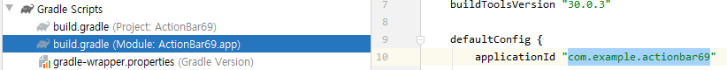

* build.gradle\(Module\)에서 project ID 확인하기

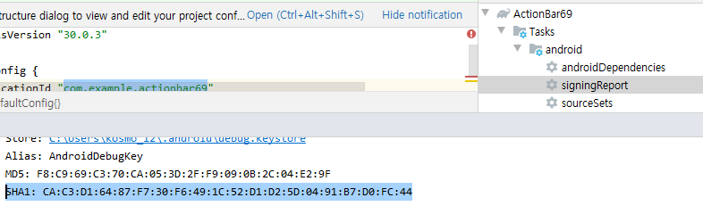

* 오른쪽 Execute Gradle Task &gt; Tasks &gt; android &gt; signingReport 클릭 &gt; Run 로그에서 SHA1 확인

### 2. Firebase : 프로젝트 생성

* 로그인
* 프로젝트 생성
* 메인 화면 안드로이드 선택

* Android 패키이 이름 = Android Project ID
* 디버그 서명 인증서 = SHA1
* 앱 등록 클릭

* 따라하기 

### 3. Android Studio : 파일 추가

* 상단 탭 Android &gt; Project 변경

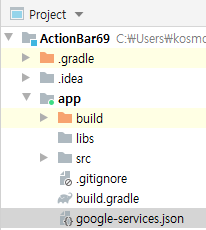

* 다운로드된 json파일 app 하위에 배포
* 다시 Firebase에서 다음 클릭 &gt; 3단계 따라하기

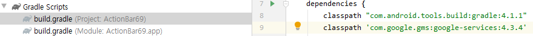

* build.gradle : Project 
* dependencies에 9번 코드만 추가하면 된다. 
* 나머지는 이미 기본설정으로 작성되어 있다.

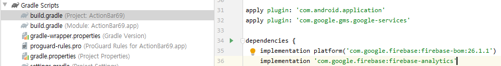

* build.gradle : Module 
* 31, 32번 코드와 dependencies의 35, 36번 코드 작성
* 모든 설정 후 상단의 노란색 알림 탭의 sync Now 클릭
* Build &gt; Build Bundle 적용

### 4. Anrdoid Studio : firebase사용 설정

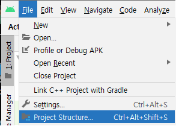

* 의존성 주입
* File &gt; Project Structure Alt + Ctrl + Shift + s

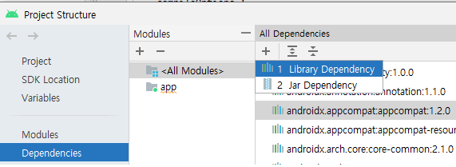

* Dependencies &gt; app &gt; + &gt; Library Dependency

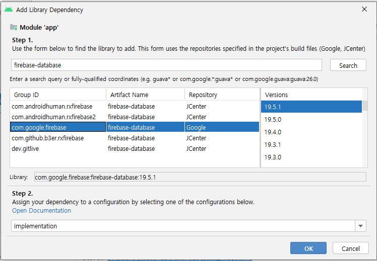

* firebase-database Search &gt; com.google.firebase &gt; 19.5.1 선택 &gt; OK &gt; Apply &gt; OK

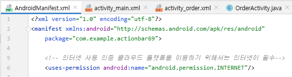

* Manifest.xml에서 인터넷 사용 인증 코드를 작성해야한다. 파이어베이스는 클라우드 제품이기 때문에 인터넷이 필수이다.
* 코드 작성후 Build &gt; Build Bundle하고 애뮬레이터 재 가동 해보기

### 5. Firebase : 완료 및 설정

* 모든 설정 &gt; Build Bundle &gt; 애뮬레이터 실행 확인 후
* 콘솔로 이동한다.

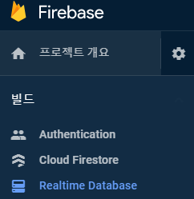

* Realtime Database 클릭 &gt; 만들기

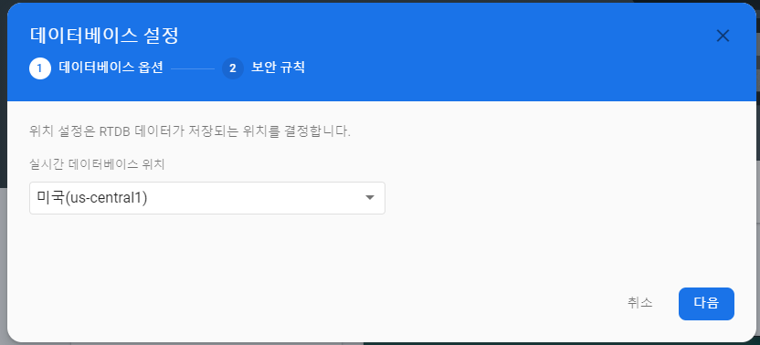

* 다음 &gt; test모드 선택, 상세설정 클릭

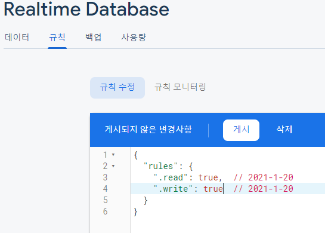

* 규칙 탭에서 읽기 쓰기 권한 부여

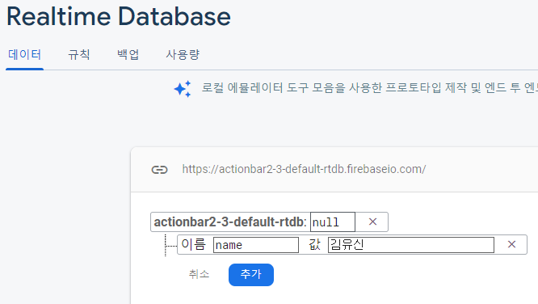

* 데이터 탭에서 데이터를 추가하여 트리 생성 확인하기

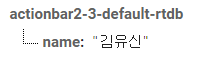

* 확인

