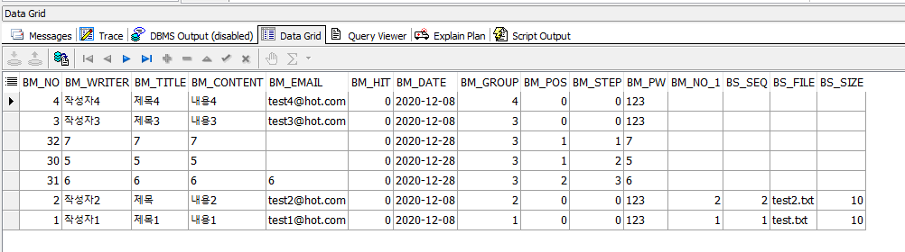

# Spring : 댓글 처리

## SQL



### Toad

```sql
SELECT * 
  FROM board_master_t bm, board_sub_t bs
 WHERE bm.bm_no = bs.bm_no(+)
ORDER BY bm.bm_group desc, bm.bm_step asc;
```

### MyBatis

```markup
	<select id="boardList" parameterType="map" resultType="map"><!-- bs테이블은 null일 수 있으므로 nullpointer방지로 NVL구문 사용 -->		   
		SELECT bm.bm_no, bm.bm_title, bm.bm_writer, bm.bm_content, bm.bm_email,bm.bm_pw, bm.bm_group, bm.bm_pos, bm.bm_step, bm.bm_hit, bm.bm_date
			   ,NVL(bs.bs_file,'') bs_file, NVL(bs.bs_size,0) bs_size 
		 FROM board_master_t bm left outer join board_sub_t bs <!-- WHERE bm.bm_no = bs.bm_no(+) -->
		   ON bm.bm_no = bs.bm_no
		 <where>
		 	<if test="bm_no > 0">
		 		AND bm.bm_no=#{bm_no}
		 	</if>
		 </where>
		 ORDER BY bm.bm_group desc, bm.bm_step asc
	</select>
```

## 댓글작성 처리 순서

### 1. WEB-INF/views/read.jsp

```javascript
<%@ page language="java" contentType="text/html; charset=UTF-8"
    pageEncoding="UTF-8"%>
<%@ page import = "java.util.List, java.util.Map, java.util.HashMap" %>
<%
	int tot = 0;
	List<Map<String,Object>> boardList = null;
	boardList = (List<Map<String,Object>>)request.getAttribute("boardDetail");
	Map<String,Object> rMap = new HashMap<>();
	if(boardList != null){
		rMap = boardList.get(0);
	}
%>
```

```markup
<!DOCTYPE html>
<html>
<head>
<meta charset="UTF-8">
<title>상세보기페이지[WEB-INF]</title>
<%@ include file="/common/easyUI_common.jsp" %>
<script type="text/javascript">
	function repleForm(){
		let url="repleForm.sp?bm_no="+<%=rMap.get("BM_NO").toString()%>;
		cmm_window_popup(url,"700px","500px","repleForm");
	}
	function refresh() {
		//alert("refresh호출");
		location.href="/board/boardList.sp";
	}
	function updateForm() {		
	}
	function deleteForm() {		
	}
	function boardList(){		
	}
</script>
</head>
```

```markup
<body>
<!-- ===================== [[ 글 상세보기 화면 ]] ====================== -->
<table id="pan_read" class="easyui-panel" title="글상세보기" data-options="footer:'#tb_read'"
 style="width:670px;height:380px;padding:10px;background:#fafafa;">
   <tr>
      <td>제목</td>
      <td><input class="easyui-textbox" value="<%=rMap.get("BM_TITLE") %>" id="bm_title" data-options="width:'450px'"></td>
   </tr>
   <tr>
      <td>작성자</td>
      <td><input class="easyui-textbox" value="<%=rMap.get("BM_WRITER") %>" id="bm_writer" data-options="width:'450px'"></td>
   </tr>
   <tr>
      <td>이메일</td>
      <td><input class="easyui-textbox" value="<%=rMap.get("BM_EMAIL") %>" id="bm_email" data-options="width:'450px'"></td>
   </tr>
   <tr>
      <td>내용</td>
      <td><input class="easyui-textbox" value="<%=rMap.get("BM_CONTENT") %>" id="bm_content" data-options="multiline:'true',width:'450px', height:'90px'"></td>
   </tr>
   <tr>
      <td>비밀번호</td>
      <td><input class="easyui-textbox" value="<%=rMap.get("BM_PW") %>" id="bm_pw" data-options="width:'450px'"></td>
   </tr>
</table>
 <div id="tb_read" style="padding:2px 5px;" align="center">
    <a href="javascript:repleForm()" class="easyui-linkbutton" iconCls="icon-edit" plain="true">댓글쓰기</a>
    <a href="javascript:updateForm()" class="easyui-linkbutton" iconCls="icon-add" plain="true">수정</a>
    <a href="javascript:deleteForm()" class="easyui-linkbutton" iconCls="icon-remove" plain="true">삭제</a>
    <a href="javascript:boardList()" class="easyui-linkbutton" iconCls="icon-search" plain="true">목록</a>
</div>
<!-- ===================== [[ 댓글 작성하기 화면 ]] ====================== -->
</body>
</html>
```

### 2. boardController.java

```java
//글 수정 입력 화면 페이지 구현 = 한 건을 갖고온다. - webapp/board/repleFrom.jsp
	public String repleForm(HttpServletRequest req, HttpServletResponse res)//viewResolver를 사용한다.
			throws Exception{
		logger.info("controller - repleForml호출성공");
		List<Map<String,Object>> boardList = null;
		Map<String,Object> pmap = new HashMap<>();
		HashMapBinder hmb = new HashMapBinder(req);
		hmb.bind(pmap);
		boardList = boardLogic.boardList(pmap);
		//String이므로 forward를 따로 작성해야한다. 어노테이션이 아닌 표준으로 한다.
		req.setAttribute("repleForm", boardList);
		return "forward:/board/repleForm.jsp";
	}
```

### 3. repleForm.jsp

```javascript
<%@ page language="java" contentType="text/html; charset=UTF-8"
    pageEncoding="UTF-8"%>
<%@ page import = "java.util.List, java.util.Map, java.util.HashMap" %>
<%
	int tot = 0;
	List<Map<String,Object>> boardList = null;
	//repleForm은 webapp밑에 있기때문에 Controller에서 ModelAndView가 아닌 String을 사용해야한다.
	boardList = (List<Map<String,Object>>)request.getAttribute("repleForm"); //forward방식
	Map<String,Object> rMap = new HashMap<>();
	if(boardList != null){
		rMap = boardList.get(0);
		out.print(rMap.get("BM_NO"));
		out.print(rMap.get("BM_GROUP"));
		out.print(rMap.get("BM_POS"));
		out.print(rMap.get("BM_STEP"));
	}
%>
```

```markup
<!DOCTYPE html>
<html>
<head>
<meta charset="UTF-8">
<title>댓글쓰기 화면[webapp]</title>
<%@ include file="/common/easyUI_common.jsp" %>
<script>
   function addAction(){
      $("#f_reple").attr("method","post");
      $("#f_reple").attr("action","/board/boardInsert.sp");//새글과 댓글을 동일하게 Insert를 사용한다.
      //$("#f_reple").attr("action","/board/boardInsert.sp?id=test");
      $("#f_reple").submit();
   }
   function writeClose(){
      window.close();
   }
</script>
</head>
```

```markup
<body>
</body>
<div id="dlg_boardAdd" class="easyui-panel" title="글쓰기" style="width:650px;height:450px;padding:10px" data-options="footer:'#tbar_boardAdd'">
	<form id="f_reple">
	<!-- numberFormatException방지, 사용자가 입력하는 값이 아님 -->
	<!-- 페이지를 출력하기 전에 오라클을 경유한 결과물은 hidden에서 사용되고  -->
	<input type="hidden" name="bm_no" value="<%=rMap.get("BM_NO")%>"/>
	<input type="hidden" name="bm_group" value="<%=rMap.get("BM_GROUP")%>"/>
	<input type="hidden" name="bm_pos" value="<%=rMap.get("BM_POS")%>"/>
	<input type="hidden" name="bm_step" value="<%=rMap.get("BM_STEP")%>"/>
	<!-- 사용자가 화면에서 입력한 값은 폼 전송으로 처리한다. -->
	<table>
      <tr>
         <td width="100px">제목</td>
         <td width="500px">
            <input class="easyui-textbox" data-options="width:'350px'" id="bm_title" name="bm_title" required>
         </td>
      </tr>
      <tr>   
         <td width="100px">작성자</td>
         <td width="500px">
            <input class="easyui-textbox" data-options="width:'150px'" id="bm_writer" name="bm_writer" required>
         </td>
      </tr>
      <tr>
         <td width="100px">이메일</td>
         <td width="500px">
            <input class="easyui-textbox" data-options="width:'250px'" id="bm_email" name="bm_email">
         </td>
      </tr>
      <tr>         
         <td width="100px">내용</td>
         <td width="500px">
            <input class="easyui-textbox" id="bm_content" name="bm_content" data-options="multiline:'true',width:'400px',height:'90px'" required>
         </td>
      </tr>
      <tr>         
         <td width="100px">비번</td>
         <td width="500px">
            <input class="easyui-textbox" data-options="width:'100px'" id="bm_pw" name="bm_pw" required>
         </td>
      </tr>
      <tr>         
         <td width="100px">첨부파일</td>
         <td width="500px">
            <input class="easyui-filebox" data-options="width:'450px'" id="bs_file" name="bs_file">
         </td>
      </tr>
   </table>
   </form>
</div>
<!-- 입력 화면 버튼 추가 -->
<div id="tbar_boardAdd" align="right">
   <a href="javascript:addAction()" class="easyui-linkbutton" iconCls="icon-save">저장</a>
   <a href="javascript:writeClose()" class="easyui-linkbutton" iconCls="icon-cancel">닫기</a>
</div>
</html>
```

### 4. boardController.java : Insert

```java
	//첨부파일은 필수조건이 아니므로 nullPointer를 피하려면 required를 붙여줘야 한다.
	public void boardInsert(HttpServletRequest req, HttpServletResponse res, @RequestParam(value="bs_file, required") MultipartFile bs_file)
			throws Exception{
		logger.info("controller - boardInsert호출성공");
		int result = 0;
		Map<String,Object> pmap = new HashMap<>();
		HashMapBinder hmb = new HashMapBinder(req);
		hmb.bind(pmap);
		
		//첨부파일이 존재하니?
		if("첨부파일".equals("첨부파일")) {
			logger.info("첨부파일 존재");
		
		}
		result = boardLogic.boardInsert(pmap);
		if(result==1) {
			res.sendRedirect("/board/boardInsertOk.jsp");//insert성공 후 목록 갱신, 보여주기
		}else {
			res.sendRedirect("/board/boardInsertFail.sp");
		}
	}
```

### 5.boardLogic.java : Insert

```java
	public int boardInsert(Map<String, Object> pMap) {//트랜잭션처리
		int result = 0;
		int bm_no = 0;
		int bm_group = 0;
		if(pMap.get("bm_group")!=null) {
			bm_group = Integer.parseInt(pMap.get("bm_group").toString());
		}
		bm_no = sqlBoardMDao.getBmno();//pk이므로 마스터에서 가져온다.
		pMap.put("bm_no",bm_no);
		//너 댓글이니?
		if(bm_group > 0) {
			pMap.put("bm_group",bm_group);
			sqlBoardMDao.bmStepUpdate(pMap);
			int pos = 0;
			int step = 0;
			
			if(pMap.get("bm_pos") != null) {//null체크 코드가 없을때 null이 발생하면 Exception이 발생할 수 있다.
				pos = Integer.parseInt(pMap.get("bm_pos").toString());
			}
			pMap.put("bm_pos", pos+1);
			
			if(pMap.get("bm_step") != null) {//null체크 코드가 없을때 null이 발생하면 Exception이 발생할 수 있다.
				step = Integer.parseInt(pMap.get("bm_step").toString());
			}
			pMap.put("bm_step", step+1);
		}

		int mresult = sqlBoardMDao.boardMInsert(pMap);

		return mresult;
	}
```

### 6. SQL

```markup
	<select id="getBmno" parameterType="int" resultType="int">
		SELECT seq_board_no.nextval bm_no FROM dual
	</select>
```

```markup
<update id="bmStepUpdate" parameterType="map">
		UPDATE board_master_t
		   SET bm_step = bm_step + 1
		 WHERE bm_group = #{bm_group} <!-- read.jsp에서 온다 -> select된 한개 row를 갖고 있다. 해당 row의 bm_group을 가져온다. -->
		   AND bm_step > #{bm_step}
	</update>
```

```markup
<insert id="boardMInsert" parameterType="map"><!-- 끝에 세미콜론 들어가면 안됨!!! -->
		INSERT INTO board_master_t(bm_no,bm_writer,bm_title,bm_content,bm_email,bm_date,bm_group,bm_pos,bm_step,bm_pw)
       	 VALUES(#{bm_no},#{bm_writer},#{bm_title},#{bm_content},#{bm_email},TO_CHAR(SYSDATE,'YYYY-MM-DD'),#{bm_group},#{bm_pos},#{bm_step},#{bm_pw})
	</insert>
```

### 7.boardList.jsp

```markup
<body>
게시판 목록
<!-- ======================== [[글목록 화면 시작]] =========================
JEasyUI의 DataGrid API를 활용하여 작성
1)익스프레션을 이용해서 화면 처리
  :tr, td태그를 직접 작성해서 처리하는 방식
2)json포맷으로 처리해서 매핑
  :field명만 맞춰주면 자동으로 매핑
 -->
 <table id="dg_board" title="글목록" style="width:950px;height:500px" class="easyui-datagrid" data-options="singleSelect:'true',toolbar:'#tb_search,#tb_board',footer:'#pn_board'">
    <!--헤더부분 추가 -->
    <thead>
       <tr>
          <th data-options="field:'BM_TITLE',width:'350px'">제목</th>
            <th data-options="field:'BM_WRITER',width:'100px'">작성자</th>
            <th data-options="field:'BM_DATE',width:'110px'">작성일</th>
            <th data-options="field:'BS_FILE',width:'280px'">첨부파일</th>
            <th data-options="field:'BM_HIT',width:'100px'">조회수</th>
       </tr>
    </thead>
    <!--데이터 출력 영역  -->
    <tbody>    	
    <!---================== 조회결과가 있는 경우 ======================= -->    	
    <%
    	if(tot > 0){
    		for(int i=0;i<tot;i++){
    			Map<String,Object> rmap = boardList.get(i);    		   	
    %>
    	<tr>
    		<td>
    		<!-- 너 댓글이니? 댓글이라면 이미지를 붙여줄거야. -->
    		<%
    			String imgPath = "\\images\\";
    			if(Integer.parseInt(rmap.get("BM_POS").toString())>0){
    				for(int j=0;j<Integer.parseInt(rmap.get("BM_POS").toString());j++){
    					//차수에 따라 들여쓰기 깊이를 다르게 한다.
    					out.print("&nbsp;&nbsp;");
    				}
    		%>
    		rply.gif" border="0"/>
    		<%
    			}
    		%>
	    		<a href="javascript:boardDetail('<%=rmap.get("BM_NO")%>')">
            	<%=rmap.get("BM_TITLE") %>
            	</a>
            </td>
            <td><%=rmap.get("BM_WRITER") %></td>
            <td><%=rmap.get("BM_DATE") %></td>
            <td><%=rmap.get("BS_FILE") %></td>
            <td><%=rmap.get("BM_HIT") %></td>
       </tr>
     <%
    		}
    	}
    		
     %>
    </tbody>
 </table>  
</body>
</html>
```

## 결과


