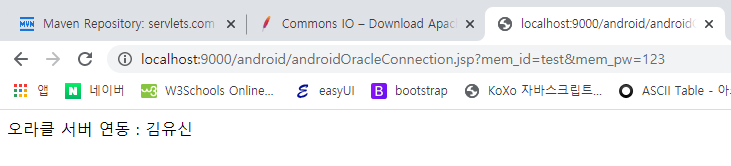
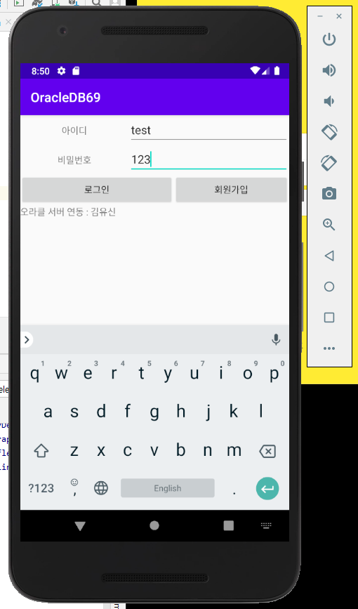
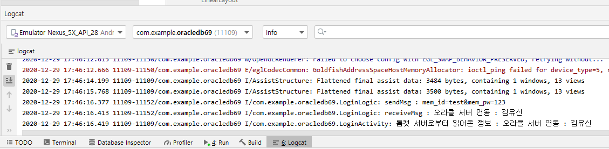

# Android Studio & Spring : 로그인 처리

## Spring : DB로그인 처리

### 코드 : androidOracleConnection.jsp

```java
<%@ page language="java" contentType="text/html; charset=UTF-8"
    pageEncoding="UTF-8"%>
<%@ page import="java.sql.*" %>
<%
	String url = "jdbc:oracle:thin:@192.168.0.187:1521:orcl11";//물리적 오라클 ip주소
	Connection con = null;
	Statement stmt = null;
	ResultSet rs = null;
	
	String mem_id = request.getParameter("mem_id");
	String mem_pw = request.getParameter("mem_pw");
	String mem_name = "";//결과로 받아올 값 변수 선언
	StringBuilder sql = new StringBuilder();
	sql.append("SELECT mem_name FROM member69 WHERE mem_id='"+mem_id+"' AND mem_pw='"+mem_pw+"'");
	try{
		Class.forName("oracle.jdbc.driver.OracleDriver");//+con -> mybatis - sqlSessionFactoryBean
		con = DriverManager.getConnection(url, "scott", "tiger");//자원반납대상
		stmt = con.createStatement();//자원반납대상, mybatis - sqlSession(java), sqlSessionTempalte(spring, selectOne)
		rs = stmt.executeQuery(sql.toString());//자원반납대상, mybatis - <select resultType-"map"> rs.next할거 없이 자동으로 resultType에 박힌다.
		rs.next();
			mem_name = rs.getString("mem_name");
		
		out.print("오라클 서버 연동 : "+mem_name);
	}catch(SQLException se){
		out.print(se.toString());
	}catch(Exception e){
		out.print(e.toString());
	//사용자원 반납	
	}finally {//품질관리 - QC팀
		try{
			//oracle에서 세션에 대한 누수 방지(방치시 서버에 더이상 접속할 수 없게 됨)
			if(rs != null) rs.close();
			if(stmt != null) stmt.close();
			if(con != null) con.close();
		}catch(Exception e) {
			
		}
	}
%>
```

* webapp > android > androidOracleConnection.jsp\
  여기에 위치해 Http url로 접근이 가능하다. 
* 10-11번에서 POST방식으로 넘어온 값을 받는다.
* 15번 : DB연결은 예외처리 필수
* 16-23번 코드는 mybatis로 작성할 경우에 필요가 없어진다.\
  \- Class.forName + con -> sqlSessionFactoryBean\
  \- stmt -> sqlSession(java), sqlSessionTemplate(spring)\
  \- rs -> mybatis의 xml에 작성되는 resultType을 통해 자동으로 Dao에 선언된 변수에 담긴다.
* 31-34번 : DB연동에 있어서 자원반납은 필수

## Android Studio : Manifests

### 코드 : AndroidManirest.xml

```markup
<?xml version="1.0" encoding="utf-8"?>
<manifest xmlns:android="http://schemas.android.com/apk/res/android"
    package="com.example.oracledb69">

    <!-- 인터넷 권한 허용 -->
    <uses-permission android:name="android.permission.INTERNET" />

    <application
        android:allowBackup="true"
        android:icon="@mipmap/ic_launcher"
        android:label="@string/app_name"
        android:roundIcon="@mipmap/ic_launcher_round"
        android:supportsRtl="true"
        android:usesCleartextTraffic="true"
        android:theme="@style/Theme.OracleDB69">
        <activity android:name=".MainActivity"></activity>
        <activity android:name=".LoginActivity">
            <intent-filter>
                <action android:name="android.intent.action.MAIN" />

                <category android:name="android.intent.category.LAUNCHER" />
            </intent-filter>
        </activity>
    </application>

</manifest>
```

* 6번 : 인터넷 권한 허용,
* 14번 : Http url접근 허용

## Android Studio : JAVA

### 코드 : LoginActivity.java

```java
package com.example.oracledb69;

import androidx.appcompat.app.AppCompatActivity;

import android.os.Bundle;
import android.util.Log;
import android.view.View;
import android.widget.EditText;
import android.widget.TextView;

public class LoginActivity extends AppCompatActivity {

    TextView tv_result = null;

    @Override
    protected void onCreate(Bundle savedInstanceState) {
        super.onCreate(savedInstanceState);
        setContentView(R.layout.activity_login);
        tv_result = findViewById(R.id.tv_result);
    }

    public void loginAction(View view) {
        //사용자의 입력값 청취
        EditText et_id = findViewById(R.id.user_id);        
        String id = et_id.getText().toString();//loginlogic클래스에 넘기기위한 변수 선언
        EditText et_pw = findViewById(R.id.user_pw);
        String pw = et_pw.getText().toString();

        //DB연동 실행
        String result = null;
        try{
            LoginLogic loginLogic = new LoginLogic();//개발자가 직접 관리
            result = loginLogic.execute(id,pw).get();
            tv_result.setText(result);
        }catch(Exception e){
            Log.i(this.getClass().getName(), "Exception : "+e.toString());
        }
        Log.i(this.getClass().getName(), "톰캣 서버로부터 읽어온 정보 : "+result);
    }
}
```

* 13번 : 결과를 출력할 공간, activity_login.xml에 작성된 TextView태그의 id값을 담을 변수 선언\
  18번에서 해당 id를 가진 xml이 매칭된 후에 19번에서 id에 접근한다.
* 24,26번에서 xml에서 사용자가 입력하는 EditText 태그의 id에 접근한다.\
  25, 27번에서 getText( ).toString( ) 함수를 사용해 입력 값을 String으로 꺼내 담는다.\
  LoginLogic클래스에서 사용하기 위해 String으로 변환한다.

### 코드 : LoginLogic.java

```java
package com.example.oracledb69;

import android.os.AsyncTask;
import android.util.Log;

import java.io.BufferedReader;
import java.io.InputStream;
import java.io.InputStreamReader;
import java.io.OutputStream;
import java.io.OutputStreamWriter;
import java.net.HttpURLConnection;
import java.net.URL;

public class LoginLogic extends AsyncTask<String,Void,String> {

    //멤버변수 선언
    String sendMsg = null;//안드로이드 앱에서 입력받은 아이디와 비번을 담아 톰캣에 전달한다.
    String receiveMsg = null;//tomcat 서버를 통해 처리된 결과를 받아 담을 변수 선언.
```

* 멤버변수로 파라미터를 받을 Strng, 응답 메세지를 담을 String을 선언한다.

```java
    //doInBackground에서 작업을 제외하고는 전부 메인 스레드의 작업이다.
    //이 메서드에서는 ui접근이 가능한 ui스레드를 사용한 작업이 이뤄진다.
    //개선 코드 : 리턴타입을 json포맷으로 받아오는 API가 있으면 좋겠다.
    @Override
    protected String doInBackground(String... strings) {//파라미터에서 열거형 연산자를 통해 배열 형태로 여러개 String값을 받아온다.
        //주의 tomcat서버의 localHost로는 tomcat서버에 접속이 불가능하다.
        String apiURL = "http://192.168.0.187:9000/android/androidOracleConnection.jsp";
        try {
            //하이브리드 앱을 구현하기위해  http프로토콜을 활용해 웹서버에 접속을 시도한다.
            URL url = new URL(apiURL);

            //톰캣 서버와 통신 채널을 개통한다.
            HttpURLConnection con = (HttpURLConnection)url.openConnection();
            con.setRequestMethod("POST");
            con.setRequestProperty("Content-Type","application/x-www-form-urlencoded");
            OutputStreamWriter osw = new OutputStreamWriter(con.getOutputStream());

            //톰캣에 전송할 메세지 처리
            sendMsg = "mem_id="+strings[0]+"&mem_pw="+strings[1];
            Log.i(this.getClass().getName(),"sendMsg : "+sendMsg);
            osw.write(sendMsg);
            osw.flush();//작성한 내용 서버로 전송후에 메모리를 비우는 메서드
            //여기까지가 요청에 대한 처리
```

* doInBackground메서드에서는 IU스레드를 활용한 작업이 이뤄진다.
* 5번에서 파라미터로 String배열로 string을 담을 수 있다.
* 7번 : spring에서 작성한 jsp로 DB연동을 하기위한 url이다. localHost로는 접근이 불가능하고 테스트시에 spring의 tomcat서버가 반드시 켜져 있어야 한다.
* 10번에서 String주소를 URL클래스로 변환한다.
* 13번에서 통신 채널 오픈
* 14번 : 개인 id, pw를 처리하는 것이므로 get방식이 아닌 post방식을 선택했다.
* 19번에서 post방식으로 넘겨야하는 파라미터 값을 담는다.
* 21번 : 만들어둔 쓰기객체를 활용해 말하기(url 말하기)한다.
* 22번의 flush( )함수는 서버 전송이 이뤄진 뒤에 메모리를 비워주는 메서드이다.
* 16번에서 쓰기(말하기)를 담당하는 OutputStreamWriter객체를 생성한다.

```java
            //응답을 받아올 준비--성공시 200번
            int responseCode = con.getResponseCode();//200,404,500, ...
            BufferedReader br = null;
            if(responseCode == con.HTTP_OK){
                br = new BufferedReader(new InputStreamReader(con.getInputStream(),"UTF-8"));
                String inputLine;
                StringBuffer sb_res = new StringBuffer();
                while((inputLine = br.readLine()) != null){//서버에서 응답으로 받아온 메세지가 있다면
                    sb_res.append(inputLine);
                }
                //최종출력
                receiveMsg = sb_res.toString();
                Log.i(this.getClass().getName(),"receiveMsg : "+receiveMsg);
            }else{
                br = new BufferedReader(new InputStreamReader(con.getErrorStream()));
                Log.i(this.getClass().getName(),"통신실패");
            }
        }catch(Exception e) {
            Log.i(this.getClass().getName(),"Exception : "+e.getMessage());
        }
        return receiveMsg;
    }
}
```

* 2번의 getResponseCode( )메서드를 활용하면 해당 연결의 통신상태를 가져올 수 있다.\
  \- 성공이면 200, 찾을 수 없으면 404 등 ...
* 3번 : BufferReader클래스를 활용해 문자열 응답을 받아오면 메모리 처리 효율이 높아진다. 한글자씩 인지하므로
* 4번 : 연결이 성공했다면, 200번이라면
* 5번에서 InputStreamReader( )클래스로 읽기(듣기)객체를 BufferdReader객체로 생성한다.
* 6번에서 응답값을 받을 String변수를 선언한다.
* 7번에서는 응답값을 append(붙이기)하기 위해 StringBuffer객체를 생성한다.
* 8번 : 응답으로 받아온 메세지가 존재하는 동안에는
* 9번 : sb_res에 메세지를 추가한다.
* 12번 : 멤버변수에 선언해둔 최종 응답 변수에 받아온 메세지를 toString( )으로 담는다.
* 21번 : return 멤버변수

## Android Studio : XML

### 코드 : activity_login.xml

```markup
<?xml version="1.0" encoding="utf-8"?>
<LinearLayout xmlns:android="http://schemas.android.com/apk/res/android"
    xmlns:app="http://schemas.android.com/apk/res-auto"
    xmlns:tools="http://schemas.android.com/tools"
    android:orientation="vertical"
    android:layout_width="match_parent"
    android:layout_height="match_parent"
    tools:context=".LoginActivity">

    <TableLayout
        android:layout_width="match_parent"
        android:layout_height="match_parent">
        <TableRow
            android:layout_width="match_parent"
            android:layout_height="match_parent">
            <TextView
                android:layout_width="wrap_content"
                android:layout_height="wrap_content"
                android:layout_weight="1"
                android:textAlignment="center"
                android:text="아이디"/>
            <EditText
                android:id="@+id/user_id"
                android:layout_width="wrap_content"
                android:layout_height="wrap_content"
                android:layout_weight="8"/>
        </TableRow>
        <TableRow
            android:layout_width="match_parent"
            android:layout_height="match_parent">
            <TextView
                android:layout_width="wrap_content"
                android:layout_height="wrap_content"
                android:layout_weight="1"
                android:textAlignment="center"
                android:text="비밀번호"/>
            <EditText
                android:id="@+id/user_pw"
                android:layout_width="wrap_content"
                android:layout_height="wrap_content"
                android:layout_weight="8"/>
        </TableRow>
        <TableRow
            android:layout_width="match_parent"
            android:layout_height="match_parent">
            <Button
                android:id="@+id/btn_login"
                android:layout_width="wrap_content"
                android:layout_height="wrap_content"
                android:layout_weight="5"
                android:onClick="loginAction"
                android:text="로그인"/>
            <Button
                android:id="@+id/btn_new"
                android:layout_width="wrap_content"
                android:layout_height="wrap_content"
                android:layout_weight="5"
                android:text="회원가입"/>
        </TableRow>

        <TableRow
            android:layout_width="match_parent"
            android:layout_height="match_parent" >

            <TextView
                android:id="@+id/tv_result"
                android:layout_width="match_parent"
                android:layout_height="wrap_content"
                android:text="결과화면" />
        </TableRow>
    </TableLayout>

</LinearLayout>
```

## Spring : DB연동 TEST화면

### spring : /android/androidOracleConnection.jsp

.png>)

* 파라미터로 조건이 들어오지 않으면 나타나는 화면



* 조건을 넘기면 제대로된 값이 출력되는 것을 확인할 수 있다.

## 결과 : 에뮬레이터



* DB에 존재하는 id과 pw를 입력하면 하단에 DB결과값이 출력되는 것을 확인할 수 있다.



* Android Studio의 logout
