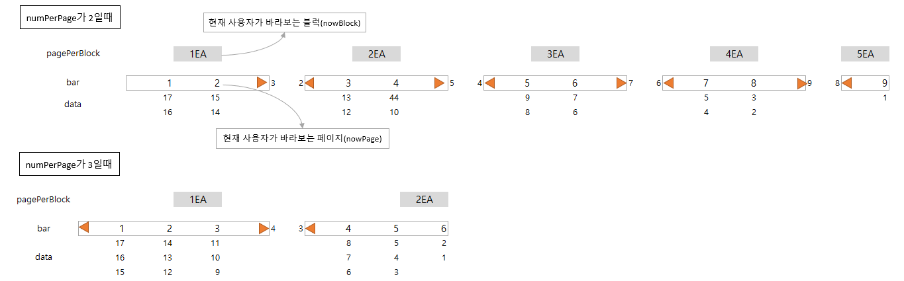

# 98Days - Spring:PageNavigation, PageBar, 총 게시글 SQL, 페이지 당 게시글 제한

### 사용 프로그램

* 사용언어 : JAVA(JDK)1.8.0\_261, JS, JQuery, JSP, Servlet, HTML, JSON
* 사용Tool  - Eclipse : Eclipse.org, Toad DBA Suite for Oracle 11.5 , Spring, Android Studio
* 사용 서버 - WAS : Tomcat

## 필기

### UI솔루션

* JS기반 솔루션(무료)\
  \- easyUI에서는 datagrid에 json형식을 담을 수 있다.
* XML기반 솔루션(유료)\
  \- jsp와 같은 화면에 섞어 사용할 수 없다.\
  \- 해결방법 1 : url로 요청한다. location.href\
  \- 해결방법 2 : 탑재된 xml -> js 변환엔진을 활용한다.\
  \- 조회결과를 xml포맷으로 출력해 데이터셋이 담아 grid와 매칭해야 한다.
* 솔루션을 활용하는 경우에는 개발자가 부여한 id로 해당 컴포넌트에 접근 할 수 없는 문제가 발생하기도 한다. 솔루션 자체에서 제공하는 UI가 개발자의 컴포넌트를 감싸기 때문으로 개발자도구에서 코드를 확인해 id를 찾아야 한다.

### ModelAndView

* ViewResolver를 활용하게된다.
* 접두어 + 페이지이름 + 접미어

### String

* return "redirect:XXX.jsp"\
  \- webapp에 배포된 경로에 접근하고, url주소가 변경되어 기존 요청은 끊어지고 새 요청이 발생한다.
* return "forward:XXX.jsp"\
  \- webapp에 배포된 경로에 접근하고, url주소가 변경되지 않으면서 페이지 이동이 발생한다.\
    기존 요청이 유지되어 서블릿에서 처리된 값이 jsp페이지 에서 사용될 수 있다.\
  \- xml 기반인 넥사크로와 같은 솔루션에서는 사용될 수 없다.\


## Spring : pageNavigation

### PageBar



### boardList.jsp

```java
<%@ page import ="com.util.PageBar" %>
<%
	//pagebar 변수
	int numPerPage = 3;//한 페이지에는 5개의 데이터를 보여줄 것이다.
	//int totalRecord = 0;//orcle에서 계산 하는 쿼리문을 작성한다.
	int nowPage = 0;
	if(request.getParameter("nowPage") != null) {
		nowPage = Integer.parseInt(request.getParameter("nowPage"));
	}
	
	int tot = 0;//=totalRecord
	List<Map<String,Object>> boardList = null;
	boardList = (List<Map<String,Object>>)request.getAttribute("boardList");
	if(boardList != null){
		tot = boardList.size();
	}
%>
```

* 상단에 PageBar페이지 import와 페이지네이션 구성에 필요한 변수들을 선언한다.

```java
<!---================== 조회결과가 있는 경우 ======================= -->    	
    <%
    	}else if(tot > 0){
    		int num = tot-(numPerPage*nowPage);
    		//for(int i=0;i<tot;i++){
    		for(int i=nowPage*numPerPage;i<(nowPage*numPerPage)+numPerPage;i++){
    			Map<String,Object> rmap = boardList.get(i);    		
    			if(i==tot-1) {//0부터이므로 -1
    				//마지막 페이지에서는 더이상 진행되면 안되므로 break문을 사용해야한다.
    				break;
    			}
    %>
```

* 게시글을 뽑아 출력하기 전에 지정한 PagePerBlock 만큼만 한페이지에 보이도록 for문을 구성한다.
* 게시글 번호는 1부터이지만 i의 초기값이 0이므로 마지막 페이지는 i -1을 작성해야한다.\
  마지막페이지에서 break를 작성하지 않으면 500번 에러가 발생한다.

```markup
 <table id="dg_board" title="글목록" style="width:950px;height:20px">
    <tr>
    <td align="center" >
       <font size="5">1 2 3 4 5 6 7 8 9 10</font>
	</td>
	</tr>
</table>
```

* 기존의 상수값을 활용한 페이지 네이션 형태

```java
 <table id="dg_board" title="글목록" style="width:950px;height:20px">
    <tr>
    <td align="center" >
    <font size="5">
	 <%
	 	String pagePath = "boardList.sp3";
	 	//생성자 파라미터 int numPerPage(한 페이지의 data수), int totalRecord(전체 로우 수), int nowPage(바라보고있는 현재 페이지), String pagePath(어떤 페이지에 적용할건지의 경로)
	 	PageBar pb = new PageBar(numPerPage, totalRecord, nowPage, pagePath);
	 	out.print(pb.getPageBar());
	 %>
	</font>
	</td>
	</tr>
</table>
```

* PageBar 클래스를 활용한 페이지네이션
* JAVA코드이므로 jsp화면에서는 스크립 틀릿을 활용한다.

### pagebar 코드분석

```java
package com.util;

public class PageBar {
	//전체레코드 갯수 - DB에서 가져온다.
	private int totalRecord;
	//페이지당 레코드 수
	private int numPerPage;
	//블럭당 디폴트 페이지 수 - 여기서는 일단 2개로 정함.
	private int pagePerBlock=2;
	//총페이지 수
	private int totalPage;
	//총블럭 수
	private int totalBlock;
	//현재 내가 바라보는 페이지 수
	private int nowPage;
	//현재 내가 바라보는 블럭 수
	private int nowBlock;
	//적용할 페이지 이름
	private String pagePath;
	
	private String pagination;
	//페이지 네비게이션 초기화
	/*
	 * 화면에서 받아와야 하는 정보에는 어떤 것들이 있을까?
	 * 페이지에 뿌려질 로우의 수 numberPerPage
	 * 전체 레코드 수 totalRecord
	 * 현재 내가 바라보는 페이지 번호 nowPage
	 * 내가 처리해야할 페이지 이름 pagePath
	 * 
	 * 공식을 세우는데 필요한 인자는 누구?
	 * 
	 * 세워진 공식들은 어디에서 적용하면 되는 거지?
	 * 
	 * 화면에 내보내 져야 하는 언어는 html 아님 자바 중에서 ?????
	 * html
	 * 내보내지는 정보는 어디에 담으면 될까?
	 * 
	 */
```

* 멤버변수 선언
* 19번의 적용할 페이지 이름은 서블릿 url-pattern이 와야 할까 jsp가 와야 할까?\
  \- url-pattern이 와야한다. pageBar를 적용할 페이지를 가르키는 변수이므로 jsp를 가르키게되면 DB를 경유하지 않기 때문이다.
* 21번의 pagination멤버변수에는 무엇을 저장해야 할까?

```java
	public PageBar(int numPerPage, int totalRecord, int nowPage, String pagePath) {
		this.numPerPage = numPerPage;
		this.totalRecord = totalRecord;
		this.nowPage = nowPage;
		this.pagePath = pagePath;
		
		this.totalPage = 
				(int)Math.ceil((double)this.totalRecord/this.numPerPage);
		this.totalBlock= 
				(int)Math.ceil((double)this.totalPage/this.pagePerBlock);
		//현재 내가바라보는 페이지 : (int)((double)4-1/2)
		this.nowBlock = (int)((double)this.nowPage/this.pagePerBlock);
	}
```

* PageBar클래스의 생성자로서 PageBar생성에 필요한 값을들 초기화한다.
* 17 / 2 = 8.5\
  data가 17건 일때 한페이지에 표시 데이터가이 2개라면\
  17 / 2는 8.5이므로 페이지는 9페이지가 필요하다.
* 17 /3 = 5.xxx\
  페이지의 데이터 건을 3개로 한다면 페이지는 6페이지가 필요하다.

```java
	//setter메소드 선언
	public void setPageBar() {
		StringBuilder pageLink = new StringBuilder();
		//전체 레코드 수가 0보다 클때 처리하기
		if(totalRecord>0) {
			//nowBlock이 0보다 클때 처리
			//이전 페이지로 이동 해야 하므로 페이지 번호에 a태그를 붙여야 하고
			//pagePath뒤에 이동할 페이지 번호를 붙여서 호출 해야함.
			if(nowBlock > 0 ) {                                    //(1-1)*2+(2-1)=1
				pageLink.append("<a href='"+pagePath+"?nowPage="+((nowBlock-1)*pagePerBlock+(pagePerBlock-1))+"'>");
				pageLink.append("");
				pageLink.append("</a>&nbsp;&nbsp;");
			}
			for(int i=0;i<pagePerBlock;i++) {
				//현재 내가 보고 있는 페이지 블록 일때와
				if(nowBlock*pagePerBlock+i==nowPage) {
					pageLink.append("<b>"+(nowBlock*pagePerBlock+i+1)+"</b>&nbsp;");
				}
				//그렇지 않을 때를 나누어 처리해야 함.
				else {
					pageLink.append("<a href='"+pagePath+"?nowPage="+((nowBlock*pagePerBlock)+i)+"'>"+((nowBlock*pagePerBlock)+i+1)+"</a>&nbsp;");
					
				}
				//모든 경우에 pagePerBlock만큼 반복되지 않으므로 break처리해야 함.
				//주의할 것.
				if((nowBlock*pagePerBlock)+i+1==totalPage) break;
			}
			//현재 블록에서 다음 블록이 존재할 경우 이미지 추가하고 페이지 이동할 수 있도록
			//a태그 활용하여 링크 처리하기
			if(totalBlock > nowBlock+1) {
				pageLink.append("&nbsp;&nbsp;<a href='"+pagePath+"?nowPage="+((nowBlock+1)*pagePerBlock)+"'>");
				pageLink.append("");
				pageLink.append("</a>");	
			}
		}
		pagination = pageLink.toString();
	}
```

* PageBar를 만드는 setter 메서드

```java
	//getter메소드 선언
	public String getPageBar() {
		this.setPageBar();
		return pagination;
	}
}
```

* 화면에서 사용될때 호출되는 getter 메서드
* 3번에서 PageBar초기화

### totalRecord SQL

```markup
	<select id="totalRecord" parameterType="int" resultType="int">
		SELECT count(bm.bm_no) as totalRecord
  		  FROM board_master_t bm, board_sub_t bs
		 WHERE bm.bm_no = bs.bm_no(+)
	</select>
```

* 전체 data row수를 구하는 쿼리문

후기 : 머리아프다 이제 3주밖에 남지않은 시간 ㅠㅠㅠㅠ
