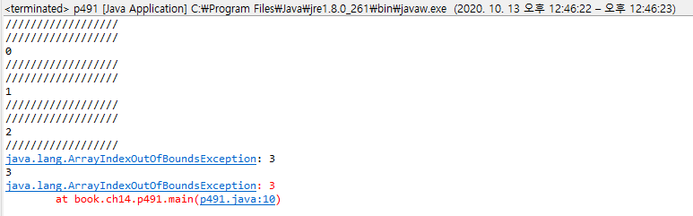
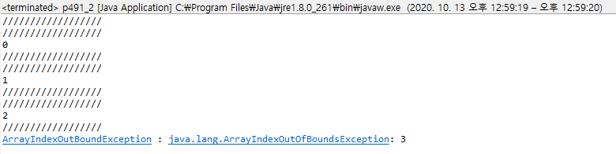
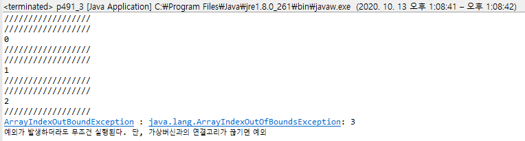
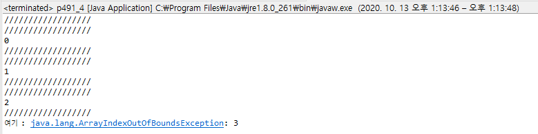

# p491~4 Exception 예외처리

### p491.java - 기본형



```java
package book.ch14;

public class p491 {
	
	public static void main(String[] args) {
		int arr[] = new int[3];
		try {
			for(int i=0;i<=3;i++) {
				System.out.println("//////////////////");
				arr[i] = i;
				System.out.println("//////////////////");
				System.out.println(arr[i]);
			}
		}catch(Exception e) {
			System.out.println(e.toString());
			System.out.println(e.getMessage());
			e.printStackTrace();
		}
	}
}
```

* 6번 : arr배열은 방이 3개인 배열이다. = 0, 1, 2
* 7번 : 일부러 runtime에러를 발생시킬것이므로 try-catch문을 작성한다.
* 8번 : 0, 1, 2, 3 = 4번 반복되는 for문 = 0, 1, 2, 3 -&gt; 탈출
* 9,11번 : 어디서 에러가 발생하는지, 탈출하는지 알아보기위해 넣은 출력문
* 10번 : i=3이 되는 네번째 반복문에서 ArrayIndexOutOfBoundsException이 발생한다. - arr\[3\] = 3; - 4번째인 3번방은 존재 하지않는다.
* 15번 : Exception 출력
* 16번 : Exception 메세지 출력
* 17번 : Exception 라인번호 + 메세지 출력 - printStackTrace메서드는 throws 된 경우까지도 출력해준다.

### p491\_2.java - 2단계



```java
package book.ch14;

public class p491_2 {
	
	public static void main(String[] args) {
		int arr[] = new int[3];//0,1,2
		try {
			for(int i=0;i<=3;i++) {//0,1,2,3 탈출
				System.out.println("//////////////////");
				arr[i] = i;//arr[3] = 3; ArrayIndexOutofBoundsException 발생
				System.out.println("//////////////////");
				System.out.println(arr[i]);
			}
		}catch(ArrayIndexOutOfBoundsException ae) {//여기서 그물에 걸린다.
			System.out.println("ArrayIndexOutBoundException : "+ae.toString());
		}catch(Exception e) {//여기까지 실행되지 않는다. 윗 그물에 걸렸으므로.
			System.out.println(e.toString());
			System.out.println(e.getMessage());
			e.printStackTrace();
		}
	}
}
```

* 15번 그물에 걸리는 Exception이므로 16번 catch문은 실행되지 않는다.

### p491\_3.java - 3단계



```java
package book.ch14;

public class p491_3 {
	
	public static void main(String[] args) {
		int arr[] = new int[3];//0,1,2
		try {
			for(int i=0;i<=3;i++) {//0,1,2,3 탈출
				System.out.println("//////////////////"); 
				arr[i] = i;//arr[3] = 3; ArrayIndexOutofBoundsException 발생
				System.out.println("//////////////////");
				System.out.println(arr[i]);
			}
		}catch(ArrayIndexOutOfBoundsException ae) {//여기서 그물에 걸린다.
			System.out.println("ArrayIndexOutBoundException : "+ae.toString());
		}catch(Exception e) {
			System.out.println(e.toString());
			System.out.println(e.getMessage());
			e.printStackTrace();
		}finally {//제일 마지막에 추가할수 있는 예약어
			System.out.println("예외가 발생하더라도 무조건 실행된다. 단, 가상머신과의 연결고리가 끊기면 예외");
		}
	}
}
```

* finally 예약어의 실행문은 그물에 이미 걸렷더라도 무조건 실행된다.
* 단, 가상머신과의 연결이 끊겼을 경우에는 실행되지 못한다.

### p491\_4 - 4단계



```java
package book.ch14;

public class p491_4 {
	
	//메서드 오버로딩 조건에 예외처리를 던지고 안던지고 하는 문제는 영향이 없다.
	public void methodA() throws ArrayIndexOutOfBoundsException{
		int arr[] = new int[3];//0,1,2
		for(int i=0;i<=3;i++) {//0,1,2,3 탈출
			System.out.println("//////////////////");
			arr[i] = i;//arr[3] = 3; ArrayIndexOutofBoundsException 발생
			System.out.println("//////////////////");
			System.out.println(arr[i]);
		}		
	}
	
	public void methodA(int i) throws ArrayIndexOutOfBoundsException, Exception{
		
	}
	
	public static void main(String[] args) {
		p491_4 p4 = new p491_4();
		//p4.methodA();에러발생
		try {
			p4.methodA();
		}catch(ArrayIndexOutOfBoundsException ae) {
			System.out.println("여기 : "+ae.toString());//여기서 그물에 걸린다.
		}
	}
}
```

* Exception이 발생하는 구문을 메서드로 빼보자
* main메서드에서 실행할때 예외처리 구문에 넣어주어야한다.


