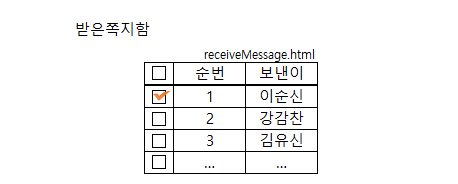

# 46 Days - \<table>분석, WAS와 웹서버, span과 div분석, JS Event-onchange, window.onload, html5-시멘틱, Dom JS선택자

### 사용 프로그램

* 사용언어 : JAVA(JDK)1.8.0\_261, JS, JQuery
* 사용Tool \
  \- Eclipse : Eclipse.org\
  \- Toad DBA Suite for Oracle 11.5
* 사용 서버\
  \- Tomcat

## 학습목표

* html과 JS의 역할에 대해 말할 수 있다.\
  \- html : 개발방법론에서 View계층 담당\
  \- JS : Event와 View를 조작(DOM)하는 역할
* JS의 선언 위치에 대해 설명할 수 있다.\
  \- head영역 : 멤버변수, 함수선언 등\
  \- body영역 : 지역변수, 함수구현(부분페이지에 대한 처리만 담당, 유지보수)
* mime타입에 대해 이해하고 페이지에 적절한 mime타입을 작성할 수 있다.\
  \- xxx.jsp가 xxx.html이나 xxx.xml이 될 수 있다.\
  \- 확장자를 보고 정하는 것이 아니라 mime타입을 보고 정체성을 정해야한다.

## DOM 요소 선택자 - JS

### Tag name

* HTML 태그를 이용해 HTML요소를 선택한다.
* document.getElementsByTagName("li");\
  \- 모든 li 요소를 선택

### ID

* 여러 태그, 요소, Element중에서 단 하나의 요소를 위한 식별자
* 문서내에서 유일한 값이여야한다.
* 한 요소에게만 기능을 부여할때, 사용하면 해당 태그만을 참조한다.
* document.getElementById("even");\
  \- "even" ID를 갖는 요소만 선택
* JS, easyUI, bootstrap에서 사용하는 값

### Class

* 여러 요소들을 위한 식별자
* 유일하지않고 중복될 수 있다.
* 보통 style에서 스타일을 일괄적용하거나 할떄 사용된다.
* document.getElementsByClassName("odd");\
  \- "odd"클래스 명을 갖는 모든 요소 선택

### Name 속성

* HTML 태그에 개발자가 부여한 이름
* 문서 내에서 중복되게, 여러번 부여해도되는 식별자
* document.getElementsByName("first");\
  \- name 속성값이 "first"인 모든 요소 선택
* JSP에서 사용하는 값

### CSS 선택자(selector)

* CSS선택자(id, class, 속성, 속성값 등)을 querySelectorAll( )메서드를 사용해 선택한다.
* document.querySelectorAll("li.odd");\
  \- 클래스가 "odd"인 요소 중에서 \<li>태그 요소들만 선택

### 객체집합(object collection)

* HTML DOM에서 제공해주는 객체집합을 이용해서도 요소를 선택할 수 있다.
* document.title;\
  \- \<title>태그 요소 선택

## JQuery 분석

### JS표준과 JQuery

|                              JS표준                              |                                         JQuery                                        |
| :------------------------------------------------------------: | :-----------------------------------------------------------------------------------: |
|                          window.onload                         |                                   $(document).ready                                   |
|                        =function( ){ };                        |                                   (function( ){ });                                   |
| <p>CSS</p><p>html 태그안에 직접 구현(정적)</p><p>별도 style생성 후 적용(동적)</p> | <p>CSS<br>$(태그명) : 모든 태그에게<br>$("#id") : 해당 id 하나에게만<br>$( ).css("이름","값);</p><p></p> |

### JQuery 선택자

* 전체 : (\*)
* 아이디 : ("#Id명")
* 클래스 : (.클래스명)
* 요소(태그이름) : (요소명)

## \<table>

### \<table>

* DOM의 구조를 보기 위해 크롬의 개발자도구를 확인한다.
* html \<table>, java table, easyui datagrid, ......
* \<table>태그의 처리주체는 브라우저로 비동기상태이다.\
  \- 이미 읽어와서 완료되었으므로 
* 테이블 태그 안에서는 text노드를 사용하지 않는다.

### \<table class>

```markup
<table class="easyui-datagrid">
```

* table태그 안에는 클래스 속성이 온다.
* **\<table class="제조회사-값">**\
  \- "easyui-datagrid"와 같은 값은 JS-JQuery에서 가져오므로 undefined가 일어날 수 있다.\
  \- 해당 속성값을 지원하는 언어가 추가되어있어야 한다.

### \<table id>

```markup
<table id="dg"></table>
```

* JS가 table에 접근하기 위해 id를 사용한다.\
  \- name은 중복되지만 id는 유일한 값이므로
* \<table id="dg_dept">\
  \- object이름-id명\
  \- id는 값을 가져올 DB의 table명과 같이 해 구분하기 쉽도록 한다.
* 이렇게 id를 부여하는 것은 JS에서 나머지를 구현하려는 것이다.\
  \- 바로 닫힌 태그로 html에서 닫는다.\
  \- JQuery를 이용해 $("#dg_dept")로 호출할 수 있다.
* **$("#dg_dept").datagrid( { } );**\
  \- 위와 같이 접근한 id를 소유주 object로 datagrid를 구현할 수 있다.

### \<table data-options>

```markup
<table class="easyui-datagrid" style="width:400px;height:250px"
        data-options="url:'datagrid_data.json',fitColumns:true,singleSelect:true">
    <thead>
        <tr>
            <th data-options="field:'code',width:100">Code</th>
            <th data-options="field:'name',width:100">Name</th>
            <th data-options="field:'price',width:100,align:'right'">Price</th>
        </tr>
    </thead>
</table>
```

* data-options="이름:값, 이름:값, 이름:값, ....."\
  \- 열거형 연산자를 사용한다.
* datagrid안에 들어가는 값을 구현한다.\
  \- dataSet과 같다.
* 웹에서는 JSON을 사용해 구현한다.\
  \- WAS에 JSON이 추가 되어 있어야 undefined가 일어나지 않는다.
* JSON을 담기 위해 URL을 사용한다.\
  \- data-options="URL:파일명, URL:파일명, ..."

### \<script JQuery - easyUI>

```markup
<script type="text/javascript" src="https://www.jeasyui.com/easyui/jquery.min.js"></script>
<script type="text/javascript" src="https://www.jeasyui.com/easyui/jquery.easyui.min.js"></script>
```

* JQuery.js를 먼저 script한 다음에 easyUI.js를 script해야한다.\
  \- 자바에서는 객체지향언어이므로 상관없지만 HTML은 절차지향적 언어이므로\
  \- 서로 의존관계에 있다. \
  \- 2번이 1번위에 있다면 undefined가 발생할 것이다.
* min : 쓸모없는 공백을 모두 제거해 좀 더 가볍게 만든 파일, 가독성이 떨어진다.

### JSON 구조

```markup
<records>
    <record>
        <deptno컬럼명>10값</deptno>
```

* 기존에는 xml을 사용해 data를 처리했는데 대용량에서는 속도가 느려 사용할수가 없었다.\
  \- oracle을 대신할 수 없다.
* 그래서 JSON이 탄생했다.

```markup
{"컬럼명" : "값", "컬럼명 : 숫자, ...}, {"컬럼명" : "값", "컬럼명 : "값", ...}, ....
```

* JSON은 열거형 연산자로 data를 관리하는 dataSet이다.
* 문자는 모두 " "를 붙이고, 숫자는 " "없이 숫자만 기입한다.
* **컬럼명은 대소문자를 구분**하니 주의하자

.png>)

* 대문자로 검색한 'SMITH'는 사원번호가 나오지만, 소문자 'smith'로 검색하면 null이다.

### 같은 태그 name주는 경우 - checkBox

* **이름이 같은 태그들은 브라우저가 자동으로 배열로 인식**한다.
* 이를 활용해 쪽지함 checkBox를 구현해보자




[receivemessage.html-name.md](receivemessage.html-name.md)


## WAS와 웹서버

### WAS(Web Application Server)

* 동적 컨텐츠를 제공하기 위한 애플리케이션 서버\
  \- java로 작성된 JSP를 해석해 컴파일을 진행하고, print를 사용해 브라우저에 적용한다. 
* DB조회, 로직처리를 요구하는 컨텐츠를 처리한다.
* JSP, Servlet이 구동 환경을 제공한다.\
  \- JSP, Servlet을 실행 시킬 수 있는 소프트 웨어 = 컨테이너
* 동작 프로세서 : 웹서버로부터의 요청\
  \-> 컨테이너가 받아서 처리한다.\
  \-> web.xml문서 참조로 해당 서블릿 스레드를 생성하고, httpServletRequest와 httpServletResponse객체를 생성해 전달한다. \
  \-> 컨테이너가 서블릿을 호출한다.\
  \-> 호출된 서블릿의 작업을 담당하는 스레드는 전송 방식에 따라 dopost( )나 doget( )을 호출한다.\
  \-> 호출된 메서드는 생성된 동적 페이지를 response객체에 담아 컨테이너에 전송한다.\
  \-> 컨테이너는 전달받은 response객체를 HTTPResponse형태로 변환해 웹서버에 전달한다.\
  \-> 생성했던 스레드 종료, httpServlet 두 객체 소멸
* 대표적인 WAS제품 : Tomcat, Jeus, JBoss\
  \- Tomcat은 Apache기능을 포함한다.\
  \- Tomcat에서 테스트하고 JEUS서버로 배포한다.

### 웹서버(Web Server)

* 클라이언트가 서버에 페이지를 요청하면 정적 컨텐츠를 제공하는 서버\
  \- 정적 컨텐츠 : HTML, PNG, CSS 등...
* 요청시 가장 먼저 요청을 처리하는 서버
* Case : 컨텐츠 request \
  \-> 정적 컨텐츠 요쳥이라면 응답response \
  \-> 정적 컨텐츠 요청이 아니라면 WAS에게 요청을 넘기고, WAS가 처리해준 컨텐츠를 받아 웹서버가 응답 해준다.
* 대표적인 웹 서버 제품 : Apache, nginx

### 차이점

* 동적, 정적 페이지의 처리위치\
  \- WAS에서도 정적페이지를 처리 할수는 있지만 부하가 많이 걸려 비효율적이다.

## HTML4와 HTML5

### HTML

* HyperText Markup Language\
  \- HyperText : 문서와 문서가 링크로 연결되어 있다.\
  \- Markup : 태그로 이루어져 있다.
* HTML파일은 웹브라우저가 주체가 되어 로딩해서 웹 페이지를 생성한다.

### HTML5

* 차세대 웹 표준으로 멀티미디어 등 다양한 애플리케이션까지 제공하도록 진화한 **웹 프로그래밍 언어**
* 모바일 웹의 핵심기술이고, Client Side Techronology기술의 중심이되는 HTML의 새로운 마크업 언어
* 클라이언트와 서버와의 통신을 지원\
  \-다른 외부 기능없이 웹서비스를 제공한다.
* 기능
  1. **Device AccessDEVICE ACCESS** \
     \- 카메라, 동작센서 등의 H/W 기능을 웹에서 직접적으로 제어
  2. **CONNECTIVITY (Web Socket)** \
     \- 웹(클라이언트)에서 서버 측과 직접적인 양방향 통신 가능
  3. **3D, GRAPHICS & EFFECTS** \
     \- 다양한 2차원 및 3차원 그래픽 기능을 지원
  4. **Styling Effects (CSS3)** \
     \- 글씨체, 색상, 배경 등 다양한 스타일 및 이펙트 기능 제공
  5. **MULTIMEDIA** \
     \- 비디오 및 오디오 기능을 자체적으로 지원
  6. **OFFLINE & STORAGE** \
     \- 네트워크 미지원 환경에서도 웹 이용을 가능하게 함
  7. **Geo-Location** \
     \-  GPS 없이도 단말기의 지리적인 위치 정보를 제공
  8. **SEMANTICS** \
     \- 웹 자료에 의미를 부여하여 사용자 의도에 맞는 맟춤형 검색 제공

### 차이점

1. **Syntax(구문)**
   1. DOCTYPE : 기존의 html 문서타입보다 간결해졌다.
   2. Encoding : 인코딩 선언부가 간결해졌다.
   3. 그래픽 언어의 사용 : 수식기술언어(MathML), 그래픽언어(SVG) 등을 사용할 수 있다.
   4. HTML5는 마크업시 TAG는 대소문자를 구분하지 않는다. 하지만 가독성 측면에서 소문자로 작성하는 것을 권장한다.
2. **Language(언어)**
   1. Semantic Element 추가 : Header, Footer, Nav, Section, Article 등
   2. 사라진 Element
      1. CSS로 처리할 수 있는 Element
      2. Frame 관련 Element
      3. 거의 사용되지 않는 Element
3. **API**
   1. Video/Audio API \
      \- Video, Audio Element와 함께 Video, Audio를 재생하는 데 사용
   2.  Offline Web Application

       \- Offline을 지원하는 API
   3. Drag & Drop API 등

### 시멘틱

* 시멘틱 웹\
  \- 기계적인 검색엔진은 어떤 태그가 어떤 기능을 하는지 분별할 수 없고, 웹 페이지의 데이터를 효율적으로 추출 할 수 없다. 이를 해결하고자 특정한 태그에 의미를 부여해서 웹 페이지를 만드는 시도가 시작되었다
* 시멘틱 태그\
  \- header : 헤더를 의미하는 태그 제공 \
  \- nav : 네비게이션을 의미하는 태그 제공 \
  \- aside : 사이드의 공간을 할당하는 태그 제공 \
  \- section : 여러 중심 내용을 감싸는 공간을 의미하는 태그 제공(article을 감싸는 태그) \
  \- article : 글자가 많이 들어가는 부분을 의미하는 태그 제공(글자가 들어가는 영역) \
  \- footer : 바닥글을 의미하는 태그 제공


[html4-html5.md](html4-html5.md)


## \<span>과 \<div>분석


[less-than-div-greater-than-less-than-span-greater-than.md](less-than-div-greater-than-less-than-span-greater-than.md)


## mime타입 분석

*  파일을 jsp파일로 생성했지만 mime타입에따라 다른 취급을 받기도 한다.
* sub타입에 따라 사용할 수 있는 태그들, 브라우저 표기방식이 달라지기도 한다.


[mime.md](mime.md)


## HTML - JS Event

### JavaScript - window.onload

* HTML에서 HTML내의 요소에 접근해 다양한 기능을 구현하는 언어
* HTML안에서 쓰이므로 절차지향적이고, 에러 체크가 없는 인터프리터의 특성을 갖는다.\
  \- 따라서 JS에서 선언과 생성, 사용되는 위치에 주의해야한다.
* 생성된 태그에 접근하려면 생성된 태그의 뒤에 위치해야하는데, 보통 body에 태그는 생성되고, JS로 구현하는 기능은 head쪽으로 빼서 관리하는것이 일반적이다.
* 이를 가능하게 해주는 메서드가 window.onload메서드이다.
* 웹브라우저 담당 window객체가 문서가 모두 다운로드된 뒤에, 문서가 사용될때 실행되는 메서드
* window.onload = fuction( ){ }; 이런 형태로 함수를 붙여 사용한다.\
  \- 해당 기능이 태그의 선언보다 앞에 위치하지만 정상적으로 작동할 수 있도록

### onchange

```markup
<input type="text" size="20" value="컵밥" onchange="check(this)">
```

* JS에서는 같은 이름을 갖는 메서드를 중복 선언할 수 없다.\
  \- 메서드 오버로드, 오버라이드를 지원하지 않는다.
* tag는 JS에서는 Element, DOM의 Node, java의 Object이다.\
  \- this를 사용할 수 있다.\
  \- value로 값을 갖는다.\
  \- 위 코드에 this.value를 찍으면 컵밥 이 출력될 것이다.
* onchange로 이벤트를 만들어 innerHTML과 value를 이용해 값을 출력해보자


[onchange.md](onchange.md)


## Eclipse의 web 소스관리

.png>)

.png>)

* 두 군데로 관리하고 있다.

\
후기 : 
