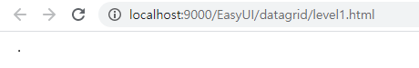
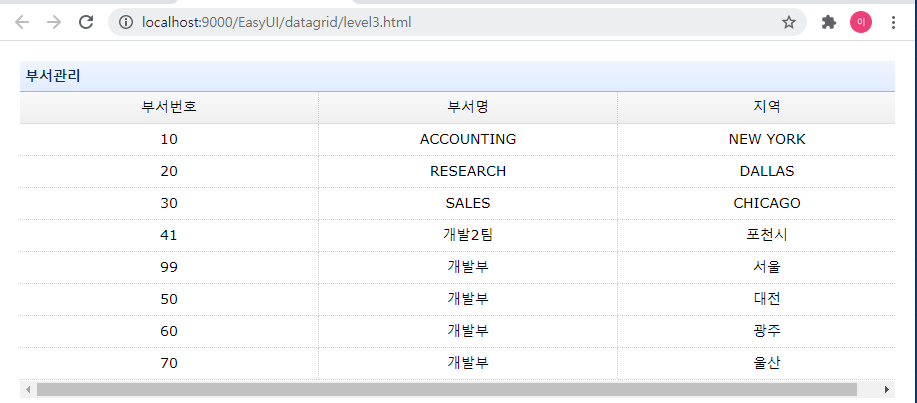
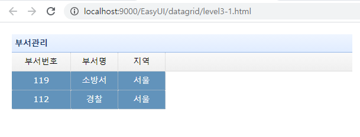

# &lt;table&gt; - datagrid level1-3

## level1 - table 생성



```markup
<!DOCTYPE html>
<html>
<head>
<meta charset="UTF-8">
<title>level1 - 태그만으로 구성하기</title>
	<!-- 인터넷이 가능한 환경이므로 URL을 통해 import, link를 건다. -->
 	<link rel="stylesheet" type="text/css" href="https://www.jeasyui.com/easyui/themes/default/easyui.css">
    <link rel="stylesheet" type="text/css" href="https://www.jeasyui.com/easyui/themes/icon.css">
    <link rel="stylesheet" type="text/css" href="https://www.jeasyui.com/easyui/themes/color.css">
    <link rel="stylesheet" type="text/css" href="https://www.jeasyui.com/easyui/demo/demo.css">
    <script type="text/javascript" src="https://www.jeasyui.com/easyui/jquery.min.js"></script>
    <script type="text/javascript" src="https://www.jeasyui.com/easyui/jquery.easyui.min.js"></script>
</head>
<body>
	<table border="1" id="dg_dept"></table>
</body>
</html>
```

* data는 없어  테두리 선을 나타내는 border마저 없으면 화면에 아무것도 나타나지 않는다.
* 화면의 .은 border값에 의해 나타난 것

### level1 - html태그, JSON만으로 생성


```markup
<!DOCTYPE html>
<html>
<head>
<meta charset="UTF-8">
<title>level1 - 태그만으로 구성하기</title>
	<!-- 인터넷이 가능한 환경이므로 URL을 통해 import, link를 건다. -->
 	<link rel="stylesheet" type="text/css" href="https://www.jeasyui.com/easyui/themes/default/easyui.css">
    <link rel="stylesheet" type="text/css" href="https://www.jeasyui.com/easyui/themes/icon.css">
    <link rel="stylesheet" type="text/css" href="https://www.jeasyui.com/easyui/themes/color.css">
    <link rel="stylesheet" type="text/css" href="https://www.jeasyui.com/easyui/demo/demo.css">
    <script type="text/javascript" src="https://www.jeasyui.com/easyui/jquery.min.js"></script>
    <script type="text/javascript" src="https://www.jeasyui.com/easyui/jquery.easyui.min.js"></script>
</head>
<body>
	<table data-options="url:'./dept.json'" id="dg_dept" class="easyui-datagrid">
		<thead>
        	<tr>
            	<th data-options="field:'DEPTNO',width:'35%', align:'center'">부서번호</th>
            	<th data-options="field:'DNAME',width:'35%', aligln:'center'">부서명</th>
            	<th data-options="field:'LOC',width:'30%',align:'center'">지역</th>
        	</tr>
    	</thead>
    </table>
</body>
</html>
```

## level3 - JS를 이용한 dataSet

### level3 - JS에서 JSON dataSet불러오기



```markup
<!DOCTYPE html>
<html>
<head>
<meta charset="UTF-8">
<title>level3 - JS만으로 구성하기</title>
	<!-- 인터넷이 가능한 환경이므로 URL을 통해 import, link를 건다. -->
 	<link rel="stylesheet" type="text/css" href="https://www.jeasyui.com/easyui/themes/default/easyui.css">
    <link rel="stylesheet" type="text/css" href="https://www.jeasyui.com/easyui/themes/icon.css">
    <link rel="stylesheet" type="text/css" href="https://www.jeasyui.com/easyui/themes/color.css">
    <link rel="stylesheet" type="text/css" href="https://www.jeasyui.com/easyui/demo/demo.css">
    <script type="text/javascript" src="https://www.jeasyui.com/easyui/jquery.min.js"></script>
    <script type="text/javascript" src="https://www.jeasyui.com/easyui/jquery.easyui.min.js"></script>
</head>
<body>	
	<script type="text/javascript">
		window.onload = function(){//dom이 스캔할떄 초기화
			$("#dg_dept").datagrid({
				title:"부서관리"
				,url:"./dept.json"
				,columns:[[
							{field:'DEPTNO', title:'부서번호', width:'35%', align:'center'},
							{field:'DNAME', title:'부서명', width:'35%', align:'center'},
							{field:'LOC', title:'지역', width:'35%', align:'center'},
						 ]]
			})
		}
	</script>
	<!-- class는 필요없고 접근할 id만 필요하다. -->
	<table border="1" id="dg_dept"></table>
</body>
</html>
```

### level3-1- 상수값 넣고 rowstyler추가해보기



```markup
<!DOCTYPE html>
<html>
<head>
<meta charset="UTF-8">
<title>level3-1 - JS만으로 구성하기</title>
	<!-- 인터넷이 가능한 환경이므로 URL을 통해 import, link를 건다. -->
 	<link rel="stylesheet" type="text/css" href="https://www.jeasyui.com/easyui/themes/default/easyui.css">
    <link rel="stylesheet" type="text/css" href="https://www.jeasyui.com/easyui/themes/icon.css">
    <link rel="stylesheet" type="text/css" href="https://www.jeasyui.com/easyui/themes/color.css">
    <link rel="stylesheet" type="text/css" href="https://www.jeasyui.com/easyui/demo/demo.css">
    <script type="text/javascript" src="https://www.jeasyui.com/easyui/jquery.min.js"></script>
    <script type="text/javascript" src="https://www.jeasyui.com/easyui/jquery.easyui.min.js"></script>
</head>
<body>	
	<script type="text/javascript">
		window.onload = function(){//dom이 스캔할떄 초기화
			$("#dg_dept").datagrid({
				title:"부서관리"
				,data: [
					{DEPTNO:'119', DNAME:'소방서', LOC:'서울'}
				 ,{DEPTNO:'112', DNAME:'경찰', LOC:'서울'}
				]
				,rowStyler: function(index,row){//방법1
					if(row.DEPTNO>90){//소문자거나 deptno가 90보다 작으면 적용되지않는다.
						return 'background-color:#6293BB;color:#fff;';//return inline style
					}
				}
			});
		    /*
			$("#dg_dept").datagrid({//방법2
				rowStyler: function(index,row){
					if(row.DEPTNO>100){
						return 'background-color:#6293BB;color:#fff;';//return inline style
					}
				}
			});
		    */
		}
	</script>
	<!-- class는 필요없고 접근할 id만 필요하다. -->
	<table border="1" id="dg_dept"></table>
</body>
</html>
```

