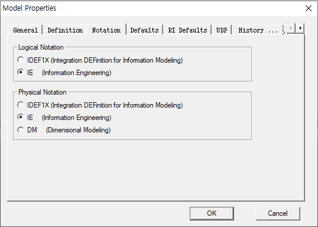

# ER-Win

## 준비

### 설치

* CAEDM73-b1666\(Data Modeler\) 
* 관리자 권한 실행 -&gt; agree -&gt; 두번째 빈 입력창 : User -&gt; next -&gt; next -&gt; next -&gt; install
* 라이센스 키 입력

### 주의할 점

* 읽기 모드에서는 저장이 안된다. 생성하기전에 저장을 미리 해놓고 진행하자

## 설정

* Logical \(논리적\) : 겉으로 보여지는 부분
* Physical\(물리적\) : 작성되는 코드, 실제로 저장되는 부
* 우리는 Oracle DB를 이용하므로 설정해준다.

* IE : 표준

## Test - 부서 & 사원

### Table, 집합 생성

* 상단 Logical옆 네모난 버튼이 집합 생성 버튼이다.
* 집합을 만들고 더블클릭하면 컬럼명 및 AK 추가할 수 있다.

* New... -&gt; 컬럼명 입력

* 입력결과
* pk = 부서번호

* Datatype표시하기

* 결과

### 관계 표시

* 사원 집합을 만들어 관계를 표시하자
* 사원 집합의 pk : 사원번호AK + 부서번호FK
* 부모 집합인 부서번호에서 FK를 받는다. = 실선표시

* 선 클릭 -&gt; Relationships
* Cardnailty : O\(Option\) 설정

* 사원 집합에서 식별자 PK를 사원번호로 지정하게 되면 부서집합에서 FK를 받아오지 않으므로 관계가 점선 표시된다.

## 교과목 - 수강신청 - 학생

* 교과목은 n개, 학생은 n명이다. n : n관계
* 이를 1 : n 관계로 만들어주기 위해 두 집합 사이에 접점이되는 집합 하나를 생성한다.

* n : n관계선 클릭 - Many to Many Transform 버튼
* 버튼을 누르고 부모집합 &gt; 자식집합 순으로 선택하면 자동으로 집합을 하나 생성해준다.

* 이로써 1 : n : 1 관계가 생성되었다.

