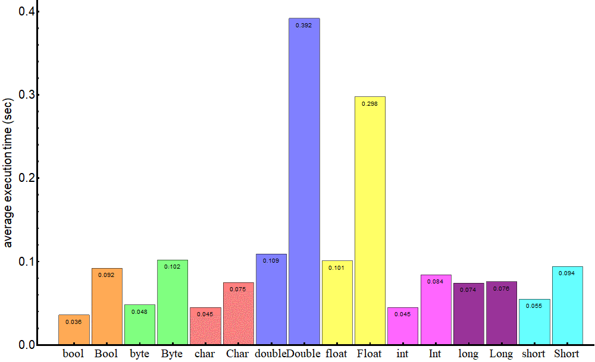

# 참조형, 원시형

##   정리

### 참조형\(reference type\)

* 객체\(Object\)의 주소를 저장하는 타입 메모리 주소 값을 통해 객체를 참조하는 타입
* 원시형을 제외한 문자열, 배열, 열거, 클래스, 인터페이스 등을 말한다.
* stack 메모리에는 주소 값이, 실제 값은 heap 메모리에 존재한다. 객체 사용시마다 참조변수에 저장된 객체의 주소를 불러와 사용하는 방식이다.

### 원시형\(premitive type\)

<table>
  <thead>
    <tr>
      <th style="text-align:left">&#xC885;&#xB958;</th>
      <th style="text-align:left">&#xB370;&#xC774;&#xD130;&#xD615;</th>
      <th style="text-align:left">&#xD06C;&#xAE30;(byte/bit)</th>
      <th style="text-align:left">&#xD45C;&#xD604;&#xBC94;&#xC704;</th>
    </tr>
  </thead>
  <tbody>
    <tr>
      <td style="text-align:left">&#xB17C;&#xB9AC;&#xD615;</td>
      <td style="text-align:left">boolean</td>
      <td style="text-align:left">1 / 8</td>
      <td style="text-align:left">true &#xB610;&#xB294; false</td>
    </tr>
    <tr>
      <td style="text-align:left">&#xBB38;&#xC790;&#xD615;</td>
      <td style="text-align:left">char</td>
      <td style="text-align:left">2 / 16</td>
      <td style="text-align:left">
        <p>&apos;\u0000&apos; ~ &apos;uFFFF&apos;</p>
        <p>(16&#xBE44;&#xD2B8; &#xC720;&#xB2C8;&#xCF54;&#xB4DC; &#xBB38;&#xC790;
          &#xB370;&#xC774;&#xD130;)</p>
      </td>
    </tr>
    <tr>
      <td style="text-align:left">&#xC815;&#xC218;&#xD615;</td>
      <td style="text-align:left">byte</td>
      <td style="text-align:left">1 / 8</td>
      <td style="text-align:left">-128 ~ 127</td>
    </tr>
    <tr>
      <td style="text-align:left">&#xC815;&#xC218;&#xD615;</td>
      <td style="text-align:left">short</td>
      <td style="text-align:left">2 / 16</td>
      <td style="text-align:left">-32768 ~ 32767</td>
    </tr>
    <tr>
      <td style="text-align:left">&#xC815;&#xC218;&#xD615;</td>
      <td style="text-align:left">int</td>
      <td style="text-align:left">4 / 32</td>
      <td style="text-align:left">
        <p>-2147483648 ~ 2147483647</p>
        <p>( -21&#xC5B5; ~ + 21&#xC5B5;)</p>
      </td>
    </tr>
    <tr>
      <td style="text-align:left">&#xC815;&#xC218;&#xD615;</td>
      <td style="text-align:left">long</td>
      <td style="text-align:left">8 / 64</td>
      <td style="text-align:left">
        <p>-9223372036854775808 ~ 9223372036854775807</p>
        <p>(-100&#xACBD; ~ + 100&#xACBD;)</p>
      </td>
    </tr>
    <tr>
      <td style="text-align:left">&#xC2E4;&#xC218;&#xD615;</td>
      <td style="text-align:left">float</td>
      <td style="text-align:left">4 / 32</td>
      <td style="text-align:left">1.4E-45 ~ 3.4028235E38</td>
    </tr>
    <tr>
      <td style="text-align:left">&#xC2E4;&#xC218;&#xD615;</td>
      <td style="text-align:left">double</td>
      <td style="text-align:left">8 / 64</td>
      <td style="text-align:left">4.9E-324 ~ 1.7976931348623157E308</td>
    </tr>
  </tbody>
</table>

* 정수, 실수, 문자, 논리 리터럴 등의 실제 데이터 값을 저장하는 타입
* stack 메모리에 값이 존재한다.

### 차이점

```java
int i = null; //불가능
Integer integer = null; //가능

List<int> i; //불가능
List<Integer> integer //가능
```

1. null을 담을 수 있는지 - 원시형은 null을 담을 수 없다. - 참조형은 null을 담을 수 있다.
2. 제네릭 타입으로 사용할 수 있는지 - 원시형은 제네릭 타입으로 사용할 수 없다. - 참조형은 제네릭 타입으로 사용할 수 있다.

### 원시형의 장점



1. 제네릭 타입으로도, null값을 가질 수 도 없는 원시형의 장점은 '성능\(접근속도\)'에 있다. - 참조형은 값을 불러올때마다 언박싱 과정을 거쳐 원시형에 비해 접근 속도가 느리다. - 단, 매우 큰 값을 복사하는 등 의 경우에는 참조값만 넘길 수 있는 참조형이 나을때가 있다.
2. 차지하는 메모리 양 - 참조형이 차이하는 메모리 크기가 더 크다. - boolean 1bit &lt; Boolean 128 bits

### 사용시기

* 속도와 메모리 효율에 있어 우수한 원시형을 먼저 고려해보고,  null을 다뤄야 하거나 제네릭타입으로 사용해야 하는 경우에는 참조형을 사용한다.

## 더보기

### 참조형 : String

* 가장많이 사용되는 데이터 타입 중 하나 Java 어플리케이션에서 String타입 객체들이 가장 많은 메모리를 차지한다.
* 문자열을 처리한다.

```java
String str = new String("Hello"); //new 객체 생성
String str2 = "Hello"; //리터럴 할당
```

* 참조형 이지만 new 연산자를 사용한 객체생성도 문자열 리터럴 형태로 사용하는것도 허용된다.
* new 객체로 생성하는 것은 새 문자열을 heap에 생성하는 것이고 리터럴을 할당하는 것은 heap에 생성되어있는 문자열 중 같은 값이 있다면 해당 값을 참조하는 것이다. new객체는 주소번지가 다르지만 리터럴 할당된 객체는 주소번지가 같다. new 객체를 생성하는 과정은 heap을 스캔하지 않고 새로 만들어버리므로

```java
String str = "Hello"; 
       str = "Bye"; 
```

* str변수의 문자열을 변경하더라도 내부적로는 heap에 최초의 str 값이 변경된 것이 아니라 heap내부에 새로운 String 객체가 생성되고 그 참조가 str변수에 할당된다. str은 최초에 "Hello"문자열의 참조를 할당받고 2번에서 "Bye"문자열의 참조를 할당받는다.
* 최초에 생성된 문자열"Hello"와 두번째 생성된 문자열 "Bye" 두 객체 모두 heap에 생성되어있다.

### String의 불변성\(Immutable\)

* 자바에서 String은 불변성\(immutable\)을 갖는다. 한번 객체\(값\)이 생성되면 그 값은 변하지 않는다.
* 자바에서 String타입 객체는 같은 값의 문자열에 대해 단 하나의 객체만을 생성한다.
* **캐싱** 어떤 문자열 반복 요청에 따라 문자열을 반복 생성하는 것이 아니라 문자열 객체는 단 하나만 생성되고 참조값을 갖는 참조변수만 반복 생성되었다가 사라지게 된다. Java에서 String객체는 Heap의 String Pool에 저장되고 참조하려는 문자열이 있으면 Pool에 있는 객체를 사용하므로 특정 문자열의 재사용 빈도가 높을수록 성능이 향상된다. JVM객체가 생성되는 heap에 문자열이 매번 생성되는 것이 아니므로 메모리 사용 효율이 높다. 문자열 객체를 캐싱\(Caching\)한다.
* **보안** String의 불변성으로 인해 중요한 데이터를 문자열로 다루는 경우 강제로 해당 참조에 대한 문자열 값을 바꾸는 것이 불가능하므로 보안에 유리하다.
* **스레드 안전성** String객체가 변경될 수 없다는 것은 여러 스레드에서 동시에 접근\(참조\)해도 안전하다는 것이다. 여러곳에서 특정 문자열값을 참조하고 있을때 값이 절대 변하지 않으므로 안전하다. str = 'hello" 처럼 새 리터럴을 할당하더라도 기존값이 heap에 남아있다. 

### String 문자열 더하기

* 
### 참조형 : Scanner

* 사용자의 입력을 받을때 사용하는 참조형 변수

### 원시형 : boolean 

* 저장 가능한 범위 true / false
* JAVA가 데이터를 다루는 최소 범위가 1Byte이므로 비효율적이지만 1Byte를 사용한다.

### 원시형 : char

* Java에서는 Unicode를 사용한다. 문자열이 아닌 문자를 처리한다. \(문자열은 참조형 string\)
* Java에서는 유일하게 제공되는 unsigned형태 이다. \(양수값만 존재한다.\)
* 한글 같은 동양의 글자는 2Byte를 차지하므로 char는 2Byte를 사용한다.
* char로 선언된 변수는 &gt;, &lt; , = 대소 비교가 가능하다. char형은 문자 값을 유니코드 정수형태로 저장하기 떄문이다. char a ='A'; b='B';  라면 a &gt; b

### 원시형 : int

<table>
  <thead>
    <tr>
      <th style="text-align:left">&#xC885;&#xB958;</th>
      <th style="text-align:left">&#xD06C;&#xAE30;(byte / bit)</th>
      <th style="text-align:left">&#xD45C;&#xD604;&#xBC94;&#xC704;</th>
    </tr>
  </thead>
  <tbody>
    <tr>
      <td style="text-align:left">tinyint</td>
      <td style="text-align:left">1 / 8</td>
      <td style="text-align:left">
        <p>0 ~ 2^8</p>
        <p>(0 ~ 255)</p>
      </td>
    </tr>
    <tr>
      <td style="text-align:left">smallint</td>
      <td style="text-align:left">2 / 16</td>
      <td style="text-align:left">
        <p>-2^15 32,768) to 2^15-1</p>
        <p>(-32,768 ~ 32,767)</p>
      </td>
    </tr>
    <tr>
      <td style="text-align:left">int</td>
      <td style="text-align:left">4 / 32</td>
      <td style="text-align:left">
        <p>-2^31 ~ 2^31-1</p>
        <p>(-2,147,483,648 ~ 2,147,483,647) &#xC57D;21&#xC5B5;</p>
      </td>
    </tr>
    <tr>
      <td style="text-align:left">bigint</td>
      <td style="text-align:left">8 / 64</td>
      <td style="text-align:left">
        <p>-2^63 ~ 2^63-1</p>
        <p>(-9,223,372,036,854,775,808 ~ 9,223,372,036,854,775,807) &#xC57D;10&#xACBD;</p>
      </td>
    </tr>
  </tbody>
</table>

* 표현범위에서 최댓값-1을 하는 이유는 0이 포함되기 때문이다.
* DB\(database\)의 공간을 절약하기위해 타입을 구분한다. 예를 들어 255세 이상 사는 사람은 없기때문에 사람 수명에 대한 데이터라면 tinyint를 사용하는 것이 DB관리에 효율적이다. 하지만 건물 수명과같은 개념이면 tinyint는 적합하지 않을 것이다.

### 원시형 : 정수형

* byte, short, int, long
* 정수형 데이터를 사용하면 JVM은 기본적으로 int 타입으로 데이터를 인식한다. long 타입의 정수를 사용할때에는 정수데이터 뒤에 접미사 'l' or 'L'을 붙인다. 소문자 'l'은 1과 비슷하므로 'L'을 사용한다.

### 원시형 : 실수형

* double, float
* JVM은 기본적으로 double 타입으로 데이터를 인식한다. float 타입의 실수를 사용할때에는 실수데이터 뒤에 접미사 'f' or 'F'를 붙인다.
* float float fl = 3.14F;

## 용어

### literal 리터럴

* 변하지 않는 값 자체 - 객체 리터럴, 정수 리터럴 .....

### 상수

* 변경할 수 없는 변수
* JAVA : final을 붙여 정의하며 최초의 초기화 후 변경될 수 없다. - final String name = "ㅇㅇㅇ";
* 여기서 name 변수가 상수, "ㅇㅇㅇ"은 문자열 리터럴인 것이다.

### Immutable

* 불변성

### 캐시

* 컴퓨터의 성능을 향상시키기위해 사용되는 메모리
* 주기억장치가 CPU사이에 위치한다.
* 자주 사용하는 데이터들을 기억한다.\(지갑\)
* 성능개선\(지역성\) - 시간 지역성   한번 참조된 데이터는 또 참조될 가능성이 높다.   ex\) for, while 반복문에서 사용되는 조건변수 - 공간 지역성   참조된 데이터의 근처에 있는 데이터가 또 사용될 가능성이 높다.   ex\) 배열 A의 \[0\]데이터, \[1\]데이터 - 순차적 지역성   분기가 발생하는 비순차적 실행이 아닌 이상, 명령어들이 메모리에 저장된 순서대로 실행된다는    특성으로 순차적일 수록 데이터가 사용될 가능성이 높다.

### Caching 캐싱

* 캐시 영역으로 데이터를 가져와서 접근하는 방식 ex\) 속도가 느린 디스크의 데이터를 속도가 빠른 메모리로 가져와 메모리상에서 읽고 쓰는 작업을 수행한다.
* 메모리 상의 데이터를 연산하는데 더 빠른 CPU영역으로 데이터를 가져와 연산을 처리하는 것도 캐싱이라 한다.

### Unsigned 

* 음수 값 없이 0부터 시작해 양수 값만 가지는 데이터 형태

