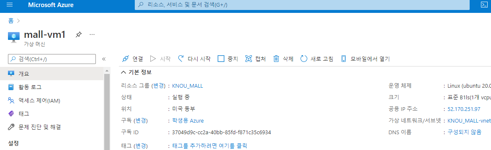
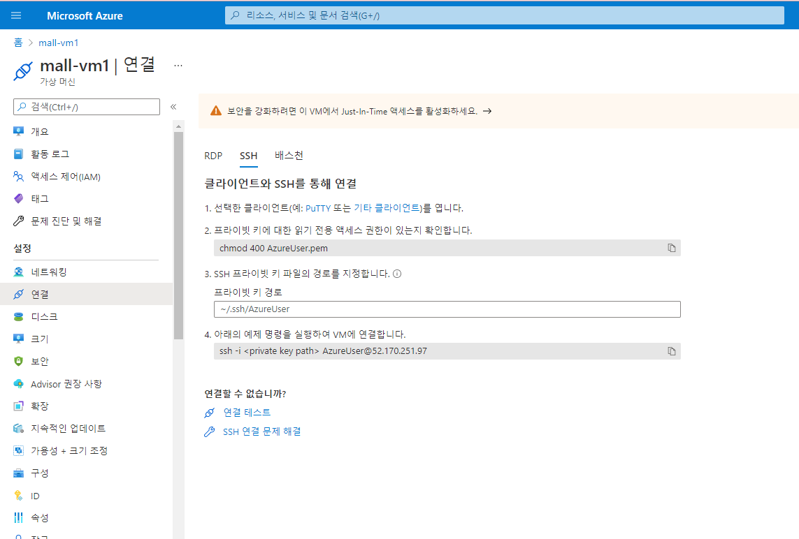

# 출석 수업

### 클라우드 컴퓨팅 서비스

* 클라우드 컴퓨팅 시장
  * 아마존 사가 최초 성공 후 10년이 넘는 시간동안 시장을 선도함
  * 마이크로소프트, 알리바바, 구글 등 국내에는 네이버, kt, LG 등 다양한 기업이 클라우드 시장에 진출하고 있
* 마이크로소프트의 Azure
  * 'Office 365' Saas뿐 아니라 Iaas/Paas 등

### Azure 가입 및 기본 설정

* 학생용으로 가입 &gt; 기본적으로 100크레딧을 제공함
* [https://azure.microsoft.com/ko-kr/free/students/](https://azure.microsoft.com/ko-kr/developer/students/)

### Azure 가상머신 만들기



### Azure 가상머신 연결하기

* 상단 Microsofr Azure 클릭하여 메인페이지로 이동
* 만들어진 가상머신 클릭



* '연결'탭 클릭



* 'SSH' 탭 클릭
* 4.번의 명령어 복사
*  Window : powerShell  Mac : Terminal


* 복사한 명령어 붙여넣기 ssh  AzureUser@52.170.251.97 &gt; '- i &lt; &gt;'부분은 삭제 enter
* 암호 입력  enter
* 연결됨 확인 끝

### 가상머신 포트 추가하기

```text
#cloud-config
package_upgrade: true
packages:
  - python3
  - python3-pip
  - build-essential
runcmd:
  - python3 -m pip install flask waitress
  - cd /opt
  - git clone https://github.com/jaehwachung/cloud_computing.git
  - cd /opt/cloud_computing/shop1
  - python3 shop_main.py
```

* 가상머신 만들기 단계에서 '고급' 에서 페이지 정보를 입력할 수 있다.
* 양재화 교수님의 쇼핑몰 홈페이지 [https://github.com/jaehwachung/cloud\_computing/blob/master/shop1/Cloud-init](https://github.com/jaehwachung/cloud_computing/blob/master/shop1/Cloud-init)


* '네트워킹' 메뉴에서 '인바운드 포트 규칙 추가'
  * 포트 이름, 포트 번호 &gt; 추가


* 인터넷 상에서 IP + 포트번호 로 페이지를 확인할 수 있다.

### 결론

* 손쉽게 환경을 설정할 수 있다.

