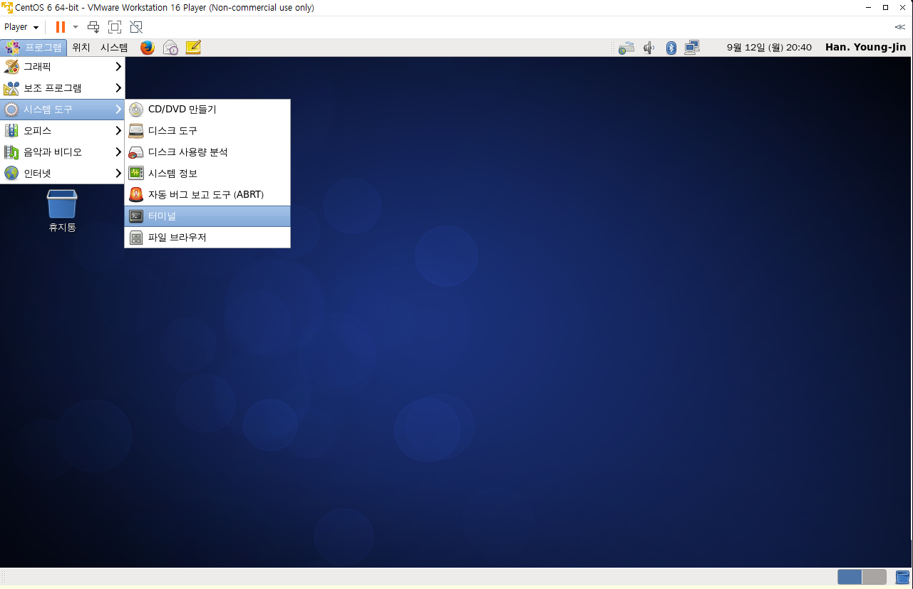

# 리눅스 설치

## 리눅스 실습환경의 준비

### Cent OS

* RHEL의 소스코드를 이용해 만들어진 무료 배포판
* 상용 RHEL과 호환되나 운영상 문제 발생시 스스로 해결해야함
* 웹 서버나 데이터베이스 서버용 컴퓨터에 널리 사용됨

### CentOS 설치 준비작업

* https://www.centos.org
* https://wiki.centos.org/Download
  * 비트 선택 후, 적당한 mirror 사이트 선택
* http://ftp.neowiz.com/centos/6.9/isos/i386
  * CentOS-6.9-i386-bin-DVD1.iso 이미지파일 다운로드
* 가상머신 SW에서 이미지 파일 사용
* 1 : 하드디스크의 빈 파티션에 설치
  * 기존 운영체제에서 사용하지 않는 파티션 존재유무 확인 - 리눅스용 파티션 준비
  * 리눅스 설치 공간은 기존의 운영체제 공간과 구분됨
  * 부팅시 윈도우와 리눅스 중 선택할 수 있음 - 멀티 부팅
* 2 : 가상머신 소프트웨어를 이용한 설치
  * 가상머신 소프트웨어 설치 후 가상머신에 리눅스 설치
  * 게스트 운영체제로 설치됨

## 저장 장치 이름과 표준 디렉토리

### 파티션

* 하드 디스크를 논리적으로 나눈 구역
* 파티션 별로 파일 시스템을 만들 수 있음
* 윈도우에서는 각 파티션 마다 각각의 드라이브로 지정한다.
* 리눅스는 1개의 루트 디렉토리(/) 만을 갖는다.
  * 파티션은 루트 파일 시스템의 특정 디렉토리에 부착되어\
    저장 장치를 사용하려면 해당 저장 장치의 이름을 파일 시스템의 특정 디렉토리에 마운트 시켜야한다. > 장치이름 dev/sdb1를 /home에 부착한다.
* 리눅스는 하드디스크나 주변 장치를 파일로 취급한다.

### 장치 이름

* 리눅스에서 사용하는 하드디스크 장치 또는 파티션의 이름
* IDE 디스크 - 이름에 'hd'를 붙인다.
* SCSI 디스크 - 이름에 'sd'를 붙인다.
* 물리적인 하드디스크가 추가될 때 알파벳 순서대로 추가된다.\
  /dev/hda, /dev/hdb, .... \
  /dev/sda, /dev/sdb, ....
* 파티션 번호는 숫자를 1부터 차례대로 붙인다.\
  /dev/hda1, /dev/hda2, ....&#x20;
* CD / DVD\
  /dev/sr0, dev/sr1, ....

### 리눅스 표준 디렉토리

#### 루트 디렉토리 : /

* 파일 시스템의 바탕을 이루는 핵심 디렉토리
* 모든 파일과 디렉토리의 최상위 디렉토리

#### 바이너리  디렉토리 : /bin, /sbin

* 기본 명령 실행파일 포함 - /bin
* 시스템 관리와 관련된 명령의 실행 파일 포함 - /sbin

#### 부트 디렉토리 : boot

* 커널 이미지(vmlinuz)와 부트 로더의 설정 파일 포함

#### 디바이스 디렉토리 : /dev

* 장치르 ㄹ접근하는데 사용되는 '디바이스 파일'이 위치하는 디렉토리

#### 시스템 설정 파일 디렉토리 : /etc

* 시스템의 중요한 환경 설정 파일이 위치

#### 사용자 계정 디렉토리 : /home

* 사용자 계정의 홈 디렉토리가 만들어지는 디렉토리
* 사용자의 홈 디렉토리는 해당 사용자만 사용할 수 있는 독립적인 공간

#### 공유 라이브러리 디렉토리 : /lib

* 프로그램들이 사용하는 시스템 라이브러리 파일이 위치

#### 미디어 디렉토리 : /media

* 이동식 저장 장치가 마운트될때 마운트 지점을 제공한다.

#### 시스템 정보 디렉토리 : /proc

* 커널이 사용하는 가상의 파일 시스템
* 하드디스크 공간을 차지하지 않고 메모리에 위치

#### 루트 계정의 디렉토리 : /root

* root계정의 홈 디렉토리

#### 사용자 디렉토리 : /usr

* /usr/bin, /usr/sbin - 여러 실행 파일
* /usr/include - 라이브러리 헤더 파일
* /usr/lib - 실행 파일을 위한 사용자 라이브러리

#### 가변 자료 저장 디렉토리 : /var

* 시스템 운영 중에 필요한 가변 자료가 저장되는 디렉토리
* 시스템 작동 로그, 인쇄, 메일

## 리눅스 설치

#### 1. 하드디스크의 비어있는 파티션에 설치

#### 2. 가상 머신에 설치

* root 계정의 암호를 반드시 기억해야 한다.

1. CentOS 다운로드 - [https://centos.org/](https://centos.org/)\
   Download > CentOS Linux > Order Version > Archived Versions > 6.10 > isos > x86\_64/ \
   \> CentOS-6.10-x86\_64-bin-DVD1.iso
2. 가상머신 소프트웨어 VMware 다운로드 - [https://www.vmware.com/](https://www.vmware.com/)\
   Workspace > Worstation Player(무료) > Download For Free > 하단 go to downloads > VMware Workstation 16.2.4 Player for Windows 64-bit Operating Systems
3. VMware 설치\
   VMware.exe 설치 > Next > 약관동의 Next > 설치경로선택 Next > Next > Next > Install > Finish
4. VMware 에서 가상머신 만들기\
   VMware실행 > Create a New Virtual Machine > Install disc image file - CentOS 이미지 파일 지정  / 강의에서는 나중에 설정하기 선택 Next > Linux, CentOS 6 64-bit 선택 Next > 가상 머신 이름, 경로 지정 Next > 디스크 용량 및 싱글/멀티 파일 지정 Next > Finish
5. 리눅스 운영체제 가상머신에 설치하기\
   생성한 가상머신 선택 > Edit virtual machine settings >  Hadware CD/DVD Use ISO image file 다운로드한 CentOS 이미지 파일 지정 > OK > 가상머신 Play > 자동 부팅 > Disc Found : SKIP > CentOS CD로 부팅이 된다. > Next > 언어선택 Next > 키보드언어선택 Next > 기본 저장 장치 Next > Y > 호스트명 설정, 네트워크 설정 - 유선 네크워트 변경하기에서 자동연결 선택 Next > 시간설정 Next > root계정 설정 > 모든 공간 사용, 파티션 레이아웃 확인 및 변경 체크 Next > Next > 포맷 > 디스크에 변경사항 기록 > Next > 소프트웨어 설치 - Desktop, 지금선택 Next > 설치 가능한 소프트웨어 확인 및 선택 > CentOS 설치 진행 > 재부팅 > 앞으로 > 라이선스 조항 동의 Next > 사용자 생성 Next > 네트워크 시간 동기화  Next > 완료&#x20;
6. 시스템 종료\
   시스템 > 끄기

#### 생성된 파티션 확

<figure><figcaption></figcaption></figure>

* 하나의 하드디스크 sda아래 1번 파티션, 2번 파티션이 생성되어있다.
* sda1는 부팅 영역, sda2 파티션에는 LVM 볼륨그룹이 담겨있다.
* 볼륨그룹은 root파티션, swap파티션으로 나뉘어있다.\
  리눅스는 root 파티션 아래 설치된다.

#### 리눅스&#x20;

<figure><figcaption>
가상머신에 설치한 리눅스
</figcaption></figure>

* 터미널 - 프로그램 > 시스템도구 > 터미널\
  &#x20;           \- 바탕화면 우클릭 > Open in Terminal
* 터미널에서 한/영 전환 - Ctrl+Space
